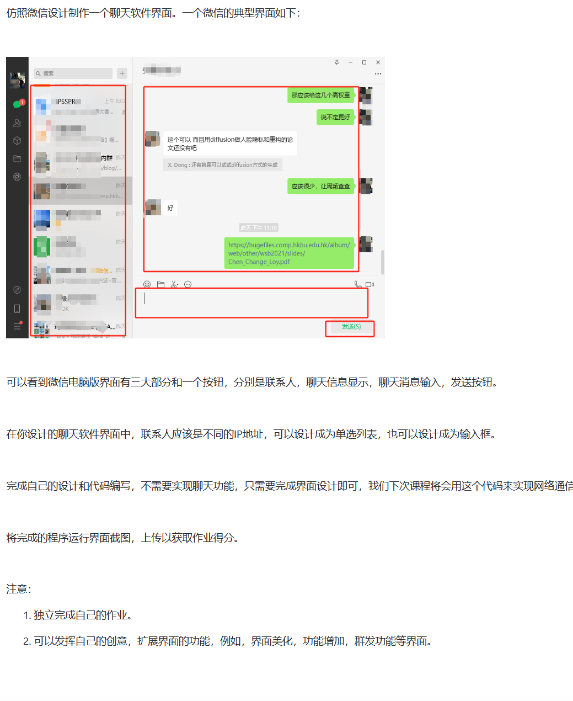
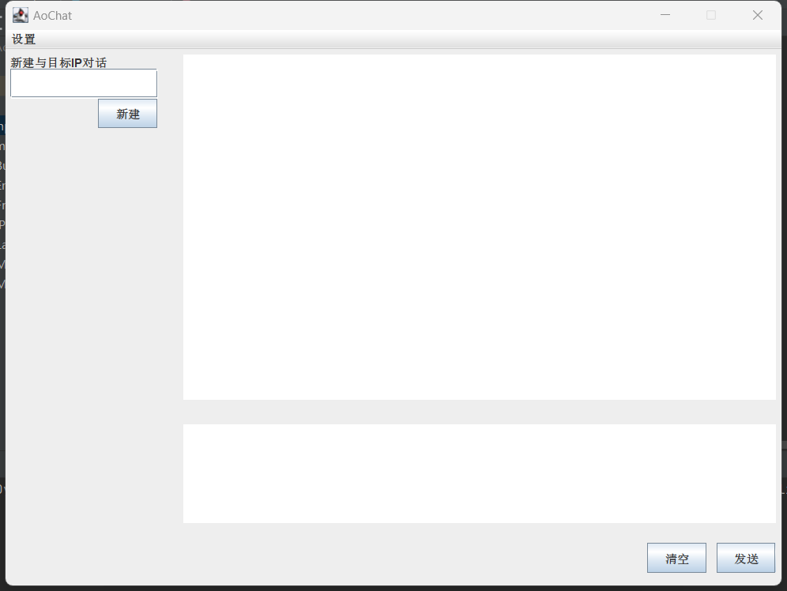
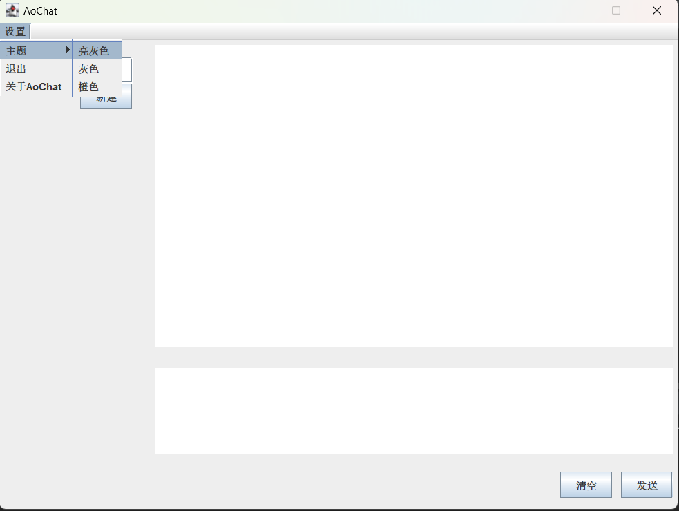
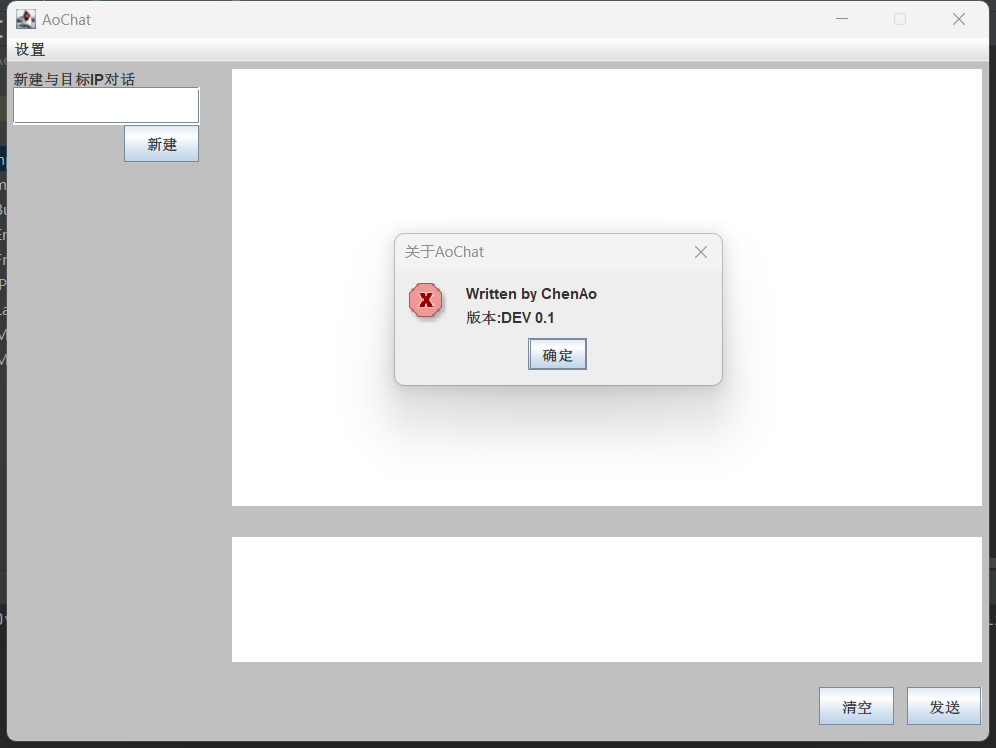
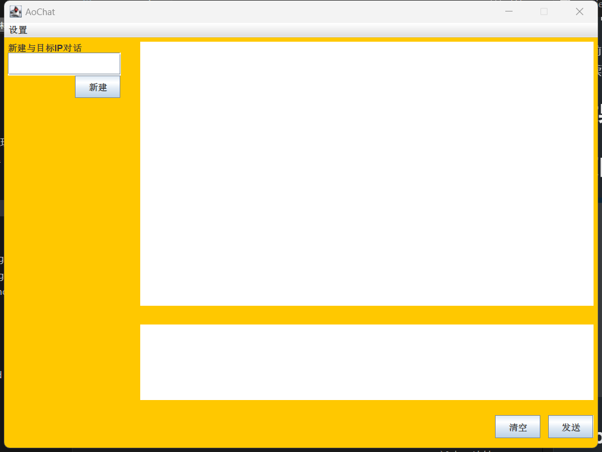
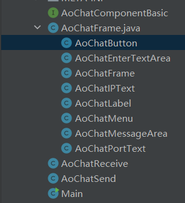

# AoChat
## 写在最前面
目前已经把框架初步写完，但还没有添加网络编程内容
后续可能会更改现有的框架体系

## 题目要求

## 效果截图




## 项目结构

## AoChatComponentBasic
这是一个接口，所有的AoChat组件都要实现这个接口
```
public interface AoChatComponentBasic {
    void add2Panel(JPanel panel);
    public void setPosition();
}

其主要含义是，把组件添加到窗口中和设置控件位置
```
## AoChatFrame
这里是AoChat主窗口，用于调用AoChat组件，所有的AoChat组件都是AoChat主窗口的成员变量
```
AoChatMenu menuBar = new AoChatMenu(rootPanel, frame);  // 新建菜单栏
AoChatEnterTextArea textArea = new AoChatEnterTextArea(rootPanel); // 新建聊天输入框
AoChatButton buttons = new AoChatButton(rootPanel, textArea);  // 新建按钮组
AoChatIPText ipText = new AoChatIPText(rootPanel); // 新建IP地址输入框
AoChatLabel labels = new AoChatLabel(rootPanel);  //新建标签组
AoChatMessageArea messageArea = new AoChatMessageArea(rootPanel);
```
### panelInit方法
初始化窗口设置
```
private void panelInit(){
        // 窗口初始化
        frame.setDefaultCloseOperation(JFrame.EXIT_ON_CLOSE);  // 关闭窗口时关闭进程
        frame.setContentPane(rootPanel);  // 面板给容器里面
        frame.setResizable(false);  // 不准改大小

        frame.setSize(800, 600);  // 设置窗口大小
        frame.setVisible(true); // 显示窗口
    }
```
### setPosition方法
调用AoChat组件中setPosition方法，设置组件位置
```
private void setPosition(){
        // 设置每个组件位置
        rootPanel.setLayout(null);// 禁用布局器
        menuBar.setPosition();
        buttons.setPosition();
        textArea.setPosition();
        ipText.setPosition();
        labels.setPosition();
        messageArea.setPosition();
    }
```
### AoChat组件
* AoChatMenu 
  AoChat菜单栏
* AoChatEnterTextArea 
  AoChat文本输入框
* AoChatButton 
  AoChat按钮组
* AoChatIPText 
  AoChatIP地址输入框
* AoChatLabel 
  AoChat标签组
* AoChatMessageArea 
  AoChat文本信息展示区
