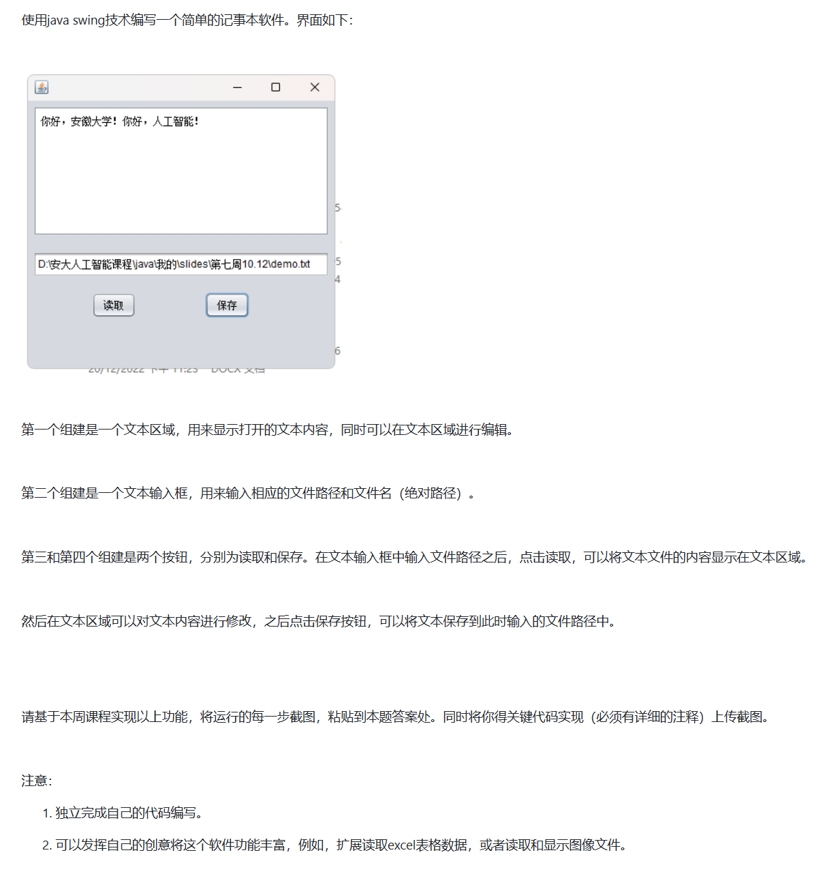
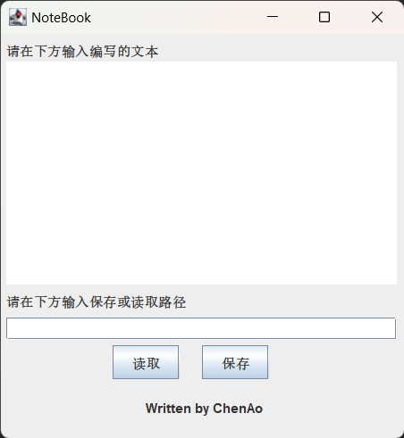
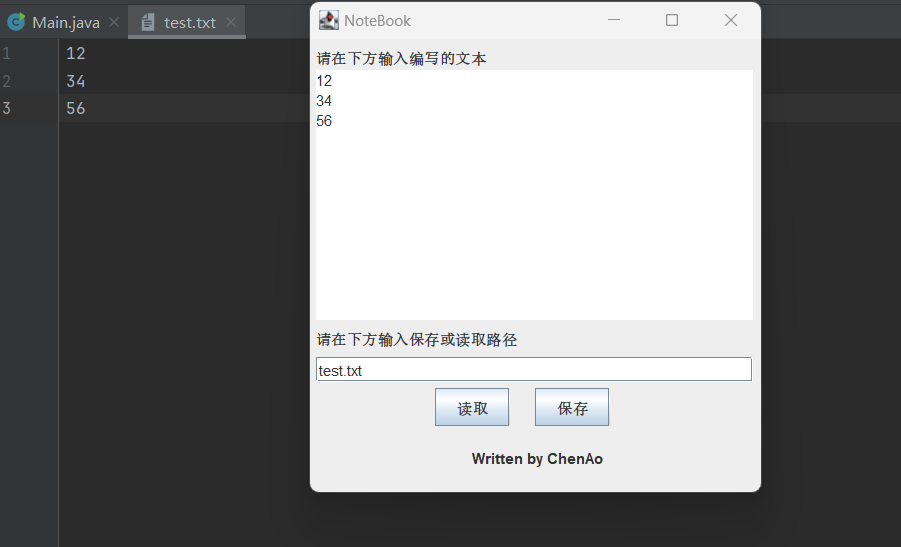
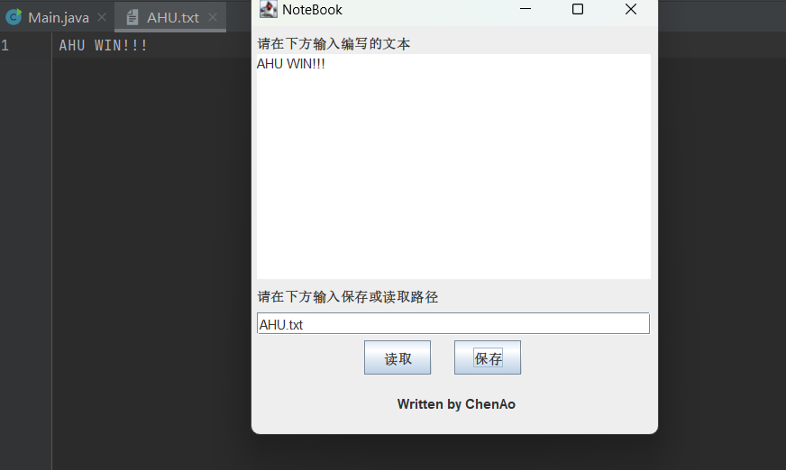

# 记事本软件
## 题目要求

## 效果截图
打开窗口效果图

读取文件效果图

保存文件效果图

## 程序设计
### file.java
这个类主要实现对文件的读取，通过对文件读取进行进一步封装，能够更好适应我的需求
```
import java.io.*;

public class file {
    private String file_path;

    public file(String file_path) {
        this.file_path = file_path;
    }

    String read() {
        String readStr = "";
        try {
            String str;
            BufferedReader in = new BufferedReader(new FileReader(this.file_path));
            while ((str = in.readLine()) != null) {
                readStr += str;
                readStr += '\n';
            }
        } catch (IOException e) {

        }
        return readStr;
    }

    void write(String str) {
        try {
            BufferedWriter out = new BufferedWriter(new FileWriter(this.file_path));
            out.write(str);
            out.close();
        } catch (IOException e) {

        }
    }
}
```
### NoteBookFrame.java
这个类主要进行窗口的实现
首先，将需要的控件作为成员变量
```
 JPanel panel = new JPanel(); // 新建一个窗口
    JButton button_read = new JButton("读取");  //创建按钮读取
    JButton button_save = new JButton("保存");  //创建按钮保存

    JTextField pathTextField = new JTextField(20); //添加单行文本框控件,路径用
    JTextArea stringTextArea = new JTextArea(); //添加单行文本框控件，编写的文本用

    JLabel pathLabel = new JLabel("请在下方输入保存或读取路径");
    JLabel textLabel = new JLabel("请在下方输入编写的文本");

    JLabel copyrightLabel = new JLabel("Written by ChenAo");
```
然后在构造函数中将其逐一添加到容器中
```
 panel.add(button_read);
        panel.add(button_save);

        //添加文本框控件
        panel.add(pathTextField);
        panel.add(stringTextArea);

        // 标签添加到面板
        panel.add(pathLabel);
        panel.add(textLabel);
        panel.add(copyrightLabel);
```
按钮监视的添加与重写如下所示
```
//添加监视
        // 添加按钮监视
        button_read.addActionListener(new ActionListener_ButtonRead());
        button_save.addActionListener(new ActionListener_ButtonSave());

 // 保存监视控件
    class ActionListener_ButtonSave implements ActionListener{

        @Override
        public void actionPerformed(ActionEvent e) {
            file saveFile = new file(pathTextField.getText());// 读取路径文本框的内容作为写文件的路径
            saveFile.write(stringTextArea.getText()); // 读取内容文本框的内容并写入文件
        }
    }

// 读取监视控件
    class ActionListener_ButtonRead implements ActionListener{

        @Override
        public void actionPerformed(ActionEvent e) {
            file newFile = new file(pathTextField.getText()); // 读取路径文本框的内容作为读文件的路径
            stringTextArea.setText(newFile.read());  // 把文件读取到内容给文件文本框
        }
    }
```

最后，我选择进行手工布置控件位置，没有选择布局
>因为我懒得自己写布局器了
```
//手工进行布置
        panel.setLayout(null);// 禁用布局器
        textLabel.setBounds(5, 5, 200, 20);
        stringTextArea.setBounds(5, 25, 350, 200);
        pathLabel.setBounds(5, 230, 200, 20);
        pathTextField.setBounds(5, 255, 350, 20);
        button_read.setBounds(100, 280, 60, 30);
        button_save.setBounds(180, 280, 60, 30);
        copyrightLabel.setBounds(130,320,200,30);
```