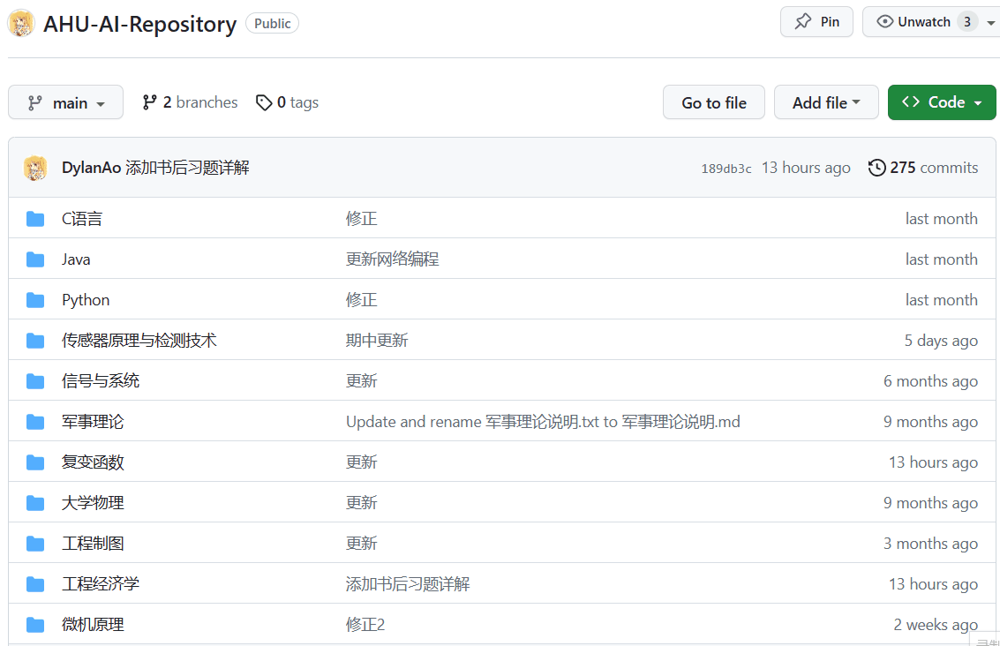
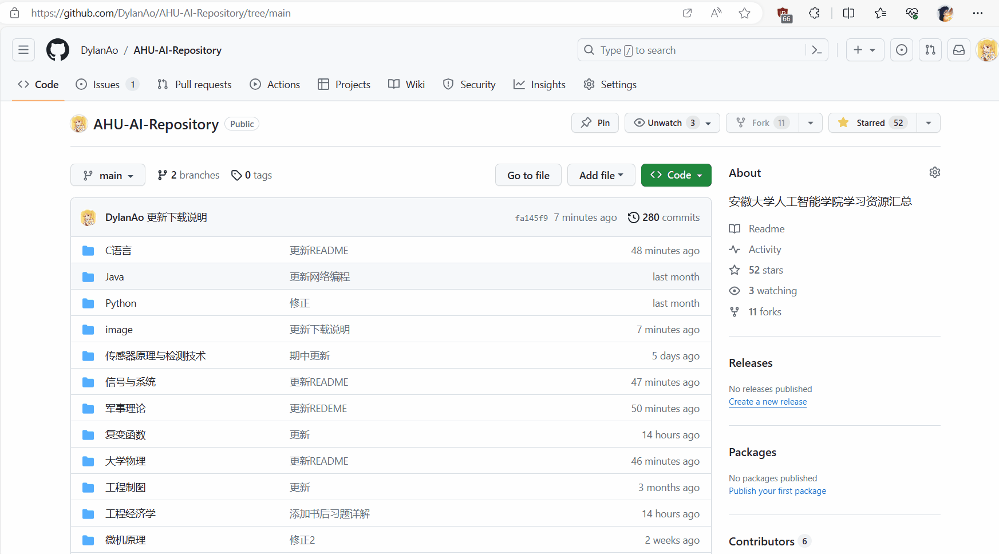
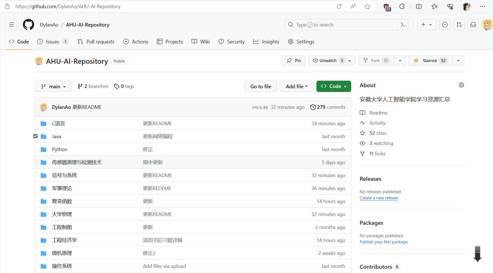
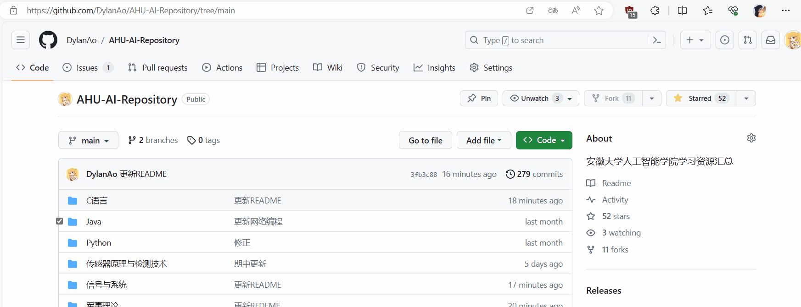
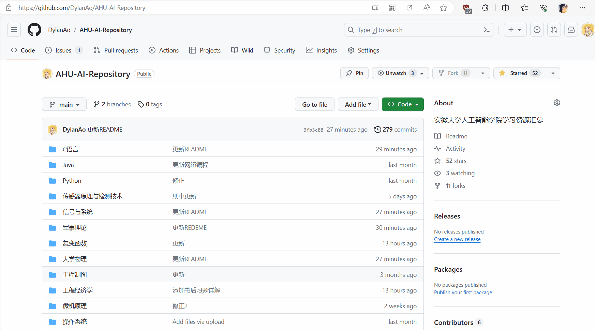

# AHU-AI-Repository&emsp;&emsp;安徽大学人工智能学院资源仓库

## 简介
这是一个致力于安徽大学人工智能学院学习交流的平台<br>
你也可以通过ao@aoaoaoao.cn来联系到我们<br>
#### 注意事项
近期我们发现，有人在**CSDN和gitcode**等平台分享或复制了本仓库，并且使用DylanAo这个账户名称，对此我们想说的有如下几点:<br>
1. 我们对分享本仓库持乐观态度，但是并**不希望**您用**DylanAo的名义**去分发本仓库
2. 本仓库在**任何情况下**都将会是**开源且免费的**，我们**不会**让您有偿去使用本仓库，如果在其他平台发现需要有偿使用，请擦亮眼睛，**谨防上当受骗**
3. 本仓库唯一发布地址是:github.com/DylanAo/AHU-AI-Repository，我们在**其他任何平台都不会发布本仓库**，也**不会使用 DylanAo的名称**
4. 我们对在其他平台上发布的本仓库**不负任何责任**，因为这**不是**我们发布的
#### 为什么要创建这个仓库？
我们不希望看到本应该公开的学习资料却被到处贩卖，拿来牟利<br>
我们不希望看到有人苦苦寻找资料却根本找不到<br>
我们希望所有人学习都应该是站在同一起跑线上的公平竞争<br>
#### 您可以对这个仓库做什么？
* 随便使用，下载仓库
* 上传并完善这个仓库(注意:不接受出版的电子书类)
* 修改代码，笔记的错误内容
* 免费，无条件的分享给其他同学
#### 我们想说明的有以下几点
* 所有资料仅供学习参考，并剔除过时且已经不适用资料
* 笔记类资料建议用VSCode打开，并安装md文件预览插件和LaTex插件
* **部分资料为其他学院资料,可能与本学院所授课程不符,仅供参考**
#### 如何加入我们？
请直接pr，看到后我会进行处理的<br>
若想要一起维护该仓库，可通过邮箱ao@aoaoaoao.cn联系我<br>
## 如何下载资料
#### 全部下载

#### 单个文件下载
这种方法需要直接点击每个文件，手动下载比较麻烦
>以上两种方法都不需要github账号


#### 部分下载
1. 在浏览器插件里面下载**GitZip for github**
   >推荐使用Edge或Chrome浏览器

   
2. 获取token，输入密码后会自动跳转回来，此时token就已经自动填好了<br>
   >注意:此步骤需要你有一个github账号，如果不进行此步，该插件也是可以使用，但是次数限制比较严重，可能无法完成正常下载<br>

   
3. 刷新一下仓库界面，此时文件夹或文件前面会有勾选框，勾选你要下载的文件，然后点击右下角箭头位置，即可完成下载
   
#### Git克隆
```git
git clone https://github.com/DylanAo/AHU-AI-Repository.git
```
## 关于各课程资料的说明
1. 未特殊标注的课程，均为机器人与人工智能都学习课程
2. 随着培养方案调整，不同课程学习时间、考核方式、内容难度可能略有出入
3. 本仓库只包含必修课以及部分专业选修课
### 杂项
* 目前尚未完善，主要包含以下内容：
* 一些在学习过程中可能用到的资料
  * VScode的基础配置文件:Cpp
  * Markdown速成手册
  * Git使用教程
  * 人工智能学院实验报告模板(手写用)
### 专业选修课
专业选修课是在大二开始开放选课，推荐在大四前全部修完，大部分课程会在大三开放选课<br>
从2022级开始，专业选修课实验学分要求从**4学分变为6学分**，请一定要注意合理安排课程<br>
* 专业选修课的笔记资料等(并不是全部专选)
  * PLC
  * MATLAB
  * Java
  * Python
  * 人机交互技术
  * 神经网络与深度学习(含实验教程及复习总结)
### 必修课
截止至2024.12.17有关必修课的调整:<br>
1. 从2024级开始，工程制图课程开课时间从大二下调整为大一上
2. 从2022级开始，python不再是默认导入的专选课，需要选课
#### 大一上
* 高数上:刷仓库内卷子
* C语言:多写书后作业的程序，或者去公开的oj等平台找题目/项目练习自学
* 工程制图(机器人):多做几遍练习册上题目，考试出原题，电子版在仓库中，可重复利用
#### 大一下
* 高数下:刷仓库内卷子
* 大物上:刷仓库内卷子
* 线性代数:刷仓库内卷子
* 数据结构:多理解原理，多写程序
#### 大二上
* 大物下:刷仓库内卷子
* 概率论:刷仓库内卷子
* 复变函数:记住主要公式，刷仓库卷子
* 离散上:仓库卷子与考试题目不匹配，建议练熟课后习题(考试出原题)，并去找教材对应辅练习(会刷到原题)或者是其他教辅(也会有原题)
* 电路与模电(机器人专核、人工智能必修专选):机器人起期末闭卷考试，人工智能期末不考试
* 数电(人工智能):理解知识，刷仓库卷子(部分题目超出考试范围)
* 凸优化(人工智能):课程很难
#### 大二下
* 离散下:仓库卷子与考试侧重点不匹配，建议练熟课后习题(考试出原题)，并去找教材对应辅练习(会刷到原题)或者是其他教辅(也会有原题)
* 数字信号处理(人工智能):
* 计算机组成原理(人工智能):
* 程序设计与算法课程(人工智能):就是将数据结构学到东西应用，写个程序，可看仓库中代码
* 信号与系统(机器人):做懂课后作业，刷仓库卷子(部分题目超出考试范围)
* 数电(机器人):与人工智能大二上课程完全相同，理解知识，刷仓库卷子(部分题目超出考试范围)
* 机械学基础(机器人):相信张老师，张老师为了你不挂科已经做出很大努力了。你可以一节课都不听，但是**重点一定要背**
#### 大三上
* 计算机网络(人工智能): 计网知识点多且杂，可以参考机器工业出版社的自顶向下方法同步学习
* 操作系统(人工智能): 着重在掌握不同类型的系统之间的特性和区别、进程的原语操作、调度算法（进程调度、作业调度）、存储模式（虚拟存储器/存储器的段页式存储等）、银行家算法即安全性检测
* 机器学习(人工智能):
* 智能控制理论(人工智能):不是宋军就是win（自求多福）  
* 程序设计与算法课程(机器人):与人工智能大二下的课程完全相同，可看仓库中代码
* 自动控制原理(机器人):仓库内笔记可大致梳理知识点，难是一定的，但是找到主线就会很简单。请放心，考试不会出很难的题。
* 微机原理(机器人):与人工智能的计组类似，但没有那么多知识，上课速度快且杂，看仓库中笔记可大致梳理知识点。但是，考试是考试，会写汇编是汇编，要根据**考试重点来复习**。(不得不提及上课没讲但是重点有且考试中占很大分数后面几章内容了。请放心老师真的会捞你的，**只要认真复习就不会挂**)
* 传感器与检测技术(机器人):相信张老师，张老师为了你不挂科已经做出很大努力了。你可以一节课都不听，但是**重点一定要背**
* 工程经济学(机器人):考试很简单，但是闭卷，背好笔记即可(以后有可能是开卷)
#### 大三下
* 工程经济学(人工智能):和大三上机器人学的一样，看仓库内笔记写一下试卷就行
* 自然语言处理(人工智能):
* 计算机视觉(人工智能):
* 软件工程概论(人工智能):
* 机器学习课程设计(人工智能):
* 机器人运动控制(机器人):上课水中水，最后会画重点，配套B站视频BV1qr421t7V7
* 机器人视觉(机器人):重点画的太多，自求多福吧，会捞人
* 计算机控制系统(机器人):可以和自控对照学习，难度适中，期末有重点，配套B站视频BV15C411G7Po
* 机器人机械与结构设计(机器人):期末画重点，全覆盖，背好重点即可
#### 大四上
* 人工智能伦理与安全(人工智能):
* 计算机视觉课程设计(人工智能):
* 只能系统设计与英语综合实践(人工智能):
* 微机原理与嵌入式系统课程设计(机器人):可以查看仓库中代码，利用`ahuai51`库
* 智能机器人系统综合训练(机器人):完成指定任务，需要进行汇报
## 写在最后
如果你觉得资料对你有帮助的话，别忘记点个Star⭐<br>
如果有任何疑问、建议，可直接在issue里面提及，或者给我发邮件(ao@aoaoaoao.cn)，我会尽快回复的<br>
同时，欢迎加入我们，积极上传资料(直接PR即可)<br>
