                                                                
# AoChat
## 基本操作与设置
### 进入AoChat
双击AoChat.exe进入软件，软件主界面默认如下图所示。

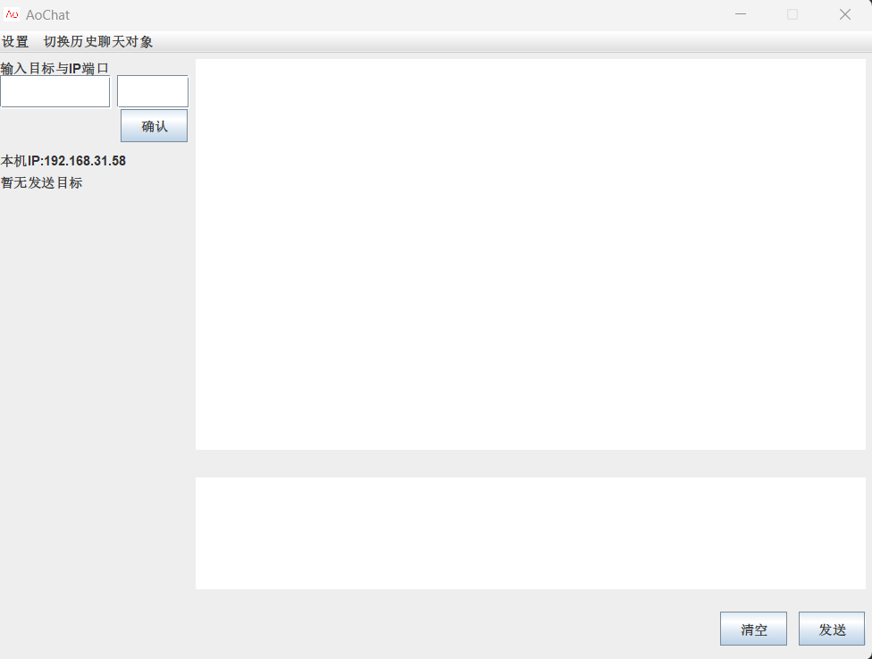
### 退出Aochat
方法一：点击软件右上角叉号退出AoChat 
方法二：
1. 点击左上角菜单栏中“设置”选项。
2. 点击二级设置栏中“退出”选项，即可退出AoChat。
### 查看AoChat软件基本信息
1. 点击左上角菜单栏中“设置”选项。

2\. 点击二级设置栏中“关于AoChat”选项，即可查看基本信息。如下图所示。

3\. 点击弹窗中“确认”按钮即可退出基本信息界面。

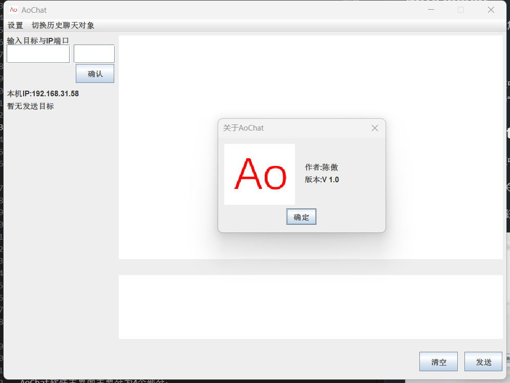
### 改变AoChat主题
您若是对AoChat默认主题不喜欢，可选择更换AoChat主题。
1. 点击左上角菜单栏中“设置”选项。
2. 点击二级设置栏中“关于主题”选项。
3. 点击三级主题栏中“亮灰色”、“灰色”、“橙色”，即可更换对应颜色主题。下图展示AoChat橙色主题。
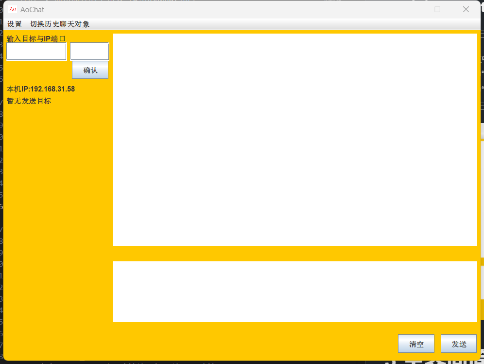

1. 右下侧聊天信息输入部分
## 聊天
### 新建聊天对象
#### 新建聊天对象步骤
1. 点击AoChat主界面IP地址输入框，输入IP地址
2. 点击AoChat主界面端口地址输入框，输入端口地址。在AoChat中，收取端口地址为8888，为保证对方正确收取信息，此处建议您填写8888。
3. 点击AoChat主界面中“确认”按钮。下方展示正确填写示意图。 
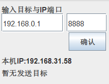
#### 正确填写
若您正确的填写IP地址与端口并按下“确认”按钮，AoChat主界面在左侧会展示出您刚刚所填写的信息。如下图所示。
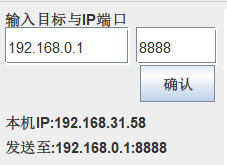
#### 错误填写提示
1. 若您错误的填写了IP地址信息，您会收到如下图所示警告弹窗提示 
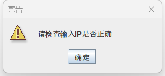

2. 若您错误的填写了端口地址信息，您会收到如下图所示警告弹窗提示 
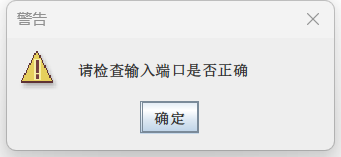

### 聊天信息的发送
#### 输入聊天信息并发送
1. 点击AoChat主界面右下侧聊天信息输入框，输入您要发送聊天信息。
2. 点击AoChat主界面右下角“发送”按钮，发送聊天信息。若您操作正确，您的聊天信息输入框内信息将会在聊天信息展示部分所展示，并同时会清空聊天信息输入框内容。正确的结果如下图所示。
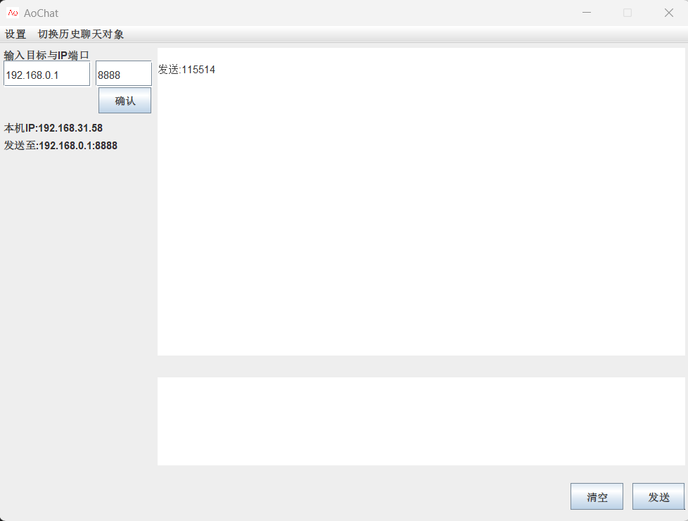

#### 由于IP或端口地址填写错误而引发的发送错误提示**
若您未能正确填写IP或端口地址信息，而直接尝试发送聊天信息，您会收到如图所示警告弹窗提醒。
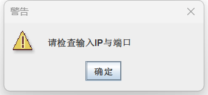
### 切换聊天对象
#### 通用的切换聊天对象
请依照“新建聊天对象”中步骤进行切换聊天对象。此方法适用于切换到新的聊天对象进行聊天和切换到历史聊天对象聊天。
#### 快速切换历史聊天对象
点击AoChat主界面最上方菜单栏中”切换历史聊天对象”，在弹出二级菜单栏中点击您要聊天的历史聊天对象，点击弹窗中“确认按钮”，即可完成切换。 
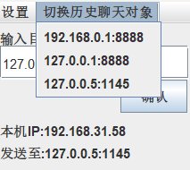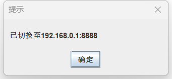
 
若您没有历史聊天对象，则AoChat会展示下图所示菜单栏。 
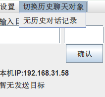
### 接收聊天信息
只要您AoChat软件运行，AoChat软件就会一直为您接收聊天信息。接收到新的聊天信息会展示在AoChat主界面右侧聊天信息展示部分，同时也会为您展示消息的发送方。下图是接收到消息的示例图。
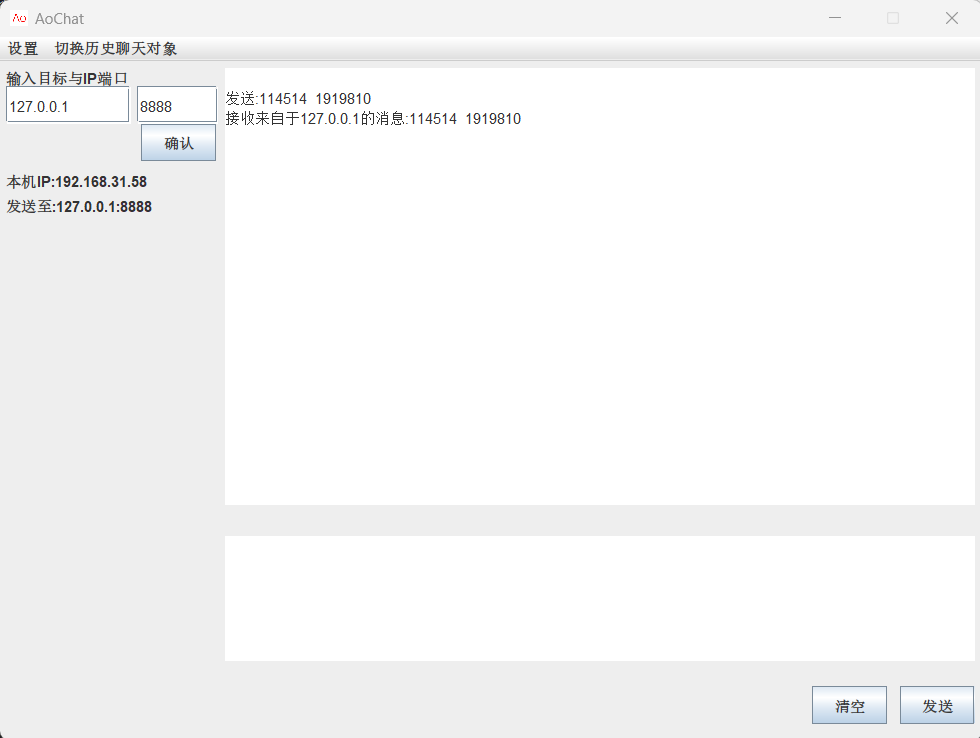

## 清空聊天信息
若您不想看到太多的聊天信息，可以点击AoChat主界面的右下角的”清空”按钮即可清空全部聊天信息。 
注意：AoChat并不保存任何聊天信息，清空后聊天信息不可恢复。
