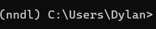
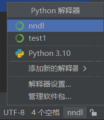
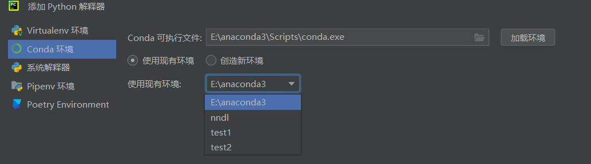
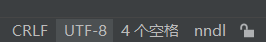
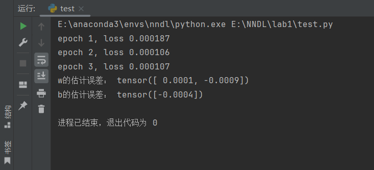
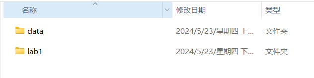
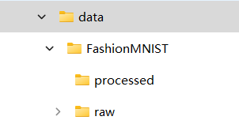
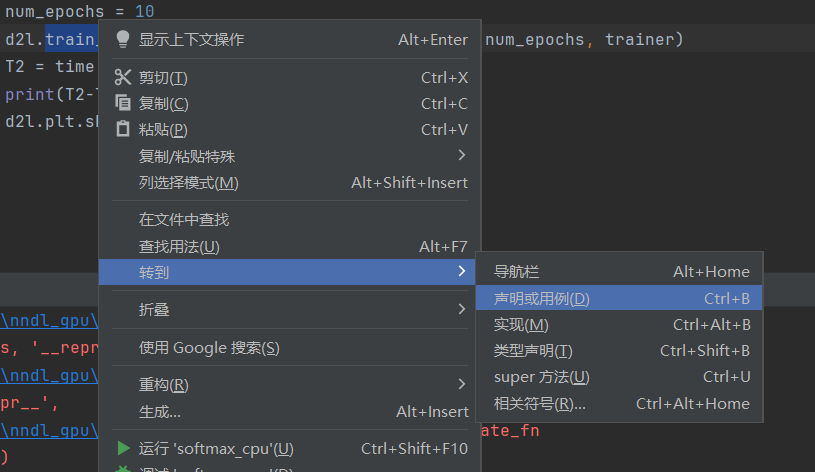
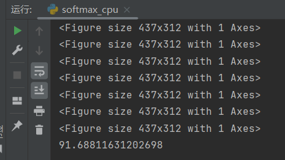
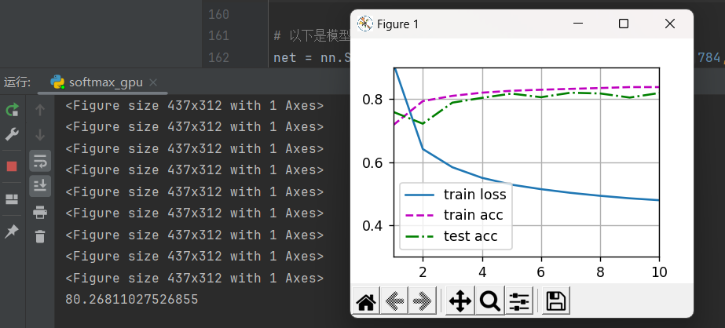

# NNDL实验1教程
By 陈傲 2024.5.22
本教程开源仓库地址:https://github.com/DylanAo/AHU-AI-Repository
在专业选修课->NNDL文件夹中可查看下载
>不建议你直接在github中查看md文件，因为有格式错误，建议你在vscode中安装插件查看，或下载PDF版本。同时也也不建议你直接复制PDF里面的代码，这回导致缩进错误，建议复制md文件中代码
## anaconda与pycharm
Q:什么是ananconda？
E:用于管理python环境。

Q:什么是python环境？
E:简单理解，在你使用python时候你可能需要按照不同的包，需要不同的python版本。

Q:为什么要用管理python环境？
E:在做实验时候，你会发现他们可能会发送冲突，那我不能手动管理这些东西吧。anaconda可以帮助你配置独立的虚拟环境，在你做不同实验时候就可以切换到不同的虚拟环境，他们之间互不干扰。

Q:pycharm是什么？
E:他是IDE，即集成开发环境，能够帮助你更好的写代码，运行代码。

## anaconda配置与使用
## 需要软件
1. anaconda
    ```
    https://www.anaconda.com/
    ```
2. pycharm
    ```
    https://www.jetbrains.com/pycharm/download/?section=windows
    ```
3. vscode(为了更好用jupyter，如果你pycharm用pro版，请忽略它，此处你可以不用管他)
    ```
    https://code.visualstudio.com/
    ```
**注意:请牢记上述软件的安装地址**
所有软件的安装非常简单，除了安装地址以外，你不需要修改任何东西，请一直点击下一步
### 使用anaconda
作为一名优秀的人工智能学院学生，我们非常鄙视使用图形化界面的教程，在这里十分推荐你使用命令行操作(图形化我也不会)

1. 你可以在cmd中输入命令，只不过这需要在你电脑里面配置环境变量
2. 如果你不想搞这么麻烦，可以在Anaconda powershell运行命令，二者效果完全一样。

#### 环境变量配置
如果你不打算用cmd使用命令，那么就不用看这部分内容

你需要在电脑中编辑环境变量，选择path并新建，方便我们在cmd中使用conda命令
在示例中，anaconda安装地址如下:E:\anaconda3
```
# 这是要新建的两条环境变量
E:\anaconda3  # 你anaconda安装地址
E:\anaconda3\Script  # 前一部分替换为anaconda安装地址
```
###  使用anaconda配置虚拟环境
请打开cmd或者Anaconda powershell进行下面的操作
``` 
conda create -n nndl python=3.9
# conda create 表示你要创建新的conda虚拟环境
# -n 后面是你虚拟环境的名字，这里我们起名为nndl，你可以起任何你喜欢的名字
# python=3.9 表示我们要安装3.9版本的python
```
虚拟环境只需要创建一次即可，当年想用虚拟环境时请输入以下命令:
```
conda activate nndl #nndl为创建环境中的名字
```
如果你成功创建并进入环境，那么你的命令提示行前面会出现你的环境名字，在此处为(nndl)，如图所示


至此你已经成功配置了虚拟环境，也成功进入了虚拟环境

下面我们要安装我们需要用到的python包，请运行以下两行命令，并等待安装完成
```
pip install torch==2.0.0 torchvision==0.15.1 -i https://pypi.tuna.tsinghua.edu.cn/simple

pip install d2l==1.0.3 -i https://pypi.tuna.tsinghua.edu.cn/simple

# pip install 是安装包的命令
# torch==2.0.0 torchvision==0.15.1是我们要安装的包并且指定了固定的版本
# -i https://pypi.tuna.tsinghua.edu.cn/simple指定了镜像的清华源，方便我们加速下载(实测非常快)
```
## 在pycharm中使用已经配置的anaconda环境
打开pycharm，新建项目，请牢记你新建项目的地址，此处你可以随便选择python解释器

进入项目后，点击右下角右数第二个方块，其会弹出这样一个界面

选择添加新的解释器，添加本地解释器，点击弹出界面中的Conda环境
在Conda可执行文件中选择该路径下的conda.exe(此处我的anaconda安装地址为E:\anaconda3)
```
E:\anaconda3\Scripts\conda.exe
```
选择后点击加载环境，此时在**使用现有环境**下拉列表中可以看到我们刚才创建的名为nndl的虚拟环境，请选择他

至此，你的右下角python环境应该显示为nndl，这代表你设置成功

## 实验内容
### 简单的线性模型
在进行实验内容前，请你参考上述内容配置好conda环境，并且确保你pycharm中已经选择上你配置好的conda环境，然后再进行下述操作

请注意，你没有必要在每次使用时候都运行conda activate nndl命令，你用在修改当前环境时，如要安装新的包时，运行该命令，然后进行修改。其他情况下，你只需要在pycharm中写代码就好

首先，需要我们写一个简单的线性模型，他的全部代码如下，你可以复制到pycharm中(请注意，你可能需要创建一个python文件，然后再复制到里面)

```py
import numpy as np
import torch
from torch.utils import data
from d2l import torch as d2l
from torch import nn

true_w = torch.tensor([2, -3.4])
true_b = 4.2
features, labels = d2l.synthetic_data(true_w, true_b, 1000)


def load_array(data_arrays, batch_size, is_train=True):  #@save
    """构造一个PyTorch数据迭代器"""
    dataset = data.TensorDataset(*data_arrays)
    return data.DataLoader(dataset, batch_size, shuffle=is_train)


batch_size = 10
data_iter = load_array((features, labels), batch_size)

net = nn.Sequential(nn.Linear(2, 1))

net[0].weight.data.normal_(0, 0.01)
net[0].bias.data.fill_(0)

loss = nn.MSELoss()

trainer = torch.optim.SGD(net.parameters(), lr=0.03)

num_epochs = 3
for epoch in range(num_epochs):
    for X, y in data_iter:
        l = loss(net(X) ,y)
        trainer.zero_grad()
        l.backward()
        trainer.step()
    l = loss(net(features), labels)
    print(f'epoch {epoch + 1}, loss {l:f}')

w = net[0].weight.data
print('w的估计误差：', true_w- w.reshape(true_w.shape))
b = net[0].bias.data
print('b的估计误差：', true_b- b)
```
如果你真的配置好环境了，都没有任何问题后，点击运行会出现以下结果:(具体数值每个人可能都不一样)


下面我们来介绍一下代码究竟是什么意思，不过首先你需要了解什么是线性模型

线性模型，顾名思义在二维时候是线，三维时候是面，那么他就符合这样一个形式:
$$
y=W^Tx+b
$$
我们称$W$为权重，$b$为偏置，此处$W$和$x$均可以为矩阵，而$b$为常数，那么在此模型中给一个$x$我就有一个$y$

这一部分是在导入你用的包(不熟悉的请复习python基本知识)
```py
import numpy as np
import torch
from torch.utils import data
from d2l import torch as d2l
from torch import nn
```

这一部分他定义了真实的w值与b，请注意这里true_w为$2 \times 1$，也就是说我输入的是**2个x**才能等到一个结果y
```py
true_w = torch.tensor([2, -3.4])
true_b = 4.2
features, labels = d2l.synthetic_data(true_w, true_b, 1000)
``` 
此处调用d2l.synthetic_data函数，根据真实权重和偏置生成1000个合成数据的特征和标签，可以理解为生成了1000个真实的线上附近的数据(不是在线上)，每两个x对应一个y那种，作为我对训练集

此处定义一个函数load_array，用于创建数据加载器
```py
def load_array(data_arrays, batch_size, is_train=True):  #@save
    """构造一个PyTorch数据迭代器"""
   dataset = data.TensorDataset(*data_arrays)  
    # 使用TensorDataset创建一个数据集，其中*data_arrays表示将data_arrays解包为位置参数
    return data.DataLoader(dataset, batch_size, shuffle=is_train)  
    # 返回一个DataLoader对象，用于批量加载数据，并根据is_train参数确定是否打乱数据
```

``` py
batch_size = 10  
# 定义一个变量batch_size，表示每个批次的大小为10(我猜是要用小排量梯度下降)
  
data_iter = load_array((features, labels), batch_size)  
# 调用load_array函数，根据features和labels以及batch_size创建一个数据加载器，并将其赋值给data_iter
```
那么他有什么用呢？当你用迭代器时候`next(iter(data_iter)) `，他就可以返回你的数据了

次数定义一个神经网络模型net，它包含一个线性层，输入特征数为2，输出特征数为1，输入特征数就是你输入的x个数，前面我们已经提到了为什么是2，输入特征数为最后输出y的个数
```py
net = nn.Sequential(nn.Linear(2, 1))
```
下面是对你定义的网络进行一些初始化操作:
``` py
net[0].weight.data.normal_(0, 0.01)  
# 将net中第一个线性层的权重初始化为均值为0、标准差为0.01的正态分布，即初始化权重
  
net[0].bias.data.fill_(0)  
# 将net中第一个线性层的偏置初始化为0，即初偏置
```

以下都是神经网络中常见的概念，不过多介绍，如果你不懂好好想想你理论课干什么了
``` py 
loss = nn.MSELoss()  
# 定义一个均方误差损失函数对象loss  
  
trainer = torch.optim.SGD(net.parameters(), lr=0.03)  
# 定义一个随机梯度下降优化器trainer，用于更新net中的参数，学习率lr设置为0.03  
```
```py
num_epochs = 3  
# 定义一个变量num_epochs，表示训练的轮数（即遍历整个数据集的次数）为3

for epoch in range(num_epochs):  
    # 开始训练循环  
    for X, y in data_iter:  
        # 对于每个批次的数据  
        l = loss(net(X) ,y)  
        # 计算预测值与实际值之间的均方误差损失  
        trainer.zero_grad()  
        # 在开始反向传播之前，清零所有参数的梯度 
        l.backward()  
        # 执行反向传播，计算参数的梯度  
        trainer.step()  
        # 根据梯度更新模型的参数  
    l = loss(net(features), labels)  
    # 在每个epoch结束时，即每完成一次全部数据集的训练时，计算整个数据集上的损失
    print(f'epoch {epoch + 1}, loss {l:f}')  
    # 打印当前epoch和对应的损失值
```  
接下来相对于是输出最终训练的结果，就是输出训练后$W$和$b$的值与真实$W$和$b$的值之间的差
``` py
w = net[0].weight.data  
# 获取net中第一个线性层的权重值，并赋值给w。  
print('w的估计误差：', true_w - w.reshape(true_w.shape))  
# 打印权重的估计误差，即将真实权重与估计权重相减。  
b = net[0].bias.data  
# 获取net中第一个线性层的偏置值，并赋值给b  
print('b的估计误差：', true_b - b)  
# 打印偏置的估计误差，即将真实偏置与估计偏置相减
```

### GPU版本
如果你配置好了pytorch GPU版本，可以使用以下代码
```py
import torch
from torch.utils import data
from d2l import torch as d2l
from torch import nn
import time

device = torch.device('cuda:0')
T1 = time.time()
true_w = torch.tensor([2, -3.4])
true_b = 4.2
features, labels = d2l.synthetic_data(true_w, true_b, 1000)
if torch.cuda.is_available():
    features = features.to(device)
    labels = labels.to(device)


def load_array(data_arrays, batch_size, is_train=True):
    dataset = data.TensorDataset(*data_arrays)
    return data.DataLoader(dataset, batch_size, shuffle=is_train)


batch_size = 10
data_iter = load_array((features, labels), batch_size)

net = nn.Sequential(nn.Linear(2, 1))
net = net.to(device)
net[0].weight.data.normal_(0, 0.01)
net[0].bias.data.fill_(0)

loss = nn.MSELoss()

trainer = torch.optim.SGD(net.parameters(), lr=0.03)

num_epochs = 3
for epoch in range(num_epochs):
    for X, y in data_iter:
        X = X.to(device)
        y = y.to(device)
        l = loss(net(X), y)
        trainer.zero_grad()
        l.backward()
        trainer.step()
    l = loss(net(features), labels)
    print(f'epoch {epoch + 1}, loss {l:f}')

w = net[0].weight.data
print('w的估计误差：', true_w.to(device) - w.reshape(true_w.shape))
b = net[0].bias.data
print('b的估计误差：', true_b - b)
T2 = time.time()
print(T2 - T1)
```
## SoftMax分类
请注意，书上的3.4节你完全可以不用看，3.4节目的是叫你如何手搓一个Softmax，实际上在书中有配套的包已经封装好你需要的函数了，即直接做3.5节即可
以下是CPU版本
```py

import time

import torch
from torch import nn
from d2l import torch as d2l


batch_size = 256
train_iter, test_iter = d2l.load_data_fashion_mnist(batch_size)

net = nn.Sequential(nn.Flatten(), nn.Linear(784, 10))


def init_weights(m):
    if type(m) == nn.Linear:
        nn.init.normal_(m.weight, std=0.01)

T1 = time.time()
net.apply(init_weights)

loss = nn.CrossEntropyLoss(reduction='none')

trainer = torch.optim.SGD(net.parameters(), lr=0.1)

num_epochs = 10
d2l.train_ch3(net, train_iter, test_iter, loss, num_epochs, trainer)
T2 = time.time()
print(T2-T1)
d2l.plt.show()
```

### 你可能遇到的问题
1. 运行后你会发现你在下载资源，而且速度非常慢，你可以选择挂梯子加速下载，或者从百度网盘处下载:
    ```
    链接：https://pan.baidu.com/s/1JCSffVSq8nXgc5NqTSIMgA 
    提取码：wdkm 
    ```
    将从百度网盘下载的压缩包放到与你项目同属一个目录下的data文件夹中(你可能需要新建data文件夹)
    此处，我的lab1文件夹为项目的文件夹，你的data文件夹应该与他在一起
    
    在data文件夹中解压缩`FashionMNIST.zip`
    注意你需要删除的解压缩路径中的`FashionMNIST`，即从`E:\NNDL\data\FashionMNIST`改为`E:\NNDL\data`，否则可能会出现读不到数据的情况
    你文件夹结构应该是这样的，注意不要有双层`FashionMNIST`文件夹
    

2. 运行后可能会报`找不到train_ch3错误`，这是因为我们下的的1.0.3版本d2l包已经删除了这个函数，所以我们要降级安装老版本
你需要打开cmd或conda powershell运行以下三条命令
    ```
    conda activate nndl
    pip uninstall train_ch3
    pip install d2l==0.17.5 --user -i https://pypi.tuna.tsinghua.edu.cn/simple
    ```
3. 运行后你可能会报类似这样的错误`RuntimeError: DataLoader worker (pid(s) 4352, 34284, 66128, 21968) exited unexpectedly`，请
    请选中train_ch3，并右键转到声明或用例
    
    请将206行的`return 4`修改为`return 0`(就是这个下面函数的返回值)
    ```py
    def get_dataloader_workers():
    """Use 4 processes to read the data.

    Defined in :numref:`sec_fashion_mnist`"""
    return 4 # 改为return 0
    ```
4. 你运行之后可能没有生成图像，亦或是画不出图，只显示`<Figure size 350x250 with 1 Axes>`，那么你需要请选中train_ch3，并右键转到声明或用例
    
    修改288行的`Animator`类为
    ```py
    class Animator:
    """For plotting data in animation."""
    def __init__(self, xlabel=None, ylabel=None, legend=None, xlim=None,
                 ylim=None, xscale='linear', yscale='linear',
                 fmts=('-', 'm--', 'g-.', 'r:'), nrows=1, ncols=1,
                 figsize=(3.5, 2.5)):
        """Defined in :numref:`sec_softmax_scratch`"""
        # Incrementally plot multiple lines
        if legend is None:
            legend = []
        d2l.use_svg_display()
        self.fig, self.axes = d2l.plt.subplots(nrows, ncols, figsize=figsize)
        if nrows * ncols == 1:
            self.axes = [self.axes, ]
        # Use a lambda function to capture arguments
        self.config_axes = lambda: d2l.set_axes(
            self.axes[0], xlabel, ylabel, xlim, ylim, xscale, yscale, legend)
        self.X, self.Y, self.fmts = None, None, fmts

    def add(self, x, y):
         # Add multiple data points into the figure
         if not hasattr(y, "__len__"):
             y = [y]
         n = len(y)
         if not hasattr(x, "__len__"):
             x = [x] * n
         if not self.X:
             self.X = [[] for _ in range(n)]
         if not self.Y:
             self.Y = [[] for _ in range(n)]
         for i, (a, b) in enumerate(zip(x, y)):
             if a is not None and b is not None:
                 self.X[i].append(a)
                 self.Y[i].append(b)
         self.axes[0].cla()
         for x, y, fmt in zip(self.X, self.Y, self.fmts):
             self.axes[0].plot(x, y, fmt)
         self.config_axes()
         display.display(self.fig)
         plt.draw()
         plt.pause(0.001)
         display.clear_output(wait=True)
    ```

### GPU版本
如果你配置好了pytorch GPU版本，可以直接使用以下代码
```py
import time

import torchvision
from torch.utils import data
from torchvision import transforms
import torch
from torch import nn
from d2l import torch as d2l
from IPython import display
from matplotlib import pyplot as plt
device = torch.device('cuda:0')

class Animator:
    """For plotting data in animation."""
    def __init__(self, xlabel=None, ylabel=None, legend=None, xlim=None,
                 ylim=None, xscale='linear', yscale='linear',
                 fmts=('-', 'm--', 'g-.', 'r:'), nrows=1, ncols=1,
                 figsize=(3.5, 2.5)):
        """Defined in :numref:`sec_softmax_scratch`"""
        # Incrementally plot multiple lines
        if legend is None:
            legend = []
        d2l.use_svg_display()
        self.fig, self.axes = d2l.plt.subplots(nrows, ncols, figsize=figsize)
        if nrows * ncols == 1:
            self.axes = [self.axes, ]
        # Use a lambda function to capture arguments
        self.config_axes = lambda: d2l.set_axes(
            self.axes[0], xlabel, ylabel, xlim, ylim, xscale, yscale, legend)
        self.X, self.Y, self.fmts = None, None, fmts

    def add(self, x, y):
     # Add multiple data points into the figure
         if not hasattr(y, "__len__"):
             y = [y]
         n = len(y)
         if not hasattr(x, "__len__"):
             x = [x] * n
         if not self.X:
             self.X = [[] for _ in range(n)]
         if not self.Y:
             self.Y = [[] for _ in range(n)]
         for i, (a, b) in enumerate(zip(x, y)):
             if a is not None and b is not None:
                 self.X[i].append(a)
                 self.Y[i].append(b)
         self.axes[0].cla()
         for x, y, fmt in zip(self.X, self.Y, self.fmts):
             self.axes[0].plot(x, y, fmt)
         self.config_axes()
         display.display(self.fig)
         plt.draw()
         plt.pause(0.001)
         display.clear_output(wait=True)

# 以下是GPU训练函数


class Accumulator:
    """For accumulating sums over `n` variables."""
    def __init__(self, n):
        """Defined in :numref:`sec_softmax_scratch`"""
        self.data = [0.0] * n

    def add(self, *args):
        self.data = [a + float(b) for a, b in zip(self.data, args)]

    def reset(self):
        self.data = [0.0] * len(self.data)

    def __getitem__(self, idx):
        return self.data[idx]


def accuracy(y_hat, y):
    """Compute the number of correct predictions.

    Defined in :numref:`sec_softmax_scratch`"""
    if len(y_hat.shape) > 1 and y_hat.shape[1] > 1:
        y_hat = d2l.argmax(y_hat, axis=1)
    cmp = d2l.astype(y_hat, y.dtype) == y
    return float(d2l.reduce_sum(d2l.astype(cmp, y.dtype)))


def evaluate_accuracy(net, data_iter):
    """Compute the accuracy for a model on a dataset.

    Defined in :numref:`sec_softmax_scratch`"""
    if isinstance(net, torch.nn.Module):
        net.eval()  # Set the model to evaluation mode
    metric = Accumulator(2)  # No. of correct predictions, no. of predictions

    with torch.no_grad():
        for X, y in data_iter:
            X, y = X.to(device), y.to(device)
            metric.add(accuracy(net(X), y), d2l.size(y))
    return metric[0] / metric[1]


def train_epoch_ch3(net, train_iter, loss, updater):
    """The training loop defined in Chapter 3.

    Defined in :numref:`sec_softmax_scratch`"""
    # Set the model to training mode
    if isinstance(net, torch.nn.Module):
        net.train()
    # Sum of training loss, sum of training accuracy, no. of examples
    metric = Accumulator(3)
    for X, y in train_iter:
        # Compute gradients and update parameters
        X, y = X.to(device), y.to(device)
        y_hat = net(X)
        l = loss(y_hat, y)
        if isinstance(updater, torch.optim.Optimizer):
            # Using PyTorch in-built optimizer & loss criterion
            updater.zero_grad()
            l.mean().backward()
            updater.step()
        else:
            # Using custom built optimizer & loss criterion
            l.sum().backward()
            updater(X.shape[0])
        metric.add(float(l.sum()), accuracy(y_hat, y), y.numel())
    # Return training loss and training accuracy
    return metric[0] / metric[2], metric[1] / metric[2]


def train_ch3(net, train_iter, test_iter, loss, num_epochs, updater):
    """Train a model (defined in Chapter 3).

    Defined in :numref:`sec_softmax_scratch`"""
    animator = Animator(xlabel='epoch', xlim=[1, num_epochs], ylim=[0.3, 0.9],
                        legend=['train loss', 'train acc', 'test acc'])
    net = net.to(device)
    for epoch in range(num_epochs):
        train_metrics = train_epoch_ch3(net, train_iter, loss, updater)
        test_acc = evaluate_accuracy(net, test_iter)
        animator.add(epoch + 1, train_metrics + (test_acc,))
    train_loss, train_acc = train_metrics
    assert train_loss < 0.5, train_loss
    assert train_acc <= 1 and train_acc > 0.7, train_acc
    assert test_acc <= 1 and test_acc > 0.7, test_acc


# 以下是读取数据集部分

trans = transforms.ToTensor()
mnist_train = torchvision.datasets.FashionMNIST(
    root="../data", train=True, transform=trans, download=False)
mnist_test = torchvision.datasets.FashionMNIST(
    root="../data", train=False, transform=trans, download=False)

batch_size = 512
train_iter = data.DataLoader(mnist_train, batch_size, shuffle=True, num_workers=0)
test_iter = data.DataLoader(mnist_test, batch_size, shuffle=False, num_workers=0)

timer = d2l.Timer()


# 以下是模型部分
net = nn.Sequential(nn.Flatten(), nn.Linear(784, 10))


def init_weights(m):
    if type(m) == nn.Linear:
        nn.init.normal_(m.weight, std=0.01)

T1 = time.time()
net.apply(init_weights)

loss = nn.CrossEntropyLoss(reduction='none')

trainer = torch.optim.SGD(net.parameters(), lr=0.1)

num_epochs = 10

train_ch3(net, train_iter, test_iter, loss, num_epochs, trainer)
T2 = time.time()
print(T2-T1)
d2l.plt.show()
```
#### 效果对比与展示
效果还是有的，速度要快上10s而且风扇也不转了
 

## 你可能需要的anconda命令
1. anaconda换源
    ```
    conda config --add channels https://mirrors.tuna.tsinghua.edu.cn/anaconda/pkgs/free/
    conda config --add channels https://mirrors.tuna.tsinghua.edu.cn/anaconda/pkgs/main/
    conda config --set show_channel_urls yes
    ```
2. 更改anaconda虚拟环境默认安装位置
    ```
    conda config --add envs_dirs E:\anaconda3\envs # 前一部分替换为anaconda安装地址
    ```

3. 查看anaconda配置信息
    ```
    conda info
    ```
4. 查看虚拟环境列表
    ```
    conda env list
    ```
5. 查看当前虚拟环境下安装的包
    ```
    conda list
    ```

6. 新建虚拟环境
    ```
    conda create -n yourname python=3.7
    ```
7. 启用虚拟环境
    ```
    conda activate yourname
    ```
8. 删除虚拟环境
    ```
    conda remove -n yourname --all
    ```
9. 安装/指定源安装
    ```
    pip install opencv-python -i https://pypi.tuna.tsinghua.edu.cn/simple
    conda install packgename -i https://pypi.tuna.tsinghua.edu.cn/simple
    ```