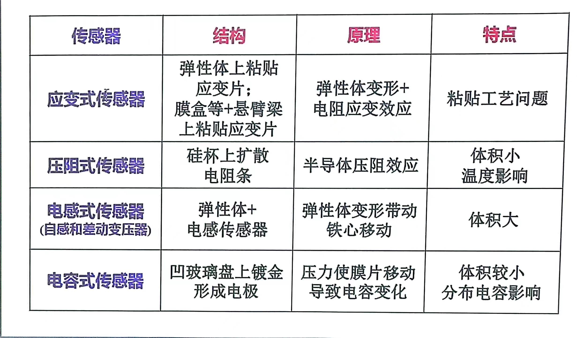

# 电容式传感器
## 工作原理
将被测物理量变成电容量变化

## 电容式传感器分类
### 变面积型
$$
C=\frac{\varepsilon_0 \varepsilon_r ab}{d} - \frac{\varepsilon_0 \varepsilon_r \Delta xb}{d}
$$
$a$:极版的长度
$d$:极板间距离
### 变介电常数型
#### 液体
$$
C=C_0+\frac{2\pi h (\varepsilon_1-\varepsilon)}{\ln \frac{D}{d}}
$$
$h$:液位的高度
$D$:外直径
$d$:内直径
$C_0$:初始电容,没液体时候
#### 插入极板
$$
C=\varepsilon_0 b_0\frac{\varepsilon_{r1}(L_0-L)+\varepsilon_{r2}L}{d_0}
$$
$$
\frac{\Delta C}{C_0}=\frac{(\varepsilon_{r2}-1)L}{L_0}
$$
$\varepsilon_{r2}$:插入极板的介电常数
$L$:插入极板的长度
$L_0$:极板整个常数
$d_0$:极板间间距
### 变间距型
$$
C=C_0+C_0\frac{\Delta_d}{d}
$$
>在间距变化量远小于初始间距时，可简化为上式
也是要求最大位移量应该**小于其间距的$\frac{1}{10}$**
## 等效电路
P86
$$
C_e = \frac{C}{1-\omega^2LC}
$$
$$
k_e = \frac{k_g}{(1-\omega^2LC)^2}
$$
## 测量电路
P86
## 应用
1. 电容式差压传感器
2. 电容式加速度传感器
3. 电容式振动位移传感器
4. 电容式物位移传感器
5. 容栅式传感器
## 总结
