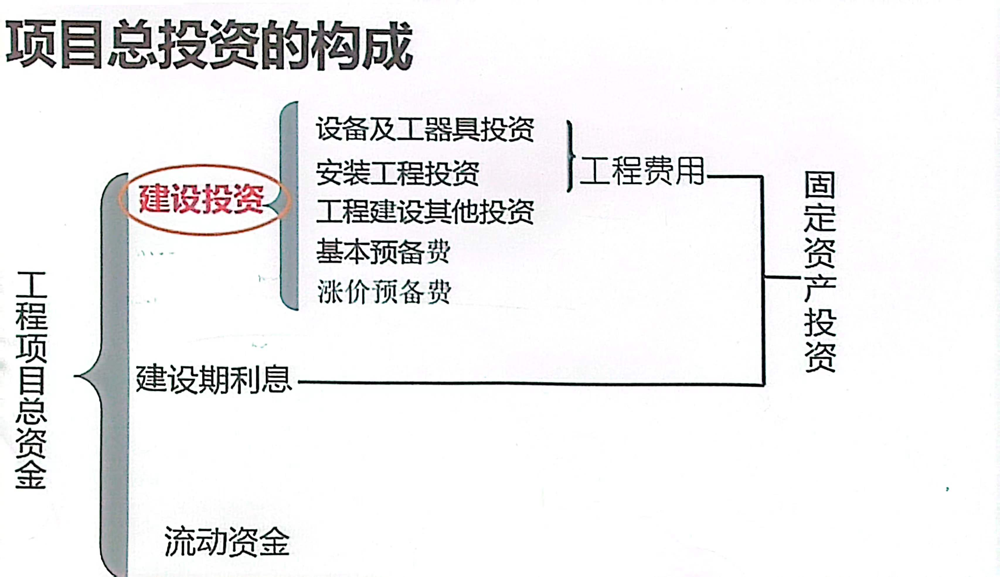

# 投资·成本·收入·税金·利润
## 投资
投资从狭义上来讲是值全部资金收入，广义上来讲是为收益而垫付的资金

投资是一个**动态**概念，投资总过程是**循环周转过程**，包含四个方面:
1. 投资形成或筹集
2. 投资分配
3. 投资实施或运用
4. 投资回收

### 投资的分类
直接投资:直接投入项目中，有一定的**经营制定权**
间接投资:不直接投入项目，买证券

固定资产投资:构建新固定资产或改造原有固定资产，即对基本建设投资和更新改造投资
滚动资产投资:购买原材料，燃料，动力，支付工资，是为了保证生产和经营中流动资金周转

长期投资:大于等于一年
短期投资:小于一年
### 项目投资构成

#### 建设投资
计算:概算法(因素计算法)
##### 工程建设其他投资
根据行业不同而不同，但属于是必须花费却不包含在工程费用中
* 土地使用费
* 与项目建设有关费用(研究实验，保险)
* 与未来企业生产有关费用
##### 预备费
* 基本预备费:可能出现，但又难以预料的支出
* 涨价预备费:应对涨价
#### 建设期借款利息
借款利息计入固定资产原值中
##### 计算方法
1. 借款在每年年中支用，当年使用建设资金借款按半年计算
2. 其余各年的按全年计息
   
* 可以及时还息
$$
各年利息 = (年初借款本金累计+\frac{本年借款金额}{2})\times名义年利率
$$
* 不可及时还息
$$
各年利息 = (年初借款本金累计+年初利息累计\frac{本年借款金额}{2})\times实际年利率
$$
#### 流动资金
在项目产前预先垫付，在投产后生成经营过程中用于买材料，燃料，备品，支付工资和其他费用以及在制品，半成品，成品间占用的周转资金

## 资产分类
1. 固定资产
2. 无形资产
   * 可辨认的:专利权，著作权等
   * 不可辨认的:商誉
3. 资动资产:现金，银行存款
4. 递延资产：人员工资，办公费，打印费等(可延续下去的)
   
## 利润
$$
利润 = 收入-成本-税金
$$
## 成本
运营期内产品所有的价值
### 划分
按生产要素计算
* 经营成本
* 折旧费，摊销费
* 利息支出

$$
总成本 = 固定成本 + 可变成本
$$
固定成本:与产量无关(计时工资，管理费，办公费等)
可变成本:与产量有关，成反比(燃料，计件工资等)
>分摊到**每一件商品上**，产量越多，每一件上分摊固定成本越少，而可变成本分摊数不变