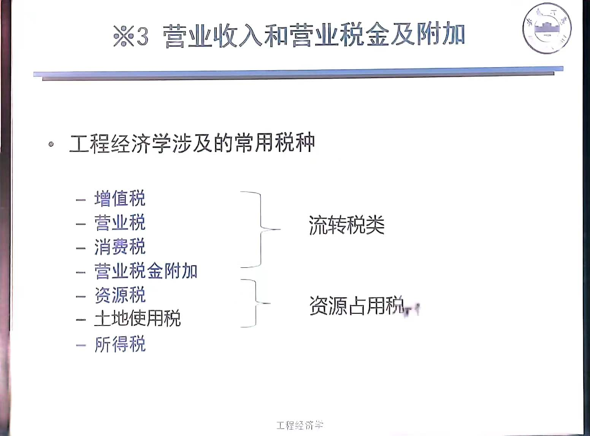
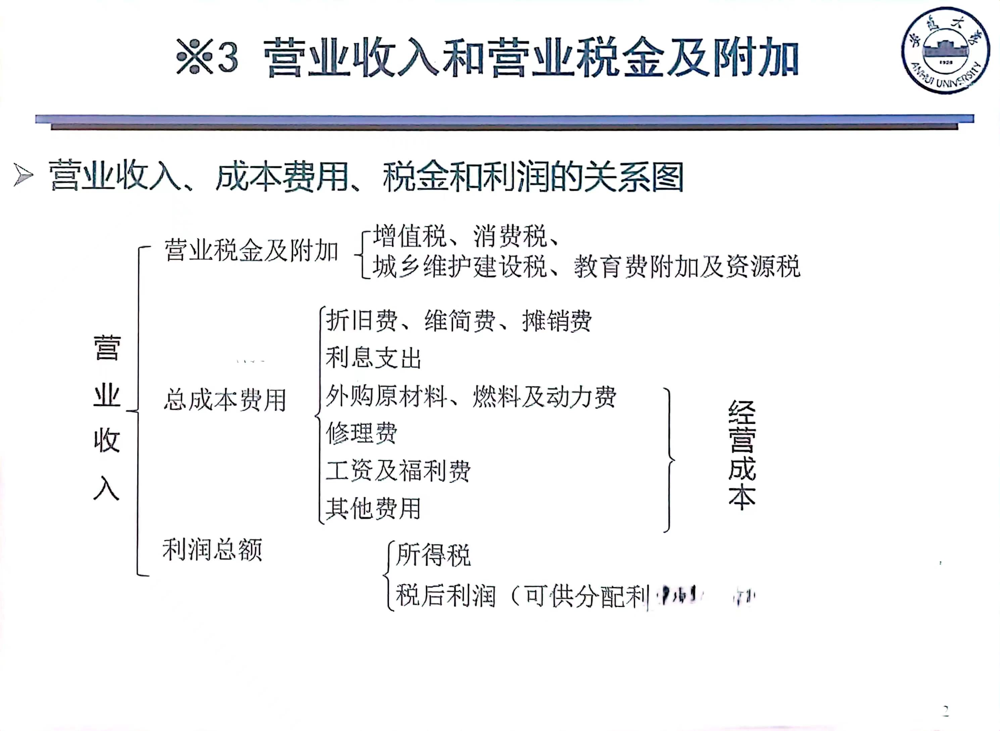

# 投资·成本·收入·税金·利润
## 投资
投资从狭义上来讲是值全部资金收入，广义上来讲是为收益而垫付的资金

投资是一个**动态**概念，投资总过程是**循环周转过程**，包含四个方面:
1. 投资形成或筹集
2. 投资分配
3. 投资实施或运用
4. 投资回收

### 投资的分类
直接投资:直接投入项目中，有一定的**经营制定权**
间接投资:不直接投入项目，买证券

固定资产投资:构建新固定资产或改造原有固定资产，即对基本建设投资和更新改造投资
滚动资产投资:购买原材料，燃料，动力，支付工资，是为了保证生产和经营中流动资金周转

长期投资:大于等于一年
短期投资:小于一年
### 项目投资构成

#### 建设投资
计算:概算法(因素计算法)
##### 工程建设其他投资
根据行业不同而不同，但属于是必须花费却不包含在工程费用中
* 土地使用费
* 与项目建设有关费用(研究实验，保险)
* 与未来企业生产有关费用
##### 预备费
* 基本预备费:可能出现，但又难以预料的支出
* 涨价预备费:应对涨价
#### 建设期借款利息
借款利息计入固定资产原值中
##### 计算方法
1. 借款在每年年中支用，当年使用建设资金借款按半年计算
2. 其余各年的按全年计息
   
* 可以及时还息
$$
各年利息 = (年初借款本金累计+\frac{本年借款金额}{2})\times名义年利率
$$
* 不可及时还息
$$
各年利息 = (年初借款本金累计+年初利息累计\frac{本年借款金额}{2})\times实际年利率
$$
#### 流动资金
在项目产前预先垫付，在投产后生成经营过程中用于买材料，燃料，备品，支付工资和其他费用以及在制品，半成品，成品间占用的周转资金

## 资产分类
1. 固定资产
2. 无形资产
   * 可辨认的:专利权，著作权等
   * 不可辨认的:商誉
3. 资动资产:现金，银行存款
4. 递延资产：人员工资，办公费，打印费等(可延续下去的)
   
## 利润
$$
利润 = 收入-成本-税金
$$
## 成本
运营期内产品所有的价值
### 划分
按生产要素计算
* 经营成本
* 折旧费，摊销费
* 利息支出

$$
总成本 = 固定成本 + 可变成本
$$

另一种划分
$$
总成本 = 经营成本 + 折旧、摊销费 + 利息支出
$$
固定成本:与产量无关(计时工资，管理费，办公费等)
可变成本:与产量有关，成反比(燃料，计件工资等)
>分摊到**每一件商品上**，产量越多，每一件上分摊固定成本越少，而可变成本分摊数不变

## 折旧
固定资产使用中，因不断的损耗而逐步丧失其使用价值，将这部分减损价值逐步转移到产品中，并入产品的销售的收入中回收过程叫折旧

固定资产原值(P):项目投产时按规定由投资形成固定资产部分
残值(L):固定资产报废后所能换取的剩余价值
折年限(N):使用年限
### 计算
### 平均年限法(直线法)
$$
年折旧率 = \frac{1 - 预计净残值率}{预计折旧年限}
$$
$$
年折折旧额 = 年折旧率 \times 原值
$$
> 缺点:
> 1. 没有考虑不同使用年限所产生经济效益不同
> 2. 没有考虑固定资产费用随使用年限增加而不断增大
### 工作量法
$$
每一工作量折旧 = \frac{固定资产原价\times(1-残值率)}{预计工作总量}
$$
$$
R = \frac{(P - L)}{M}
$$
M:工作量
R:单位工作量折旧额
### 加速折旧法
整个使用过程中，其能效是发生变化的
#### 双倍加速折旧法
1. 最后两年前
   $$
   年折旧率 = \frac{2}{预计使用年限}\times100\%
   $$
$$
年折折旧额 = 年折旧率 \times 固定资产期初净值
$$
2. 最后两年
   $$
   年折旧额 = \frac{固定资产净值 - 残值}{2}
   $$
#### 年数总和法
$$
第i年折旧率=\frac{尚可使用年数}{预计使用年数总和}=\frac{n-已使用年限}{1 + 2 +····+n}
$$
>注意:第一年是已使用年限是0，年折旧率逐年递减
## 收入
### 营业收入
* 销售产品或提供服务所获得收入
* 营业收入与产品或服务的销量和价格有关
$$
年营业收入 = 产品销售单价\times 产品年销售量
$$
### 补贴收入
* 与收益有关的政府补贴，如先征后返的增值税
* 按销量或工作量依据国家规定的补助定额计算并按期给予的定额补贴
* 政府财政扶持的定额补贴
## 税

### 增值税
增值税:就产品生产、流通、加工、维修过程的增值额征收的税
增值额:企业销售收入减去对应的材料费、商品成本的差额
$$
应纳税额 = 销向税额 - 进项税额
$$
$销向税额=销售额 \times 税率$
$进项税额=外购原材料、燃料等 \times税率$
### 营业税
转让无形资产或销售不动产的单位或个人就其营业额征收的税
* 交通运输，建筑，邮电通信，文化体育
* 金融保险，服务，转让土地使用权，专利权
* 娱乐业
$$
应纳营业额 = 营业额 \times 税率
$$
### 消费税
针对**特定消费品和消费行为**征收的税
从价定率计税:
$$
应纳税额 = 应税消费品的销售额 \times 税率
$$
从量定率计税:
$$
应纳税额 = 应税消费品的销售量 \times 单位税率
$$
### 教育附加税
$$
教育附加税 = (增值税 + 营业税 + 消费税) \times 税率
$$
### 城市维护建设税
$$
城市维护建设税 = (增值税 + 营业税 + 消费税) \times 税率
$$
### 资源税
$$
应纳税源税额 = 课税数量 \times 单位税额
$$
### 所得税
$$
税额 = 应纳税所得额 \times 所得税税率
$$
$应纳税所得额 = 收入总额 - 准予扣除的项目金额$
>一般工程分析中，税额按利润总额来进行计算
## 利润
$$
利润总额 = 销售收入 - 总成本费用 - 增值税营业税及附加
$$
$$
税后(净)利润 = 利润总额 - 所得税 
$$
$$
所得税 = 应纳税所得额 \times 所得税税率 = 利润总额 \times 所得税税率
$$
## 注意事项
1. 征消费税都要征增值税
2. 征增值税不会再征营业税
3. 征营业税不会再征增值税

