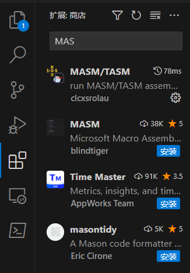
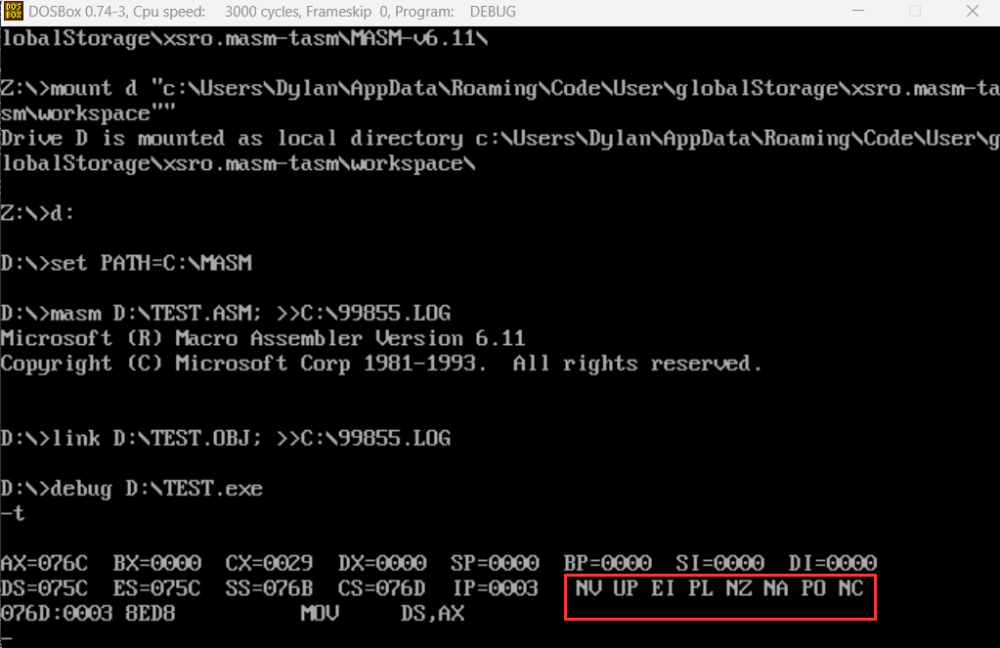

# 汇编快速上机教程
## 写在前面
本教程只包含如何配置环境和进行简单的调试操作，至于如何写一个汇编程序，并不在此教程范围内
关于如何写一个汇编程序，可以参考我的笔记，它在
https://github.com/DylanAo/AHU-AI-Repository
其中汇编语言程序设计基础讲述了一个汇编程序的基本结构是什么样的
其他指令和伪指令分散在其他章节
## 环境配置
1. 下载并，安装VSCODE，安装程序中选好安装到的位置，然后一直下一步即可
 https://code.visualstudio.com/
2. 打开VSCODE,点击左边第五个按钮扩展,搜索扩展并安装 Chinese
   如图所示第一个扩展，安装完成后，根据提**右下角**提示重启VSCODE
   
3. 搜索扩展并安装  MASM/TASM
   
4. 双击进入扩展界面，点击扩展设置，并按照如下截图配置
   
   

至此，环境已经配置完毕，下面告诉你如何使用VSCODE创建汇编源文件并运行
## VSCODE汇编简单上机教程
1. 菜单栏->文件->打开文件夹
   
   在弹出的窗口选择一个文件夹，这里建议新建一个文件夹，专门放汇编上机的内容

2. 点击左侧第一个按钮，打开资源管理器，右键刚才新建的文件夹，点击新建文件，将文件命名为HelloWord.asm
   
3. 将下段代码复制到刚才新建的文件中
```nasm
DATA SEGMENT
    STR DB "Hello Word!"
    LEN DW $ - STR
DATA ENDS

CODE SEGMENT
    ASSUME CS:CODE,DS:DATA

START:
    MOV AX,DATA
    MOV DS,AX
    
    MOV CX,[LEN]
    MOV BX,OFFSET STR
PRINT:
    MOV AH,02H
    MOV DL,[BX]
    INT 21H
    INC BX
    LOOP PRINT 

    MOV AH,4CH
    INT 21H
CODE ENDS
END START
```
4. Ctrl+S保存文件，然后右击空白处，选择运行当前程序
   
5. 打开的DOSBOX中会出现HelloWord!语句
   

至此，你已经学会如何使用VSCODE编写汇编程序了，下面是一些进阶级教程

## DEBUG
### 进入debug
Ctrl+S保存文件，然后右击空白处，选择调试当前程序，debug界面如下
   
   
### 命令
命令就是上图进入debug后输入的东西，输入命令后按回车即会执行
g：运行
t：单步运行
r：查看寄存器
d：查看内存
e：修改内存单元
q：退出debug
### 标志位
标志位就是图中红圈部分

debug中的标志位显示顺序位 
OF DF IF SF ZF AF PF CF

* OF 标志位(溢出) 
OF = 1, 显示为OV 
OF = 0, 显示为NV 


* DF 标志位(方向) 
DF = 0, 显示为UP 
DF = 1, 显示为DN 


* IF 标志位(中断) 
IF = 0，显示为DI 
IF = 1, 显示为EI 


* SF 标志位(符号位) 
SF = 1, 显示为NG, 表示负数 
SF = 0, 显示为PL, 表示为正数 


* ZF标志位(零标志) 
ZF = 1, 显示为ZR 
ZF = 0, 显示为NZ 


* AF标志位(半进位) 
AF = 0, 显示为NA 
AF = 1, 显示为AC 


* PF标志位(奇偶标志位) 
PF = 1, 显示为PE 
PF = 0, 显示为PO 


* CF 标志位(进位标志) 
CF = 1, 显示为 CY 
CF = 0, 显示为 NC 
