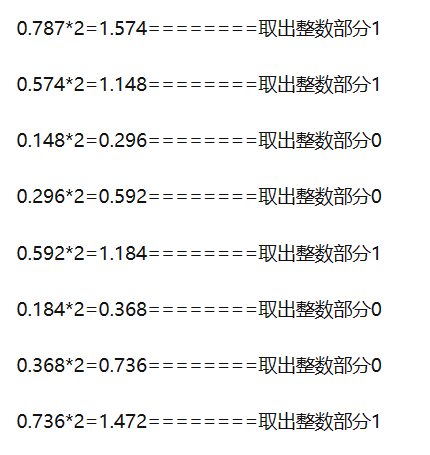
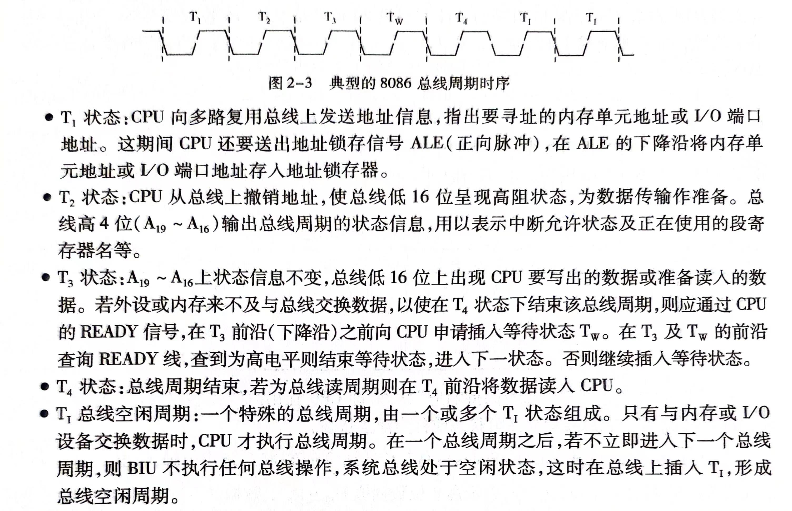
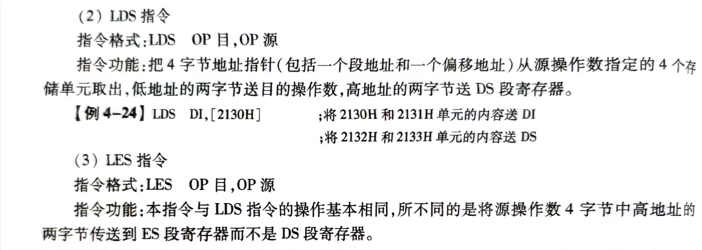

# 微机原理复习(杜库版)
### 进制的转换
十进制小数转二进制

### 正反补码
* 正数：正反补码相同
* 负数：反码取反，补码加1
  >符号位为1时(负数)，该数的绝对值为其余位取反加1，或减1取反
### 总线周期

最大最小模式在总线读取周期上相同，只是在最大模式下要同时考虑CPU发出的信号与总线控制器8288发出信号
### 标志寄存器
* OF 标志位(溢出) 
* DF 标志位(方向) 
DF = 0, 显示为UP，CLD
DF = 1, 显示为DN，STD
* IF 标志位(中断) 
IF = 0，显示为DI 
IF = 1, 显示为EI，允许响应
* SF 标志位(符号位) 
* ZF标志位(零标志) 
* AF标志位(半进位) 
* PF标志位(奇偶标志位) 
低8位有偶数个1，则PF=1
* CF 标志位(进位标志) 
### 寻址方式
### 指令
* 位移
* 字符串
* 转移指令(无条件与条件)

### 存储器
#### 分类
1. 只读存储器(ROM)，存放系统管理程序
     * ROM 一次性掩膜ROM 
     * PROM 一次性编程ROM，成品是空片，每个单元都是FFH
     * EPROM 紫外线可擦除ROM
     * E²PROM 电可擦除/在线可擦除ROM
  2. 随机读写存储器(RAM)
     掉电失信息
     * SRAM 静态RAM
     * DRAM 动态RAM，需要自己设计刷新电路
  3. 顺序存储器(SAM)
#### 技术指标
1. 存储容量：允许存放字数*位数表示存储器容量
2. 存取周期：又叫读写周期和访问周期，指连续存入或取出两个数据间隔的时间
3. 取数时间：从CPU发出读命令开始，直到存储器获得有效读出信号的这一段时间
4. 可靠性：通常以平均无故障时间来衡量可靠性
5. 经济性：以性价比来衡量
### 中断
1. 什么是中断？
   中断是外设随机或程序预先安排产生中断请求信号，暂停CPU正在运行程序，转入执行称为中断服务的子程序，中断服务完毕后，返回到主程序被中断处继续执行的过程
2. 中断嵌套
   若中断处理过程中又有新的优先级较高的中断请求，且当允许中断时，CPU应能暂停正在执行的中断服务程序，转去响应并处理优先级较高的中断申请，待处理结束后，再返回原先优先级较低的中断处理过程，这种情况称为中断嵌套
3. 中断过程
   1. 中断请求：向CPU发出请求
   2. 中断判优：判断优先级
   3. 中断响应：弄清楚中断响应条件，入栈CS,IP，查中断向量表
   4. 中断处理：执行中断服务程序
   5. 中断恢复
4. 中断分类
   * 硬件中断(可/不可被IF屏蔽)
   * 软件中断
5. 中断向量表
   把存储器中最低1024字节(00000H~003FFH)，作为中断向量表,里面存放中断向量，一个向量占用四个字节单元，从中断类型号0 ~256依次存放
    $$N(中断类型号) \times 4 = 中断向量表中对应首地址$$
    头两个单元存的是偏移地址，后两个单元存的是段地址
6. 为什么需要中断？
   处理异步事件与硬件请求
7. 中断源
   * 输入输出设备
   * 数据通道：磁带等
   * 实时控制过程中各种参数
   * 故障源：掉电保护等
   * 控制系统的现场测试信号与软件中断
### DMA
一种不需要CPU干预也不需要软件介入的高速数据传送方式，数据传输控制的硬件称为DMA控制器(DMAC)
1. 传送方式
   * 单字节传送：只传送一个字节数据，然后释放总线
   * 成组传送：传送一组信息，一组信息字节多少编程决定
   * 请求传送：也叫查询传送，与成组传送类似，只不过传送一个字节后检测DREQ是否有效，有效继续传，无效就挂起
2. DMA操作基本方法
   * 周期挪用：利用CPU不访问存储器的周期实现DMA操作
   * 周期扩散：
   * CPU停机：
DMA（直接存储器访问）是一种数据传输方式，允许外设直接和内存进行数据传输，而无需CPU的介入。在DMA传输数据的过程中，涉及到两个概念：周期扩散（Cycle Stealing）和CPU停机（Holding the Bus）。

周期扩散（Cycle Stealing）： DMA控制器在进行数据传输时，会周期性地从系统总线中"偷取"一个周期，这被称为周期扩散。这样，DMA控制器每隔一段时间就会让出总线，允许其他硬件或CPU本身进行访问。这种方式下，DMA控制器和CPU之间共享总线的带宽，相互交替使用总线，实现了对总线的有限共享。

CPU停机（Holding the Bus）：当DMA控制器需要访问总线时，它会请求总线的控制权。如果CPU当前正在使用总线，CPU会放弃对总线的控制，这就是CPU停机。在这个时间段内，CPU暂停执行，允许DMA控制器独占使用总线进行数据传输。一旦DMA传输完成或需要CPU介入时，DMA控制器会释放总线控制权，CPU则可以重新开始执行。

综合起来，DMA中的周期扩散和CPU停机是为了实现DMA控制器和CPU之间的协调工作。周期扩散确保DMA控制器不会一直占用总线，而是定期释放总线，允许其他硬件或CPU访问。CPU停机是指当DMA控制器需要总线时，CPU会主动暂停执行，将总线控制权交给DMA控制器，以便DMA能够独占使用总线进行数据传输。这种方式提高了总线的利用效率，减少了冲突，使得DMA传输和CPU执行可以相对独立地进行。
### CPU与外设进行数据传送
p194
1. 无条件传送：用于外设工作事件已知，外设必须在微处理器限定事件内准备就绪，完成数据的接收或传送(只能串行连接)
2. 查询传送：在进行数据传送前对外设状态进行“检查”(只能串行连接)
3. 中断传送：利用中断来实现CPU与外设之间的数据传送，可以实现几个外设并行工作
### 接口
1. 第一部分：用于与系统总线进行连接，实现CPU启动、选中接口等控制信号的配合，提供传送数据信息的I/O端口
2. 第二部分：根据接口的功能不同而不同，结构与设备传输数据的要求与数据格式有关
   
### 最大最小模式
1. 最小模式
如果系统中只有一个微处理器8086（或8088），所有总线控制信号由它产生，则系统中总线控制逻辑信号可减少到最小，因此称这种系统为最小模式系统
2. 最大模式
如果系统中包括两个以上处理器，其中一个为8086/8088作为主处理器，其他处理器作为协处理器，这样的系统称为最大模式系统。一般多用于复杂的大中型系统
### 并口
并行通信就是把一个字符的全部n个数据位用n条线同时进行传输。与串行通信相比，它具有传输速度快、效率高等优点；实现并行通信的接口就是并行接口