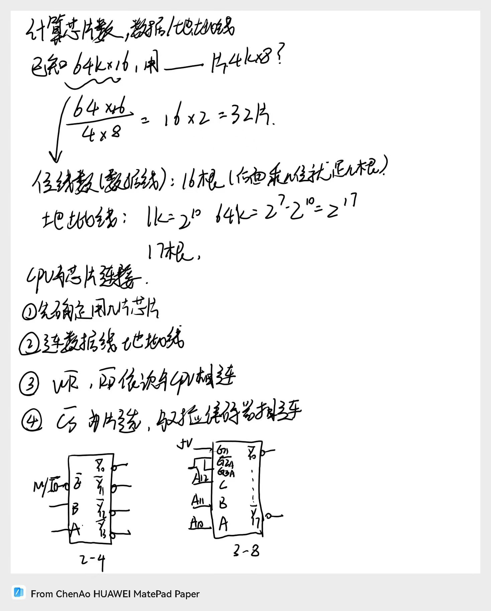

# 微机存储系统
## 存储器分类
* 外存
磁盘，属于IO设备
* 内存(半导体存储器)
  1. 只读存储器(ROM)，存放系统管理程序
     * ROM 一次性掩膜ROM 
     * PROM 一次性编程ROM，成品是空片，每个单元都是FFH
     * EPROM 紫外线可擦除ROM
     * E²PROM 电可擦除/在线可擦除ROM
  2. 随机读写存储器(RAM)
     掉电失信息
     * SRAM 静态RAM
     * DRAM 动态RAM，需要自己设计刷新电路
> 位扩展是并联,字扩展是串联
> 如1K\*1想变成16K\*8,那么先并联8个变成1K\*8,再串联16个变成16K\*8
## 主要技术指标
1. 容量
   62256 32K
2. 速度
   * 存取时间:启动一次存储器操作到完成这次操作时间
   * 存取周期:两次存取操作间隔的时间

