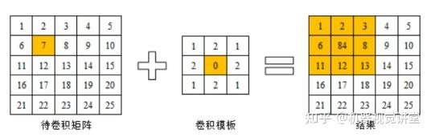
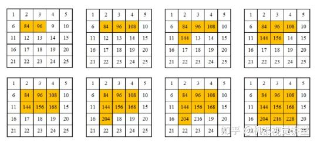

# 图像分割
顾名思义，图像分割就是将图像的不同部分分割开来，而对于怎么分割开，就有如下集中方法
## 基于阈值的分割
### 全阈值分割法
在本章，我们只考虑灰度图像。所以，最最最简单的方法就是认为图像背景灰度值是个常数，你要分割的物体和背景有几乎固定的对比度。那么我只要找到一个灰度值，将图像分为俩部分，一部分认为是背景，一部分认为是物体，就分割完成了。而符合这种规律的图像，往往其灰度直方图有**明显双峰**
那么，这个灰度值该怎么找呢？我们有如下办法:
* **人工选择法**
  就是瞪眼法，你干瞅，觉得那个灰度值是啥，你就选择啥
* **直方图技术选择法**
  做出该图像的直方图，选择直方图中谷的位置作为阈值(其实也是瞪眼法)
* **迭代阈值选择法**
  在这种方法下，阈值就不是瞅出来的，而是算出来的，那么怎么算的呢？
  我们把第i次选择的阈值记为$T_i$，最终让$T_i$和$T_{i+1}$差值小于某个数就行了(很符合我对迭代的想象)
  在最开始，我们选择中间的灰度值作为初始阈值，接下来进入循环，根据所选的阈值将图像分为两个部分，分别计算两个部分的平均灰度值，然后再将这两部分的平均灰度值取平均数，作为下一次循环新的阈值
* **最大类间方差阈值选择法**
  在这个算法中，优化的目标变为类间方差，当类间方差最大时，就找到了最佳阈值
### 多阈值分割
很多时候啊，直方图上是可能有很多峰的，所以就用多种阈值来进行分割
### 自适应阈值
在理想情况下，背景的灰度值应该是常数，但实际情况下，是不可能的，所以这对阈值的取法产生了要求
1. 第一种方法，我可以将阈值去为一个函数，让其随着在图像位置不同缓慢变化
2. 第二种方法，我可以将图像分割成不同小块，称为子图像，每块取不同的阈值

所以，这种方法的关键就在于我怎么取我的函数？我怎么分割出子图像？
### 最佳阈值选择法
这种方法其实是想找到一种具有一致性的方法来确定阈值
在这其中有一种叫最小误差阈值选择法，他假设各模式灰度是独立同分布的随机变量，还假设图像中待分割的模式服从一定的概论分布。在这两种假设下，最佳分割阈值就是目标和背景像素灰度均值的平均值
### 分水岭算法
这种算法下把图像看作成地球，每个像素的灰度值代表高度。(什么地平论？)其中的灰度值较大的像素连成的线可以看做山脊，也就是分水岭。你取的阈值可以理解为水平面，比水平面低的区域会被淹没，刚开始用水填充每个孤立的山谷(局部最小值)。

当水平面上升到一定高度时，水就会溢出当前山谷，可以通过在分水岭上修大坝，从而避免两个山谷的水汇集，这样图像就被分成2个像素集，一个是被水淹没的山谷像素集，一个是分水岭线像素集。最终这些大坝形成的线就对整个图像进行了分区，实现对图像的分割。
## 基于梯度的图像分割
上述都是想办法把图像分为内部和外部两个部分来进行分割，而这里利用图像边界具有高梯度性质找出边界
### 边界跟踪
1. 找到图像中最高梯度的点，此点必在边界上。若有多个则随机取一个
2. 以起始点为3*3邻域馁找到梯度最大的点作为第一个边界，若有多个则随机选一个
3. 重复步骤2
值得注意的是，面对无噪声的图像这种算法能很好找到边界，但是面对有噪声的情况下，则会出现偏离边界情况。此外，这种算法也不难保证边界闭合
### 梯度图二值化
若我们们取一个合适的阈值，然后对一幅梯度图进行二值化，会发现图像内部点与背景其实是低于阈值，而边缘的点是高于阈值的
Kirsch分割法利用这一特点，先取一个中等偏低的阈值，使背景与物体分割开，然后慢慢提高阈值，在二者要接触又没接触上的时候停下来，就是找到了边界
## 边缘检测
一个像素要是落在了边界上，那么他的邻域将会有一个灰度级的变化带，这种算法就是利用了这一特点
边缘检测会用到边缘检测算子，用于对一个像素的邻域的灰度变化率进行量化，而这种量化大多数是求卷积
同时，边沿检测算子可分为两类:
* 水平边缘检测算子
* 垂直边缘检测算子

常用的边缘检测算子如下:
* Roberts算子
* Sobel算子(在这里求梯度值的时候，和算子卷积后结果要除4)
  这种算子分为垂直和水平两种，二者依次对图像卷积，取最后的最大值为输出值
* Prewitt算子
* Kirsch算子

在这种算法中，常用的卷积运算是这么求的:
1. 用卷积模板中的系数乘以图像中对应位置的像素数值，并对所有结果求和

那么我们求的第一个像素卷积后的值就是84
1. 将卷积模板在图像中从左至右从上到下移动，重复以上3个步骤，直到处理完所有的像素值，每一次循环的处理结果如图所示

值得注意的是，我们卷积的模板是不能放在边缘的，也就是说卷积后，最外面的一圈是不变的
## 区域分割
区域分割是考虑一种空间关系，利用空间关系将图像分为不同部分
### 区域生长法
在区域生长法中，要有一个合适的函数，或者说一种定义。这定义，能很好衡量像素所属的区域，他可以通过包括但不限于:灰度值、纹理、颜色等进行全方面衡量。同时，这种定义我们也可以叫生长准则
在图像中选取合适的种子点，利用生长准则，将其判断为一类的图像归类到一起，这一就实现了区域生长
### 区域分裂合并法
这种算法和上述类似，我们需要确定一个一致性性准则T(x)
在区域分裂中，我们选取一个区域，若不满足这个准则，则说明不是裂的不够彻底要分下去；在区域合并中，我们选取一个区域与其邻域，若满足这个准则，则说明裂的太碎了，要合并成一个区域

区域分裂合并法主要就是利用上述两个步骤(合并、分裂)，既可先分裂后合并，又可以同时分裂合并。一般情况下对一个区域都是分为四个部分来进行处理的，然后遍历每个区域看是否能够合并或分裂(怎么听起来像DFS?)

## 数学形态处理
对图像进行数学形态处理，图像本身是二值化的
### 腐蚀与膨胀
* 腐蚀:消除物体边界一种过程，使剩下物体沿其周边比原体小一个像素。如果物体是圆，腐蚀后直径减2，若物体任意两点宽度小于3，那么腐蚀后就会变成非连通的。任何宽度不大于2的物体会被抹除
* 膨胀:将某物体所接触到背景点全部合并到该物体中。如果物体是圆，膨胀后直径增2，若物体任意两点间隔小于3，那么膨胀后就会变成连通的
### 开运算与闭运算
* 开运算:先腐蚀后膨胀，消除细小物体、在纤细点处分离物体、平滑较大物体边缘
* 闭运算:先膨胀后腐蚀，填充物体内细小空洞、连接邻接物体、平滑其边界
