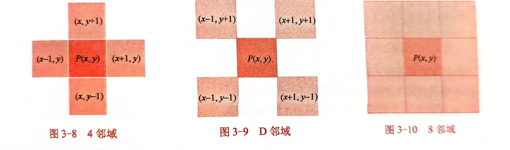

# 基础知识
* 采样率:一般是分割成好多像素来进行采样
* 灰度级量化:图像函数灰度值的离散化称为图像灰度值的量化
  8bit即为$2^8=256$，分别为从0至255，0为黑色，255为白色
## 邻域与邻接

两个像素是4邻域、8邻域关系可称为4临接、8邻接
两个像素是4邻域或D邻域关系，而且他们两个的四邻域之间没有重合的v值的像素，称m邻接
## 距离
P、Q两像素间欧几里得距离定义为:
$$
De(P,Q)=[(x-s)^2+(y-t)^2]^\frac{1}{2}
$$
城市距离为:
$$
D_4(P,Q)=[|x-s|^2+|y-t|^2]^\frac{1}{2}
$$
棋盘距离为:
$$
D_8(P,Q)=max(|x-s|,|y-t|)
$$
>实际上这个取的就是两轴上距离的最大值
# 图像变换
这里的图像变换指的是图像经过傅里叶变换，转为频域形式
## 二维离散傅里叶变换
一个图像可用f(u,v)来表示，经过傅里叶变换后则用F(U,V)表示。变换前后两幅图像是一样的，如下图所示

四个顶点对应的是直流分量，向内是低频直流分量，而中心对应的是高频分量
傅里叶变换后的图像是具有对称性的，通常我们要移位后显示，所以在代码中常常加入```fftshift()``` 语句，将其变为后一幅图(中间低频，四周高频)