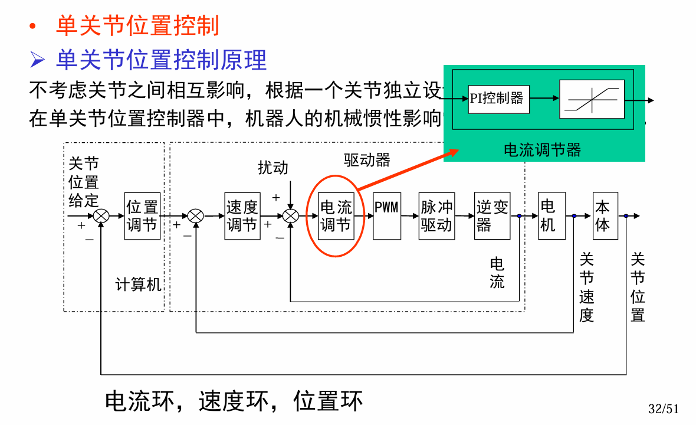
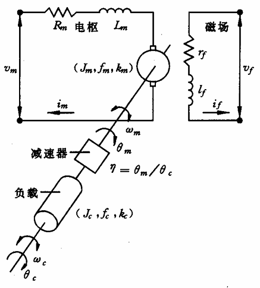
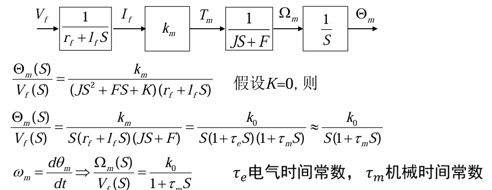
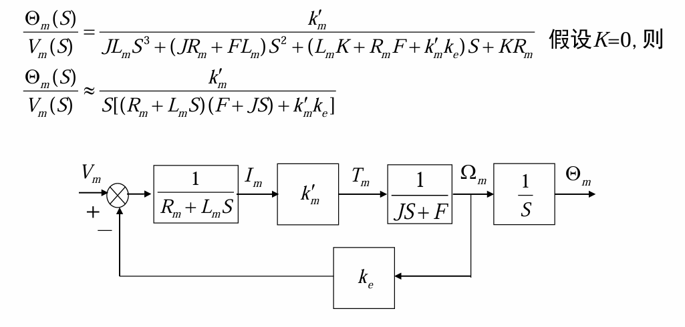
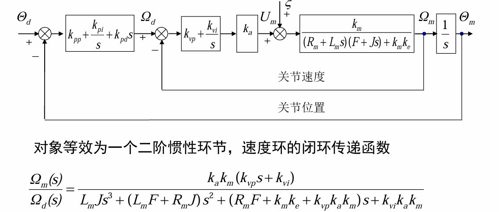
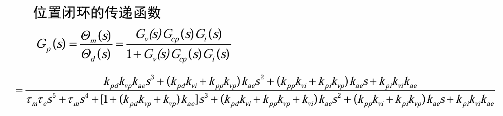

# 单关节位置控制
位置控制并不是仅仅对位置控制，也并不是仅仅给定期望位置，而是给定期望的位置、速度、加速度对位置、速度、加速进行控制
## 控制模型

电流闭环:采样周期短，电流可等效于电机输出力矩，实时性高
速度闭环:采样周期仅次于电流闭环
位置闭环:采样周期较大，控制输出的角位移

给定的关节位置与实际位置做差(位置闭环)，得到偏差，即相差的位置，通过位置调节，得到的物理量(速度，在单位时间内两个位置相减即为速度)送到速度闭环中；期望速度减去实际速度得到偏差，经过速度调节，得到加速度，加速度与电流等效，所以直接输入电流环，得到力或力矩(电机的扭矩与电流成正比)

## 直流传动系统建模
本质上是给一个电流直接调节电机，那么这个电流是怎么来的呢？(电压和电流某种角度上是一回事)
这来源于电机的控制，我们需要寻找电压于角度、角速度、力矩之间关系，电机模型如下图所示:

### 励磁控制
在励磁控制条件下，单关节的开环传递模型如下:

### 电枢控制
在电枢控制的条件下，单关节的开环传递模型如下:

$k_e$为电动机转动时产生的反电动势系数，$J$为总转动惯量，$F$为总粘滞摩擦系数，$k_m^{'}$为电机的扭矩常数
上式展示了所加电压与负载轴之间角位移的关系
## 基于电枢控制下的单关节控制
只有开环环节肯定是不够的，我们要加上闭环环节才能进行精确的控制:

$k_a$我认为是将加速度(电流)变为电压的东西
