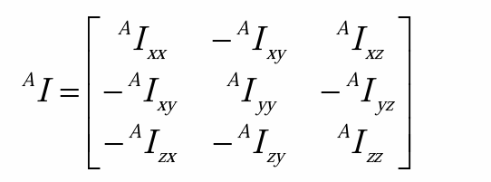
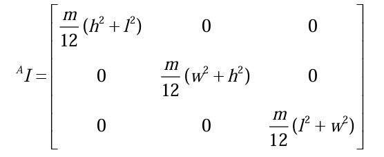
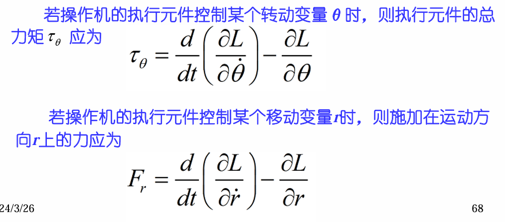

# 机器人动力学
动力学方程主要是研究机器人各机构的力、力矩与其位置、速度、加速度之间的关系的方程式
## 惯性张量
惯性张量是表示刚体质量分布的特征的，他根据**坐标系的不同其数值也不同**，具体表示形式如下:

上式中各各数值的运算如下所示:
$$
I_{xx}=\int\int\int(y^2+z^2)\rho dv=\int\int\int(y^2+z^2)\rho dxdydyz
$$
$$
I_{xy}=\int\int\int xy\rho dv=\int\int\int xy\rho dxdydyz
$$
通常我们称上述矩阵的对角项为惯量矩，其他项为惯量积
### 旋转与平移
假设坐标系B与A原点重合，B相对于A旋转一个角度，那么有:(平行移轴定理)
$$
^{A}I=^{A}_{B}R ^{B}I ^{A}_{B}R^{T}
$$

假设坐标系C与A原点重合，C相对于A移动一段距离，那么有:
$$
^{A}I_{zz}=^{C}I_{zz}+m(x_c^2+y_c^2)\\
$$
$$
^{A}I_{xy}=^{C}I_{xy}-mX_cY_C
$$
### 惯性主轴与主惯量矩
若惯量积为零，那么称该坐标系的轴称为惯性主轴，惯量矩称为主惯量矩
当坐标系原点位于长方体的质心时，就会出现这种现象

惯性张量有如下特征:
1. 惯量矩恒为正，惯量积可正可负
2. 当坐标系的方位改变时，三个惯量矩的和不变
3. 惯性张量的特征值、特征向量分别是刚体相应的主惯量矩和惯性主轴
## 牛顿-欧拉方程
* 牛顿方程(平动，力平衡)
$$
^{C}f=m^{C}a=m^{C}\dot{v}
$$
* 欧拉方程(转动，力矩平衡)
也可称牛顿-欧拉方程
$$
^{C}\tau=^{C}I^{C}\varepsilon+^{C}\omega\times(^{C}I^{C}\omega)
$$
左上角带上标$^{C}$表示在C坐标系下求得的，$^{C}\varepsilon$表示角加速度，$\omega$为角速度，$^{C}f$为合力，$^{C}\tau$为合力矩
## 拉格朗日动力学方法
所谓动力学只不过是通过一种方法求出力与运动之间的关系，那么对于拉格朗日动力学来说，就有:
$$
拉格朗日函数 \qquad L=T-V
$$
$T$为系统的总动能，$V$为系统的总势能
那么我要是像求力或者力矩，就用以下方程，也叫动力学方程:
$$
拉格朗日方程 \quad \tau_i=\frac{d}{dt}\frac{\partial L}{\partial \dot{q_i}}-\frac{\partial L}{\partial q_i}
$$
即你想求第i个关节的力/力矩，就等于上述式子
那么什么时候求的是力，什么时候求的是力矩呢？
* 当$q_i$是一个转动的变量时候，求的是力矩
* 当$q_i$是一个移动的变量时候，求的是力

我们对应上述两种情况，分开来写，就有下述公式:

我们将拉格朗日函数带入拉格朗日方程，化简后可得到:
$$
\tau_i=\frac{d}{dt}\frac{\partial T}{\partial \dot{q_i}}-\frac{\partial T}{\partial q_i}+\frac{\partial U}{\partial q_i}
$$
