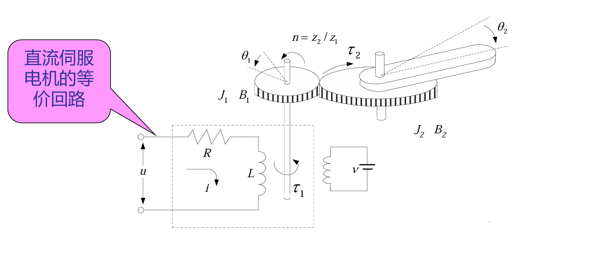
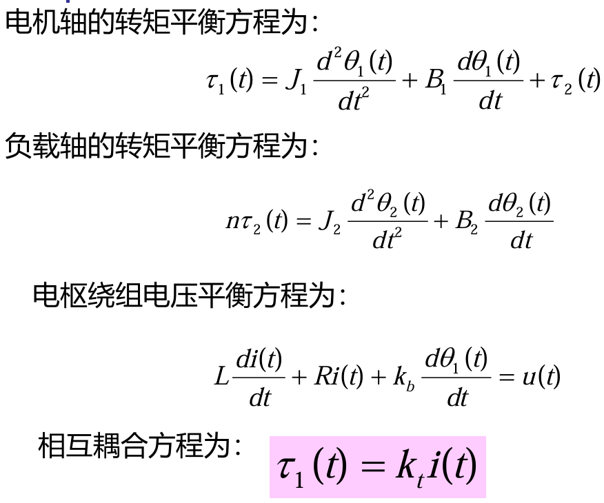
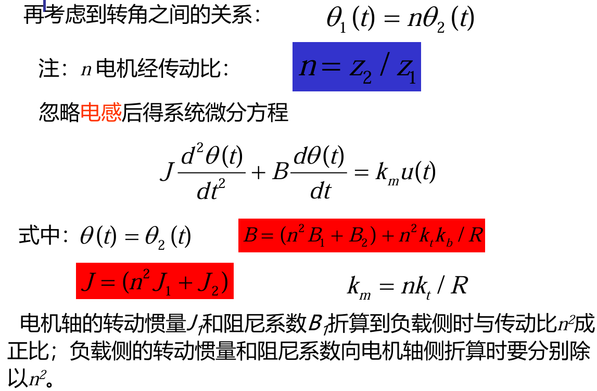
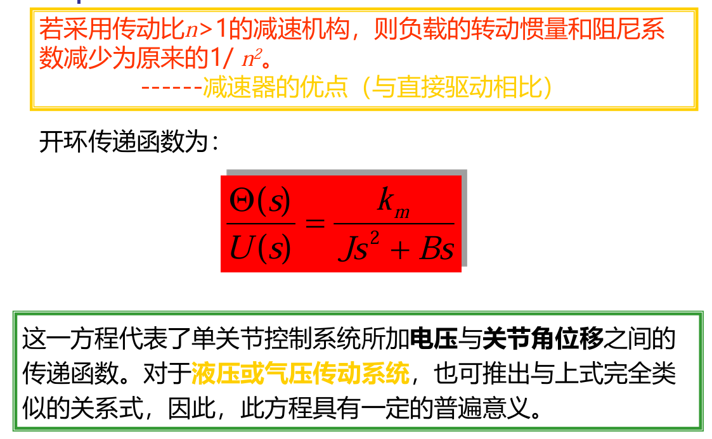
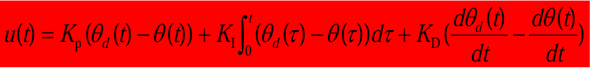
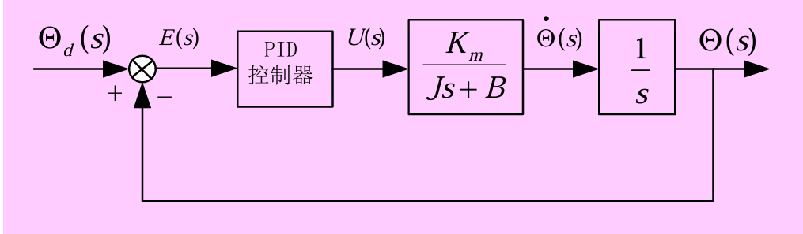

# 机器人控制技术
## 控制简介
* 开环控制
精确地**知道被控对象的模型**，并且这一模型在控制过程中保持不变
如果被控对象的模型能够精确知道，但模型是变化的；若模型的变化可以预测，使用开环预测控制；若模型的变化可以实时辩识，使用开环辨识控
* 闭环控制
被控对象的模型**不能完全确定或完全不能确定**
### 分类
* 线性控制系统
* 非线性控制系统
* 恒值控制系统
* 随动系统
* 连续控制系统
* 离散控制系统
### 机器人控制的特点
* 非线性
引起机器人非线性的因数很多，机构构型、传动机构、驱动元件等都会引起系统的非线性
* 多变量
机器人系统是一个时变系统，动力学参数随着关节运动位置的变化而变化
* 强耦合
各关节具有耦合作用，表现为某一个关节的运动，会对其他关节产生动力效应，使得每个关节都要承受其他关节运动所产生的扰动

总结:机器人是一个十分复杂的多输入多输出非线性系统，且在实际应用中一般很难得到精确的动力学方程

为解决以上问题，我们将复杂的整体控制问题简化为多个低阶子系统的控制问题；将控制分为单关节控制、多关节控制问题，这样前者需要考虑误差补偿问题，后者考虑耦合作用的补偿。由于工业机器人通常运动速度比较低，也要安装减速器，所以工业机器人系统就变成了一个由多关节(多轴)组成的各自独立的线性系统
## 单关节工业机器人模型

## 机器人控制方式和控制方法
### 控制方式
* 位置控制、速度控制、加速度控制
  * 位置控制
  适用于纯运动控制，即机器人与被控对象无接触，因此只需把持工具按照规定的轨迹运动
    * 点位控制:只管起点和终点位姿，怎么过去的不管
    * 连续轨迹控制:不仅管起点和终点位姿，还管怎么过去的
    * 直角坐标位置控制:是对机器人末端执行器坐标在参考坐标中的位置和姿态的控制
    * 关节坐标位置控制:直接输入关节位移给定值，控制伺服机构
  * 速度控制:在轨迹控制的同时，还需要机器人按预定指令，控制运动部件的速度和加速度，以满足运动平稳、定位准确的要求
* 力控制
    利用机械手末端执行器与工作对象之间存在力的作用，通过力传感器提供的反馈信号，控制机器人运动
    *  以位移为基础的力控制:在位置闭环之外加上一个力的闭环，力传感器检测输出力，并与设定的力目标值进行比较，力值误差经过力/位移变化环节转换成目标位移，参与位移控制
    *  以广义力为基础的力控制:在力闭环的基础上加上位置闭环，通过传感器检测手部的位移，经位移/力变换环节转换为输入力，与力的设定值合成之后作为力控制的给定量
* 力/位混合控制
  由两个独立的闭环来分别实施力和位置控制

### 控制方法
滑模控制、模糊控制、人工神经网络控制、遗传算法、自适应控制、PID控制
常用的为PID控制，它的传递函数与流程图如下所示

注意单关节的开环传递函数，比前面的少分母少个s，所以要有积分环节

## 机器人控制系统结构
分为上位机与下位机，上位机就是小电脑，负责系统的管理及坐标变换和插补运算；下位机就是单片机，且有多个，负责关节的控制；二者之间通过总线进行通信
### 工作过程
主控计算机接到工作人员输入的作业指令后，首先分析解释指令，确定手的运动参数，然后进行运动学、动力学和插补运算，最后得出机器人各个关节的协调运动参数。这些参数经过通信线路输出到伺服控制级作为各个关节伺服控制系统的给定信号。关节驱动器将此信号D/A转换后驱动各个关节产生协调运动，并通过传感器将各个关节的运动输出信号反馈回伺服控制级计算机形成局部闭环控制，从而精确控制机器人手部在空间的运动
