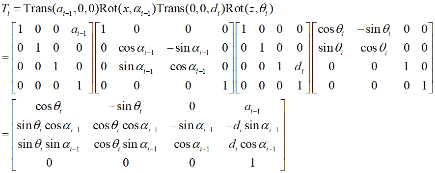
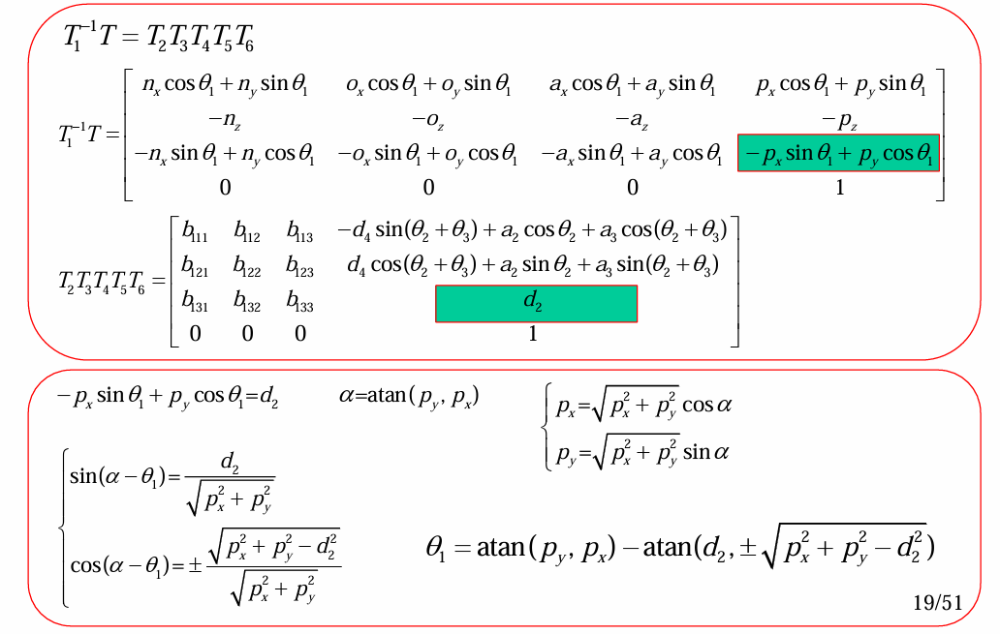

# 机器人运动学
## 机器人正向运动学
机器人正向运动学解决的问题是，我知道了各种连杆的参数，然后我要求最末端的位姿
在连杆变换章节中，我们得到了连杆变换矩阵:
* $O_i$建立在$J_{i+1}$上
  
* $O_i$建立在$J_i$上
  

那么，我知道了连杆的参数，根据我建立坐标系的位置，可以得到连杆变换矩阵。值得注意的是，连杆变换矩阵是针对两个相邻的连杆坐标系进行变换的，也就是说各各连杆变换矩阵之间是“联体”的关系而非“基”的关系，即用**右乘**

那么机器人的末端姿态和位置为:
$$
T=T_1T_2···T_n
$$
上述式子相当于是相对于第一个坐标系的位姿，不过通常我们都取第一个坐标系为基坐标系，要是相求相对于连杆$C_{i-1}$位姿，那么就是:
$$
^{i-1}T=T_iT_{i+1}···T_n
$$
其实你有没有发现，连杆变换矩阵本质上应该这么写$^{i-1}T_i$，这也就不难解释上述两个式子咋来的了

刚才上面提到了，我们建立的坐标系有两种，由于坐标系的建立不是唯一的，不同的坐标系下D-H矩阵是不同的，那么末端位姿$T$不同。但对于相同的基坐标系，不同的D-H矩阵下的末端位姿$T$相同

在机器人正向运动学中，可以看成是一个一对一关系，我有一套连杆参数，那么我一定有**一个唯一**的末端位姿$T$
> 这里的一一对应关系仅仅指的是给一套参数就只有一个对应的末端位置，其实也会出现我有两套参数，但是对应在一个末端位置
## 机器人逆向运动学
机器人逆向运动学解决的问题是，我知道了末端位姿，那么我连杆参数是什么呢？简单来讲，就是我知道了我末端在哪，那么我关节应该是怎样的才能让我的末端到那个位置

对于机器人逆向运动学，就不是一一对应关系了，我一个末端的位置可以对应好几套连杆参数

面对逆向运动学，其一般的解法是这样的:
已知$T_1···T_{n}$，那么就可以求出$T=T_1T_2···T_n$
接下来有:
$$
T_1^{-1}T=T_2···T_n
$$
此时让矩阵间元素一一对应，即可解出一定的参数
以此类推，得出好几个上述的公式，求出其他的参数

 
具体示例如下图所示:

有人可能会问，兄弟，我怎么知道这一大堆字母哪来的？
兄弟，这一大堆字母你不知道，但是你知道机器人的结构，你可依据题目建立坐标系，随后设出来这些参数。请记住兄弟，你知道的知识旋转变换矩阵具体是多少