# 柔顺控制
柔顺意味着低刚度
## 被动柔顺
不需要对机器人进行专门的控制即具有的柔顺能力，一般为机械装置
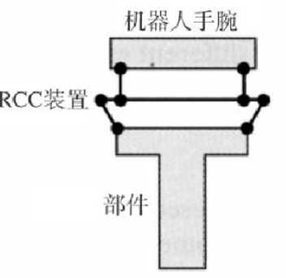

柔顺中心：对其施加力，纯平移；对其施加力矩，纯旋转
特点：具有快速响应能力，成本低，但只能用于特定的任务
位置控制：刚度强，缺乏柔顺性
影响机械手端点刚度的因素：
* 伺服关节的刚度
* 关节的机械柔顺性
* 连杆的挠性
## 主动柔顺
机器人采用专门的控制策略获得柔顺的能力，通过对伺服关节的刚度控制以达到柔顺目的
### 原理推导
我们定义一个刚度矩阵$K_p$，是**笛卡尔空间**的刚度矩阵
那么关节空间力矩与笛卡尔空间力之间关系为:
$$
\tau = (J^TK_pJ)\Delta q = K_q\Delta q
$$
我们称$K_q = J^TK_pJ$，为**关节空间**的刚度矩阵
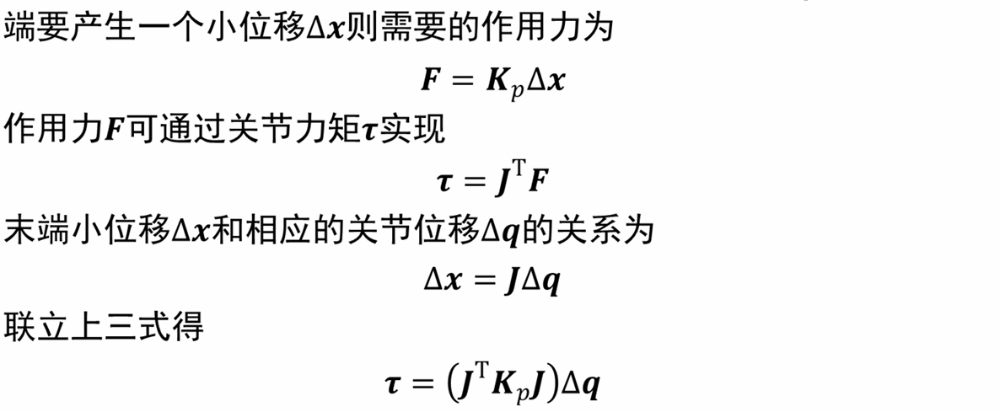
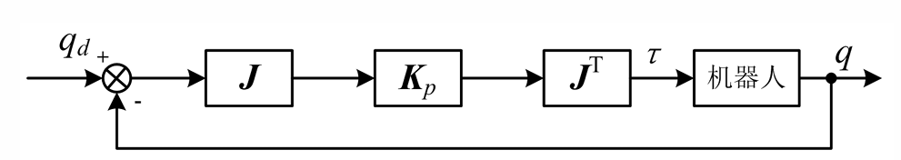
我的目标是取一个关节刚度矩阵，沿着机械手的方向上要小一点(力矩要小)

机器人为什么要柔顺呢？因为受到到约束:
* 自然约束:由物体的几何特性或作业结构特性等引起的对机械手的约束
* 人为约束:是一种人为施加的约束，用来确定作业结构中的期望运动的力或轨迹的形式

### 柔顺顺控制的分类
* 间接力控制:并不之间对力进行闭环控制，而是转变为位置量间接实现力控制(没有力的误差)
    * 阻抗控制: 力转变为位置偏差，以实现柔顺控制，利用适当的控制方法使机械手末端表现出所需要的刚性和阻尼
静态：力和位置的关系用刚性矩阵描述
动态：力和速度的关系用粘滞阻尼矩阵描述
* 直接力控制:直接用力进行闭环控制
  * 力位混合控制 : 分别组成位置控制回路和力控制回路，通过控制律的综合实现柔顺控制
  * 动态混合控制：在柔顺坐标空间将任务分解为某些自由度的位置控制和另一些自由度的力控制，然后将计算结果在关节空间合并为统一的关节力矩

#### 力反馈型阻抗控制
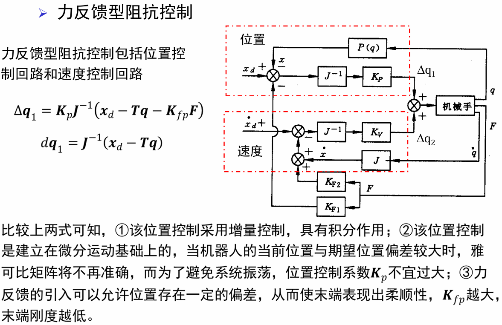
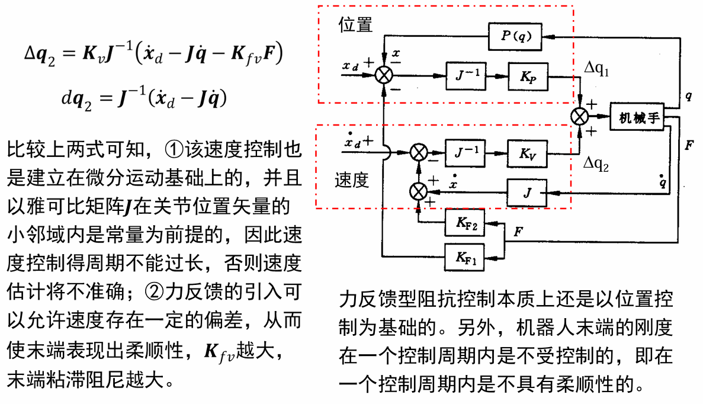
T是运动学方程
#### 位置阻抗控制
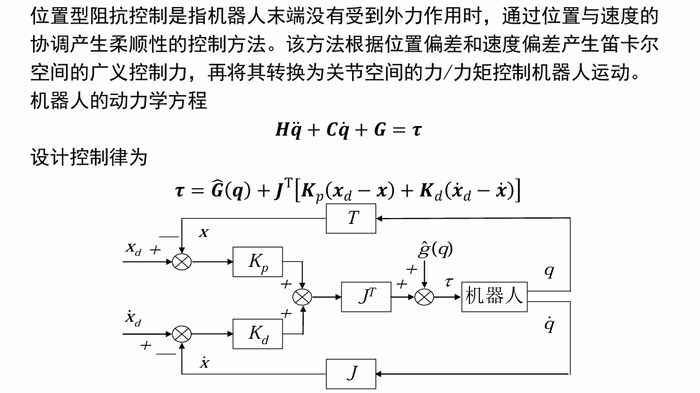
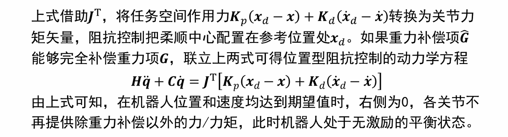

##### 稳定性分析
李亚普诺夫(Lyapunov)稳定性理论:如果一个系统的Lyapunov函数是正定的，并且其导数（或称为Lyapunov函数的梯度）是负定的，那么可以说明这个系统是稳定的
正定:函数在原点取值为零，而在其他任何地方都取正值
负定:函数在原点取值为零，而在其他任何地方都取负值
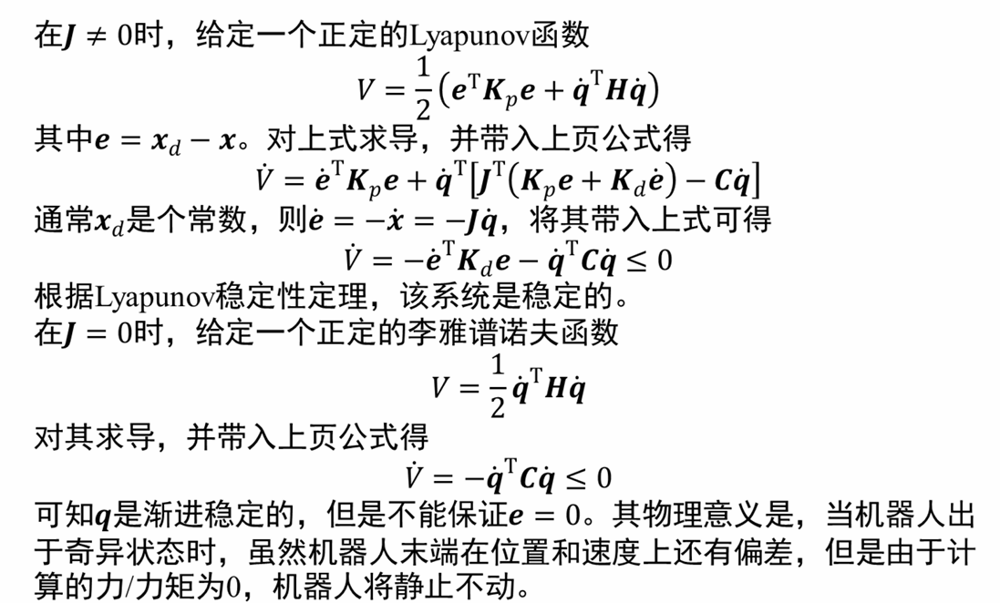

#### 柔顺型阻抗控制
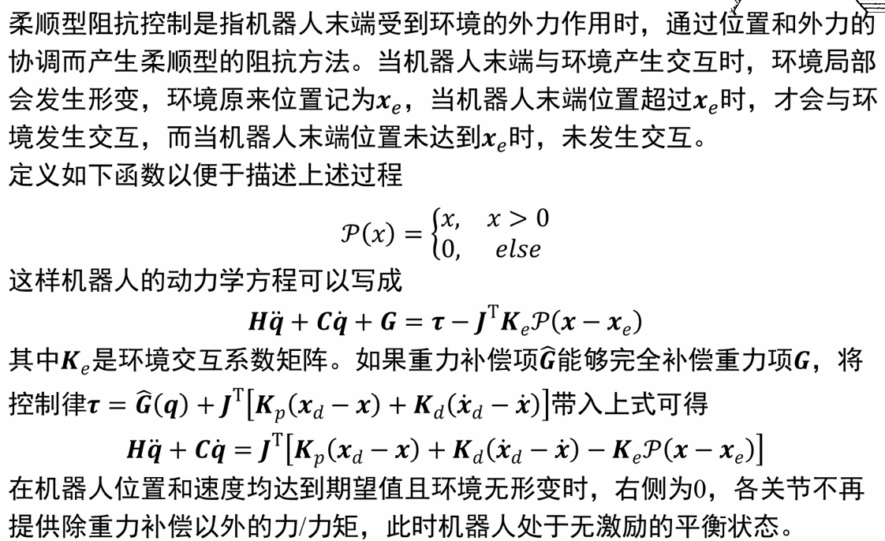
##### 稳定性分析
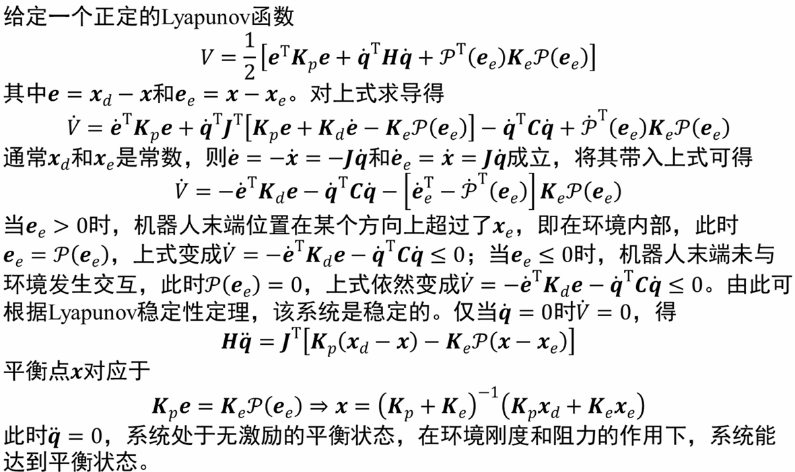
#### 力位混合控制
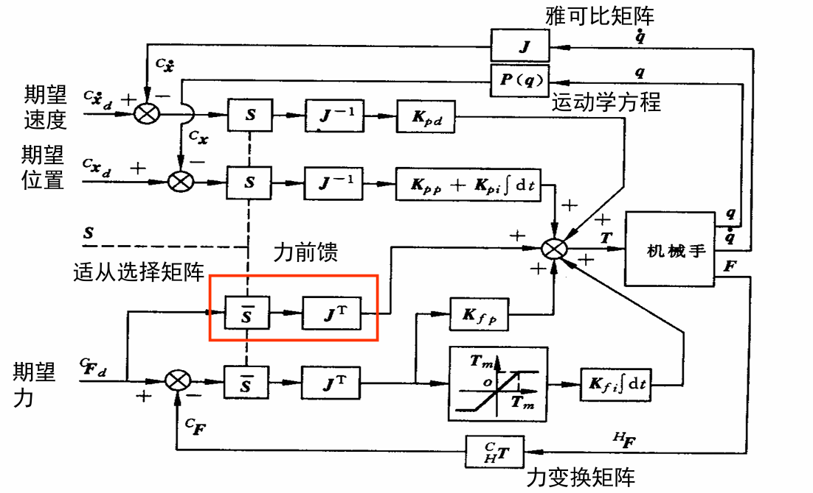
适从选择矩阵就是工作模式选择矩阵
改进的R-C力和位置混合控制
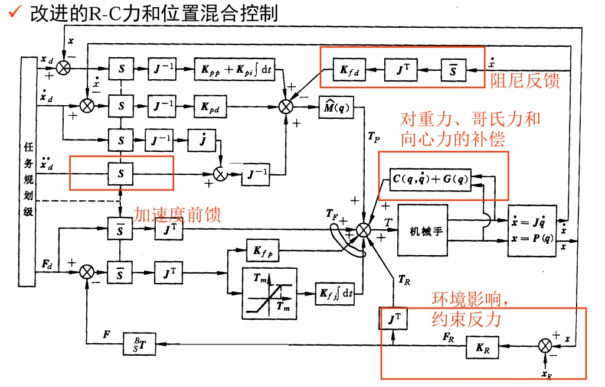