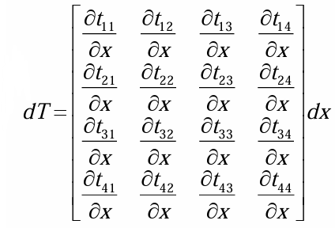
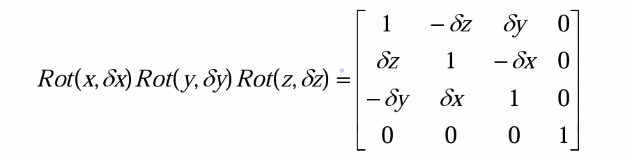
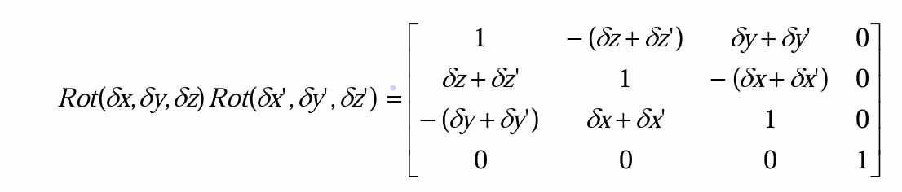

# 微分运动学
学过大物的都知道，对位移微分是速度，对速度微分是加速度。我们在前面章节算的矩阵是代表一个位姿，相当于是一个位移，那么我对这个矩阵求微分是不是就是代表了速度呢？
从某种角度来说，是这样的，所以首先我们来看看怎么微分，这些微分有哪些性质？
## 微分运动与微分变换
为解决两个不同坐标系之间的微小位移关系问题，需要讨论机器人杆件在作微小运动时的位姿变化，而这种微小变化在数学上可以用微分变化表示
那么一个矩阵该怎么求微分呢？
很简单，如下图所示:

矩阵对一个元素求微分，那么对矩阵当中每个元素都求微分就行了
### 微分运动与性质
机器人某一杆件相对于基座坐标系的位姿为$T$，经过微分运动后该杆件相对基座坐标系的位姿变为$T+dT$，那么有
$$
dT=\Delta·T\\
\Delta=Trans(d_X,d_y,d_z)Rot(r,d\theta)-I_{4\times4}
$$
微分运动的性质:
1. 在忽略高次项的前提下，微分变换与次序无关，即微分变换具有无序性(另一PPT说微分旋转变换具有无序性)

1. 微分旋转具有可加性，有$Rot(dx,dy,dz),Rot'(dx',dy',dz')$，那么$Rot(dx,dy,dz)Rot'(dx',dy',dz')$的结果就是两个矩阵轴的元素相加

注意，是矩阵的轴元素相加，**不是矩阵相加**

## 速度雅可比矩阵
通过一系列复杂的数学推导过程，我们知道速度雅可比矩阵$J(q)$为操作空间速度(基坐标系的)与关节空间速度(带关节变量的)之间的线性变换，写成数学公式就是:
$$
\frac{dx}{dt}=J(q)\frac{dq}{dt}
$$
如果说人话，就是我求出带关节参数的矩阵，求个偏导带入上面式子去，就得到了这个变换

举个例子，我知道机器人的的坐标和关节参数关系了:
$$
\left\{  
    \begin{array}{lr}
             x=l_1cos\theta_1+l_2cos(\theta_1+\theta_2) \\
             y=l_1sin\theta_1+l_2sin(\theta_1+\theta_2)
    \end{array}  
\right. 
$$
我门假设，这个机器人只有关节可以旋转，那么实际上只有$\theta_1\theta_2$是变量，然后我对这两个求偏导:
$$
\left\{  
    \begin{array}{lr}
             dx=\frac{\partial x}{\partial\theta_1}d\theta_1+\frac{\partial x}{\partial\theta_2}d\theta_2\\
              dy=\frac{\partial y}{\partial\theta_1}d\theta_1+\frac{\partial y}{\partial\theta_2}d\theta_2
    \end{array}  
\right. 
$$
如果我们每行除$dt$实际上，每行就代表一个速度，只不过这个速度表示的是在坐标系下$X$轴与$Y$轴的速度，我们先不着急除$dt$
如果你听过汤家凤考研线代课，那么你一定能知道，线性代数本质上在解方程，一行一方程，线性方程组是可以用矩阵来表示的，上述那组方程可用矩阵表示为:
$$
\left[
\begin{matrix}
    dx\\dy
\end{matrix}
\right]=
\left[
\begin{matrix}
    \frac{\partial x}{\partial\theta_1} && \frac{\partial x}{\partial\theta_2}\\
    \frac{\partial y}{\partial\theta_1} && \frac{\partial y}{\partial\theta_2}
\end{matrix}
\right]
\left[
\begin{matrix}
    d\theta_1\\ d\theta_2
\end{matrix}
\right]
$$
我们管中间那个矩阵叫速度雅可比矩阵，对应一开始提到的$J(q)$，这里就是$J(\theta)了$，$q$只是代表你矩阵里面连杆是哪个量发生变化:
$$
速度雅可比矩阵\quad J=\left[
\begin{matrix}
    \frac{\partial x}{\partial\theta_1} && \frac{\partial x}{\partial\theta_2}\\
    \frac{\partial y}{\partial\theta_1} && \frac{\partial y}{\partial\theta_2}
\end{matrix}
\right]
$$
如果我们对两边的矩阵都除个$dt$呢？
那么就变成这样:
$$
\left[
\begin{matrix}
    \frac{dx}{dt}\\\frac{dy}{dt}
\end{matrix}
\right]=
J(\theta)
\left[
\begin{matrix}
    \frac{d\theta_1}{dt}\\ \frac{d\theta_2}{dt}
\end{matrix}
\right]
$$
还记得吗，我们说位移的微分就是速度，这么说速度不就出来了吗？
$$V=
\left[
\begin{matrix}
    V_x\\V_y
\end{matrix}
\right]=
J(\theta)
\left[
\begin{matrix}
    \dot{\theta_1}\\ \dot{\theta_2}
\end{matrix}
\right]=J(\theta)\dot{\theta}\\
$$
$$
V=J(\theta)\dot{\theta}
$$
这里的$\dot{\theta}、\dot{\theta_1}、\dot{\theta_2}$实际上是角速度，还记得我们高数学过，字母上加一点代表微分吗？一个角度的微分就是角速度
还是线代的知识，我们在表示线性方程组的系数矩阵的时候，通常习惯用列向量来表示，那么就可以写为:
$$V=
\left[
\begin{matrix}
    J_1&& J_2
\end{matrix}
\right]
\left[
\begin{matrix}
    \dot{\theta_1}\\ \dot{\theta_2}
\end{matrix}
\right]
$$
所以，有:
$$
        V=J_1\dot{\theta_1}+J_2\dot{\theta_2}
$$
可以看出，我们的速度求出来的，第一个是第一个关节引起的速度，第二个是第二个关节引起的速度，两个速度相加是**矢量加法**，而且这里表示的意思是每个关节的速度矢量合成，而不是X轴Y轴的速度矢量合成

反之，给我末端的速度，我也能求出关节的速度:
$$
\dot{\theta}=J^{-1}V
$$
有人可能会问，兄弟，道理我都懂，可是矩阵的逆怎么求啊？
我说，兄弟，复习一下考研线代吧，别真考不上了，$A^{-1}=\frac{A^*}{|A|}$

总结一下，我们的速度用矩阵表示就是这样的:
$$V=
\left[
\begin{matrix}
    V_x\\V_y
\end{matrix}
\right]=
\left[
\begin{matrix}
    \frac{\partial x}{\partial\theta_1} && \frac{\partial x}{\partial\theta_2}\\
    \frac{\partial y}{\partial\theta_1} && \frac{\partial y}{\partial\theta_2}
\end{matrix}
\right]
\left[
\begin{matrix}
    \dot{\theta_1}\\ \dot{\theta_2}
\end{matrix}
\right]
$$
对应成线性方程，**矩阵相乘后**的一行代表了一个方向上的速度
不知道你有没有发现速度雅可比矩阵的规律？
雅可比矩阵的行数等于机器人操作空间的维度，列数等于机器人的关节数(维度)，而且不一定是方阵。对于n关节的机器人来说，雅可比矩阵是$6\times n$的矩阵，前三行代表末端线速度的映射，后三行代表末端角速度的映射

## 力雅可比矩阵
$$
\tau = J^T F
$$
$\tau$为广义关节力矩阵，$F$为首部端点力，$J^T$称力雅可比矩阵