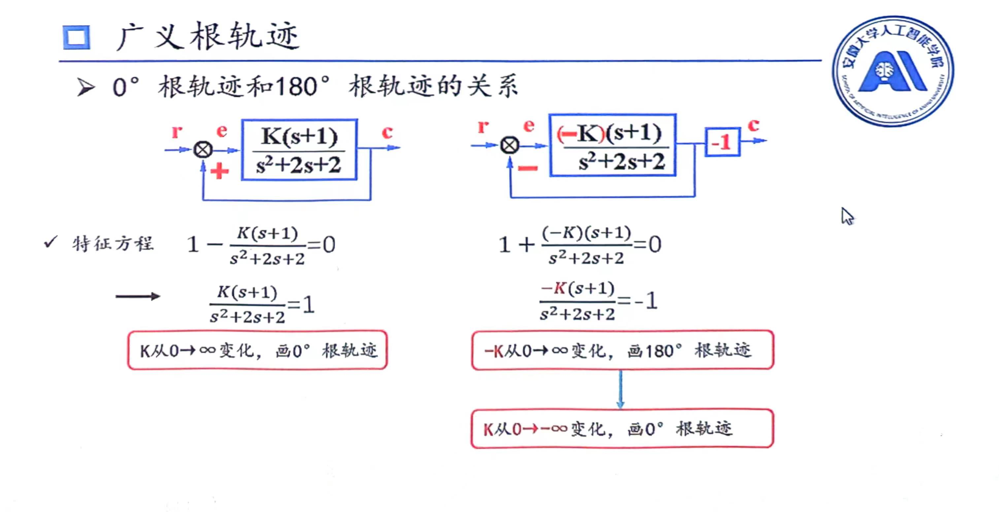

# 180度与0度根轨迹间关系

## 概述
### 绘制根轨迹的条件
想要以**常规的方法**绘制根轨迹，都是要确保以下条件必须满足
1. 根轨迹增益**必须是从$0\to+\infin$变化**
2. 开环传递函数**分母**写成$(as+b)(cs+d)····$形式后，$s$的系数必须是正数
> 常规方法是指可以按照所教的方法正常求解，绘制出根轨迹

### 绘制根轨迹类型判断法则
如何判断绘制0度根轨迹还是180度根轨迹？
1. 写出特征方程，写成上述例题形式
2. 根据上述2个条件，调整符号形成新的特征方程，也要写成例题根轨迹的形式
3. 观察中间符号(1与多项式之间)，为$-$则是0度根轨迹，为$+$则是180度根轨迹
### 二者关系
根据上面的例题所示：
1. 左侧所求的是0度根轨迹，在将特征方程写成要求形式后满足绘制根轨迹的条件，故正常绘制0度根轨迹
2. 右侧所求的是180度根轨迹，再将特征方程写成
   $$
    1+\frac{(-k)(s+1)}{s^2+2s+2}=0
   $$
   此形式是绘制180度根轨迹形式，若想满足绘制根轨迹的条件，即**根轨迹增益$-k:0\to+\infin$(条件1)**,那么需要将$-k$看成一个整体,即$-k:0\to+\infty$画180度根轨迹

3. 右侧若想绘制0度根轨迹，那么特征方程有(下式与上式完全相同)
   $$
    1-\frac{k(s+1)}{s^2+2s+2}=0
   $$
   需要注意的是，此系统的**根轨迹增益是$-k$**，我们按照正常方法绘制根轨迹时，都要求**根轨迹增益是$0\to+\infin$(条件1)**。上述式子虽然符合0度根轨迹的形式，但是若$k:0\to+\infin$变化,则不符合条件1，那么就需要将$k:0\to-\infin$，即有$-k:0\to+\infin$，此时符合条件1，才能**正常绘制0度根轨迹**