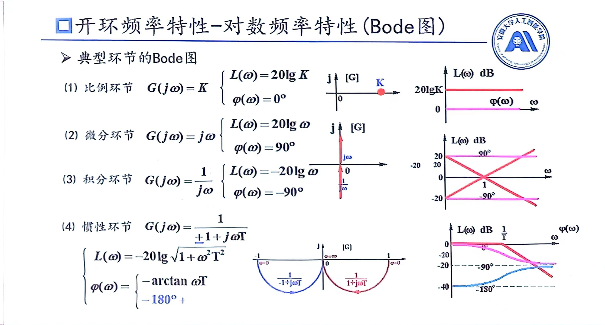
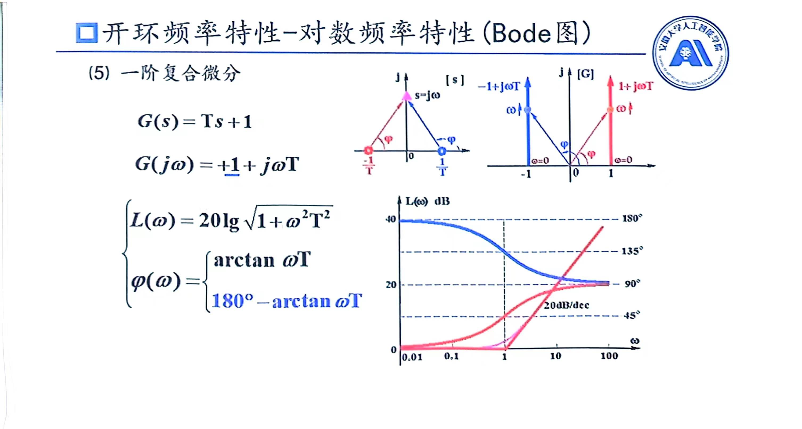
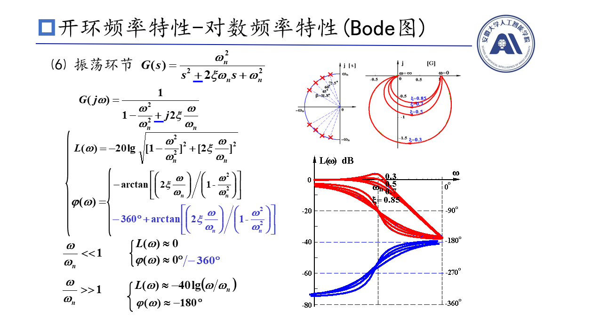
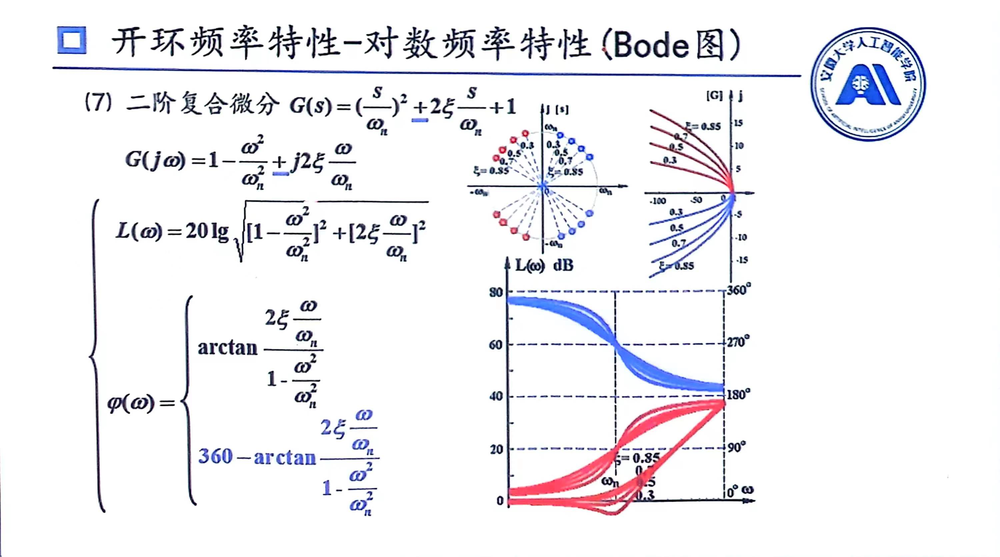
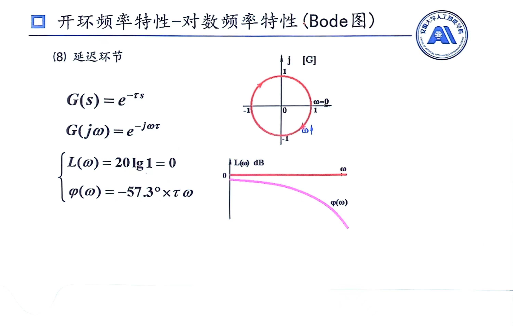
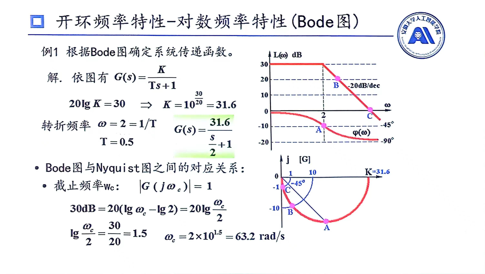

# Bode图
## Bode图基本概念
Y轴坐标(幅值部分)是取20倍lg，即
$$L(\omega)=20\lg(\omega)$$
X轴坐标是按照$\lg\omega$刻画的，但是习惯上仍写$\omega$，也就是说写的数字都是$\omega$
Bord图中形如0.1到1，1到10称为十倍频，也叫一个旬距
## 典型环节Bode图

## 转折频率
### 惯性环节
惯性环节的对数频率特性为
$$
L(\omega)=-20\lg\sqrt{1+\omega^2T^2}
$$
当$\omega<\frac{1}{T}$，则可将$\omega^2T^2$忽略，即有$L(\omega)\approx-20\lg1=1$；当$\omega>\frac{1}{T}$，则可将$1$忽略，即有$L(\omega)\approx20\lg\sqrt{\omega^2T^2}=\lg\omega T$，此时$\frac{1}{T}$称为转折频率

### 振荡环节
振荡环节的对数频率特性为
$$
L(\omega)=-20\lg(\sqrt{[1-(\frac{\omega}{\omega_n})^2]^2+(2\xi\frac{\omega}{\omega_n})^2})
$$
当$\omega<\omega_n$，则可将$\frac{\omega}{\omega_n}$忽略，即有$L(\omega)\approx-20\lg1=1$；当$\omega > \omega_n$，则可将$1$忽略，由于前面式子是四次方，那么也可将$(2\xi\frac{\omega}{\omega_n})^2$忽略，即为$L(\omega)=-40\lg\frac{\omega}{\omega_n}$，此时$\omega_n$称为转折频率
>实际上利用上述近似条件，会使在转折频率时图像不准确

>注意：以转折频率的角度为中心，角度的那条线是中心对称的
## 斜率
由于X轴坐标是$\lg\omega$，那对于形如$L(\omega)=20\lg(\omega)$，其在Bord图上斜率就是20。**相当于是一个旬距上升20分贝**，那么想要快速画出不同斜率直线时候，只要在一个旬距里面上升($+$)或下降($-$)对应距离就可以快速做出对应的直线了。
典型环节的斜率如下：
1. 微分环节：20
2. 积分环节：-20
3. 惯性环节：-20
4. 一阶复合微分：20
5. 振荡环节：-40
6. 二阶符合微分：40

## Bord图与Nyquist图之间关系

1. 已知角度，那么就在Nyquist图找到对应角度画一条线，与其交点即是所求点
2. 已知模值，那么就在Nyquist图中以原点为心，以模值为角度画园，与其交点即是所求点
3. 截止频率是模值为1的点，也是Bord图中与X交点，它有两种求解方法
   * 解模值等于1方程(不推荐)
   * 根据Bord图中三角形，解三角形求解(用过都说好)

## 绘制开环环节Bord图步骤
### 幅频特性曲线
1. 将$G(s)$化为尾1标准型
2. 按照顺序写出转折频率
3. 确定基准线
   * 基准点(基准线过的点)：$(\omega = 1,L(1)=20\lg K)$，即经过点$(1,20\lg K)$
   * 斜率 $-20 v$
   >K为增益，v为几阶系统

   如果我们将所有复杂的环节去掉，只剩下形如$\frac{K}{s^v}$时候，我们发现，图一开始是条斜线，这条斜线可由上述方法确定
   由于$20lg$有叠加的特性，其他的复杂的环节都是依次叠加在这条斜线上的，所以这个斜线是基准线
4. 叠加作图
   其他环节在没有到达**转折频率**时，就按照基准线或基准线叠加其他转折频率比他小环节后的图像画；经过转折频率后，就在**原有斜率基础上**，**叠加**自己的斜率，画出斜线
5. 修正
   * 两个惯性环节转折频率比较接近时
   * 振荡环节$\xi<0.38$需要有向上鼓包，$\xi>0.8$会向下比较平
6. 检查
   * 最右端斜率为$-20(n-m)$
   * 转折点数=惯性+一阶复合微分+振荡+二阶复合微分
   * $\varphi\to-90(n-m)$
   >n为极点数，m为零点数
### 相频特性曲线
1. 依次画出每个环节的相频特性曲线(也包括$\frac{K}{s^v}$)
2. 转折频率处应为45度
3. 叠加所有相频特性曲线