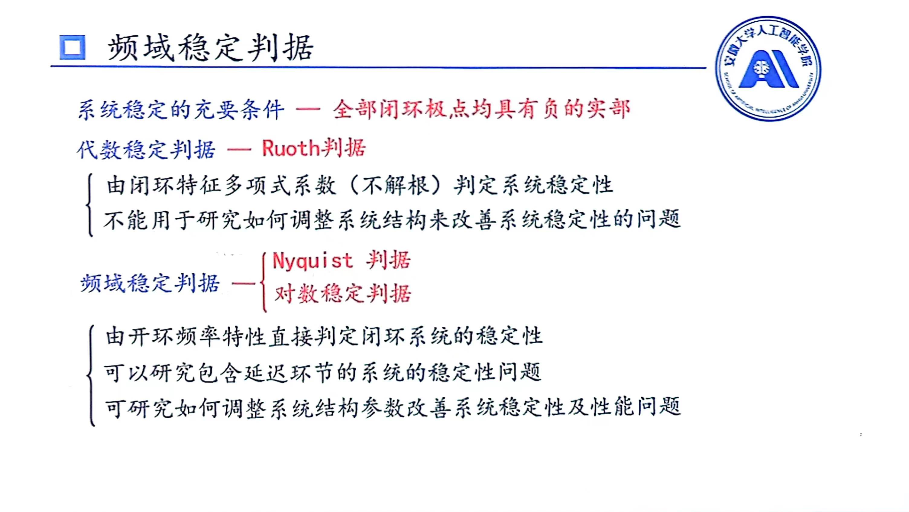
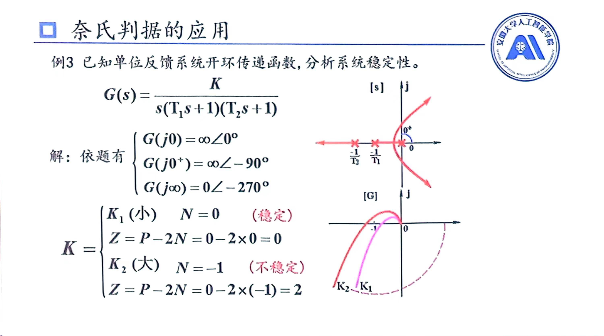

# Nyquist判据与对数稳定判据

## Nyquist稳定判据
$$
Z=P-2N
$$
其中$Z$为闭环函数右半平面极点个数；$P$为开环传递函数右半平面极点个数；$N$为开环传递函数画出的Nyquist图，绕$(-1,0)$点转的圈数

注意事项：
1. 右半平面不包含0点
2. 顺时针为负圆，符号为$-$
   逆时针为正圆，符号为$+$
3. 允许有半圆，即$N$可为$\pm\frac{1}{2}$，且$\frac{1}{2}$是最小单位

## 对数稳定判据
若是在Bode图中，可以有以下结论：
$$
N=N_+-N_-
$$
他们满足以下规则：
1. 只看Bode图中$L(\omega)>0$时对应的相角图像
2. $N_+$为由下向上穿过-180度次数；$N_-$为由上向下穿过-180度次数
3. 从接近-180出去为$+\frac{1}{2}$，靠近-180为$-\frac{1}{2}$
### 特殊情况
针对s平面而言，若是开环极点出现在虚轴上，一般是在0的情况，那么在算$j0$($j\omega$)是需要计算两个：
1. $j0$，此时该点($j\omega$)相当于在X正半轴上
2. $j0^+$，此时该点($j\omega$)相当于在Y正半轴上
   
在Nyquist图中用虚线表示$j0$到 $j0^+$变化，这条虚线也计算绕$(-1,0)$点转的圈数

在Bord图中相角部分也是要画出该虚线，这条虚线也参与计算$N^+$与$N^-$情况

