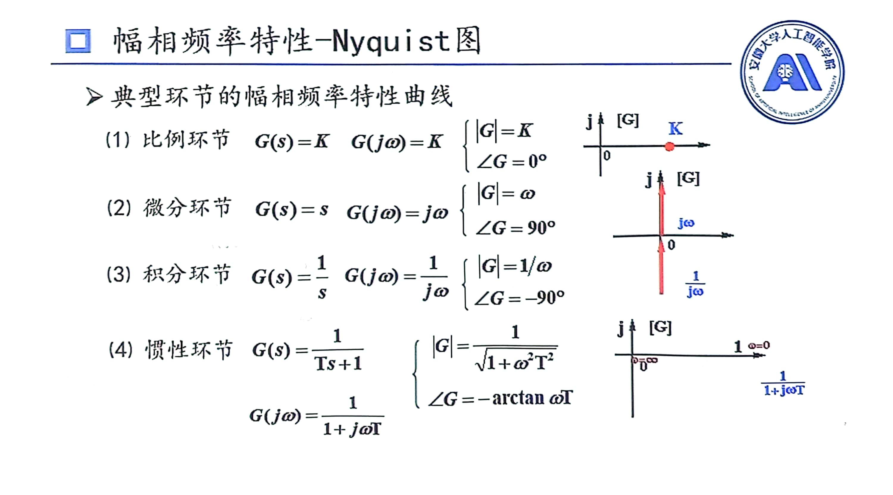
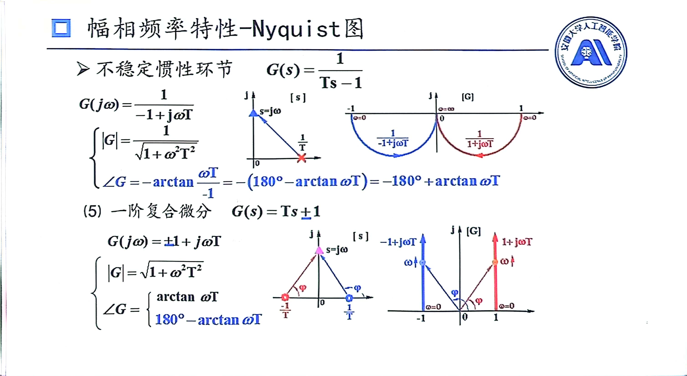
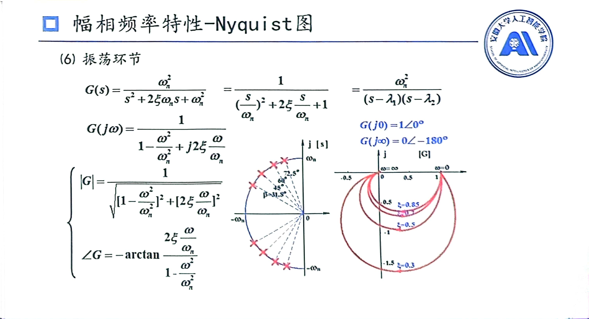
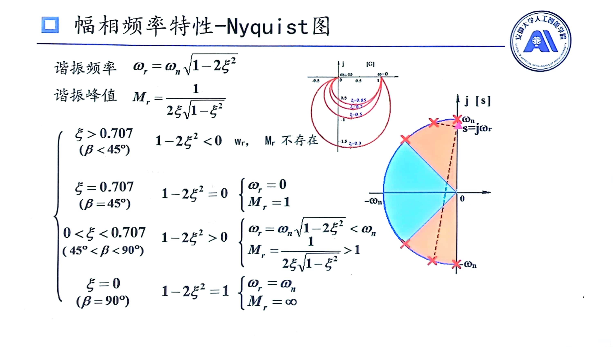
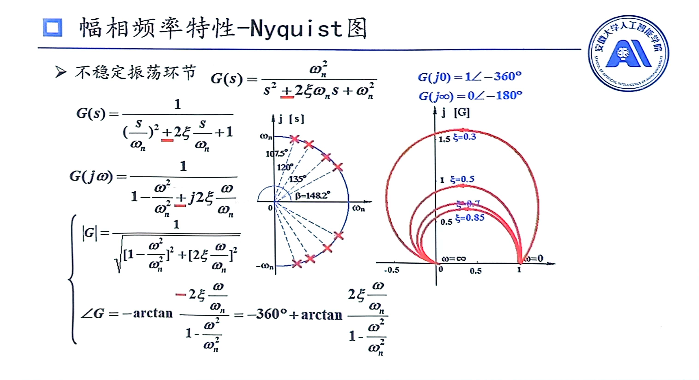
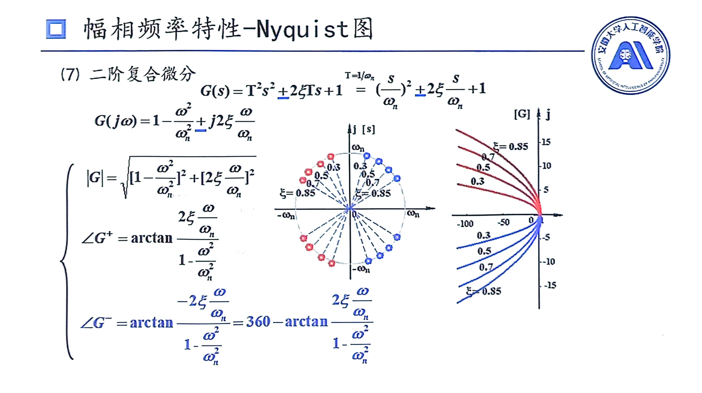
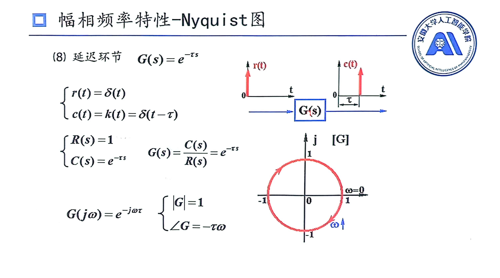
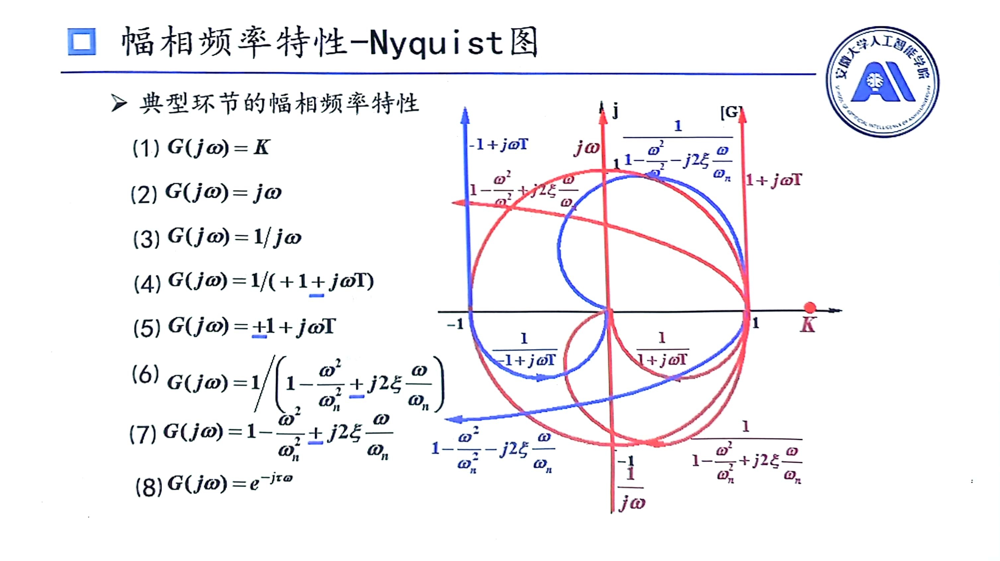

# Nyquist图
## 经典环节Nyquist图

## 经典环节Nyquist全图

## 补充说明
1. $角度=\frac{虚部}{实部}$
2. $角度=分子-分母$
3. 若是两点重合，这两点间角度为90度
4. 谐振频率即幅值最大时候频率，是求导得出来的
## 绘制开环环节Nyquist图步骤
1. 将传递函数写成乘积形式，并在**复平面**上画出零点、极点，此时可以看成有从零点、极点到y轴上$j\omega$的向量，即求这些向量的角度、幅值
2. 求出起始点和终止点角度、模值，要注意分母的情况
3. $j\omega$向上移动，观察角度、模值变化趋势
4. 按照趋势大概画图(G平面)
5. 必要时候可求与X，Y轴交点
   * 与X轴交点
      虚部为0
   * 与Y轴交点
      实部为0

