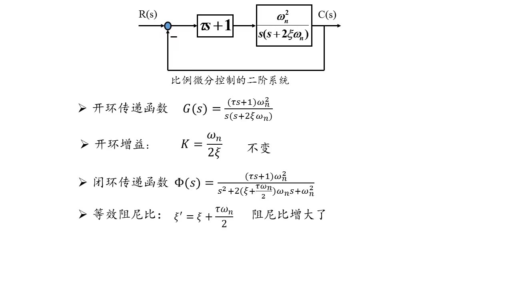

# 二阶线性系统拓展
## 规律总结

## 非典型二阶线性系统
在部分二阶线性系统中可能不能化成典型形式，但是可以化成如下形式
$$
\Phi(s) = \frac{k'\omega_n^2}{s^2+2\zeta\omega_n s+\omega^2}
$$
那么，实际上我们有以下结论
1. $t_r,t_p,t_s,\sigma\%$相比于典型二阶线性系统，不变
2. 稳态值变为原来的$k'$倍
## 改善二阶线性系统性能
### 比例微分

### 微分

### 总结
