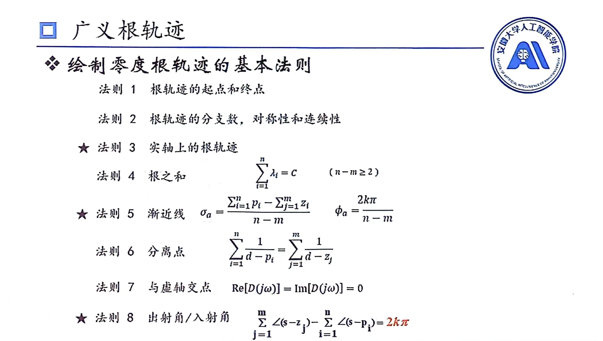
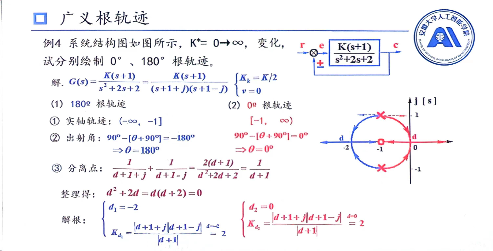
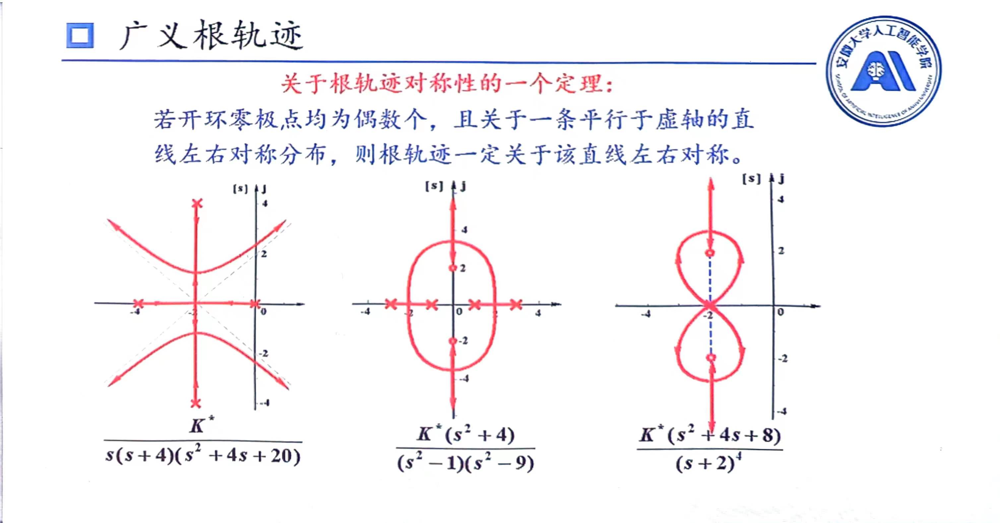

# 广义根轨迹
绘制系统的根轨迹时，并不是只以$k$，$k^*$为可变参数，而是用任意可变参数进行绘制，这时就是广义根轨迹
## 参数根轨迹
利用**等效开环传递函数**，进行根轨迹的绘制
等效传递函数只用作画根轨迹
### 普通参数
利用结论：$闭环传递函数=\frac{开环分子}{开环分子+开环分母}$,同时分母也是特征方程，构造新的等效传递函数
例如$G(s)=\frac{(s+a)/4}{s^2(S+1)}$，$D(s)=s^3+s^2+\frac{1}{4}s+\frac{1}{4}a$
那么，新的等效传递函数就是$G(s)^*=\frac{\frac{1}{4}a}{s^3+s^2+\frac{1}{4}s}$
### 特殊情况
由于我们分析系统都是线性**因果**系统，所以写出来的等效传递函数都极点数大于等于零点数，但有些参数按照上述方法会出现非因果现象
如$G(s)=\frac{625(s+26)}{s^2(Ts+1)}$，$D(s)=Ts^3+s^2+615s+15990$，按照上面方法显然会出现上述情况
* 方法1：$G(s)^*=\frac{\frac{1}{T}(s^2+615s+15990)}{s^3}$
* 方法2：$G(s)^*=\frac{Ts^3}{(s+27.7)(s+587.7)(\frac{s}{\infty}+1)}$
## 零度根轨迹
处于正反馈的的系统画出来的根轨迹叫零度根轨迹
叫零度根轨迹原因是模值条件不变，相角条件改为0度，那么相应的与相角有关的法则也发生变化

>实际上实轴上的根轨迹就是180度根轨迹互补后状态，出射角与入射角0度与180度是对称的

### 180度与0度根轨迹关系

### 根轨迹对称性定理

