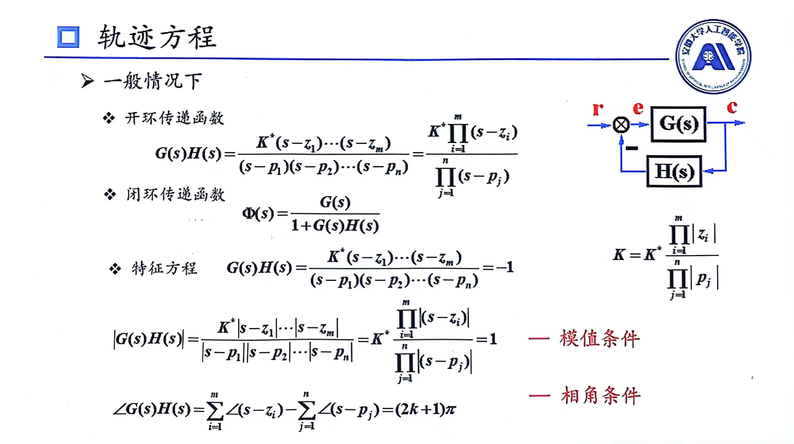
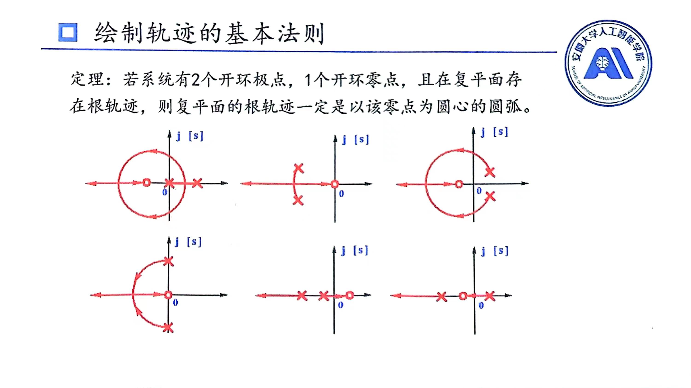
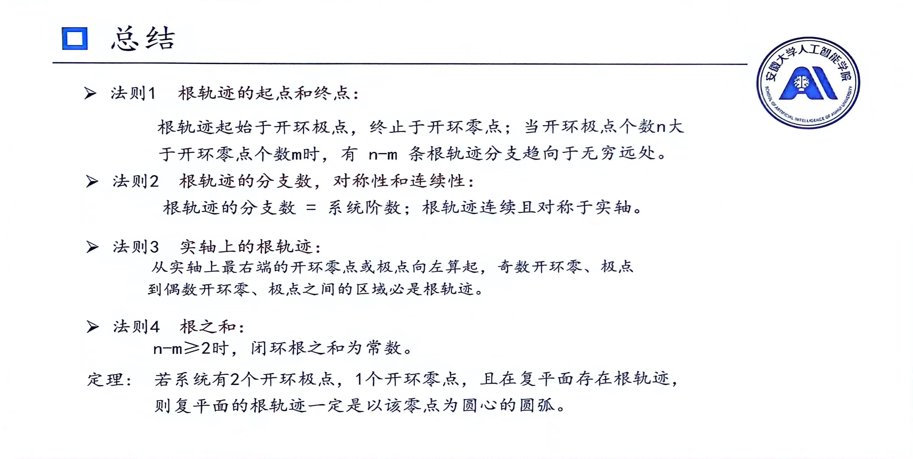
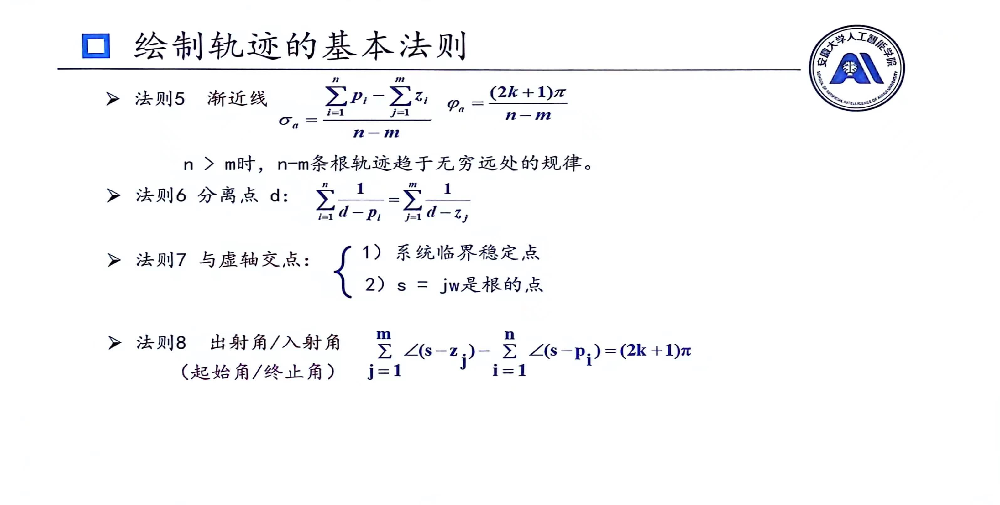

# 根轨迹
## 基本概念
系统中某个参数从0变化到无穷时,**闭环**特征根在S平面上移动的路径
根轨迹增益:**开环**函数首1型增益
>为什么不画闭环零点的根轨迹图?
>因为闭环零点根轨迹就俩点,不变化

闭环零点=前向通道开环零点+反馈通道开环极点

## 根轨迹条件

根轨迹上的点必须满足模值条件与相角条件,模值条件是一定满足的,主要是看相角条件,即
* 判断一个点是否在根轨迹上就是带入相角条件判断
* 求K就是带入模值条件
## 根轨迹的基本法则
### 规则一
根轨迹的分支数等于开环极点数,根轨迹都是起于开环极点终止于开环零点;若没有对应开环零点,则到无穷
>根轨迹的分支数等于闭环特征方程阶数
### 规则二
根轨迹是**连续的对称的**,且对称于实轴

### 规则三
从实轴上最右端开环零极点算起,奇数开环零极点到偶数开环零极点间区域,是实轴上根轨迹
>下标是从1开始数,不是从0开始

>上图中第二和第三个其实就利用了规则三与规则一判断出的
### 规则四
闭环根之和为一个常数,即根轨迹上相应的点加起来是常数
**根之和,闭环极点之和等于开环极点之和,等于常数**
>当极点数-零点数大于等于2时成立

### 规则五
渐近线
$$
\sigma_\alpha=\frac{\sum_{i=1}^np_i-\sum_{i=1}^mz_i}{n-m}
$$
$$
\varphi_\alpha=\frac{(2k+1)\pi}{n-m}
$$
>n:开环极点数;m:开环零点数;p开环极点;z开环零点

这条规则是用来画区域无穷时候的根轨迹的,这时候根轨迹只能画出一个大体形状,且这个形状要根据其他规则进行判断是否正确

### 规则六
分离点d
$$
\sum_{i=1}^n\frac{1}{d-p_i}=\sum_{i=1}^m\frac{1}{d-z_i}
$$
若是没有零点，右边为0
分离点是若是解不出，则采用试根法，挨个试
在分离点处$K_d$的值
$$
K_d^*=\frac{\Pi_{i=1}^n|d-p_i|}{\Pi_{i=1}^m|d-z_i|}
$$
>这个式子实际上就是根据模值条件来的，若是没有零点则分母为1
### 规则七
与虚轴交点
* 方法1:写出劳斯表中的辅助方程，辅助方程的解就是交点
* 方法2:将$j\omega$带入开环分母，求解即是交点

### 规则八
入射角与出射角
$$
\sum_{j=1}^m\angle(s-z_j)-\sum_{i=1}^n\angle(s-p_i)=(2k+1)\pi
$$
s即为所求点，入射角的未知量在前面，是出射角的未知量在后面，最后的$\pm\pi$根据式子中角度大小来判断(即等式的左边)
上述式子本质上来讲就是算各点之间的角度，那么就有自己和自己之间角度就是你所求的角度，一般设为未知量，自己与其他点之间角度正常计算即可(即复平面上两点之间计算角度，参考复变函数课程，要注意求角度的方向)

### 总结

