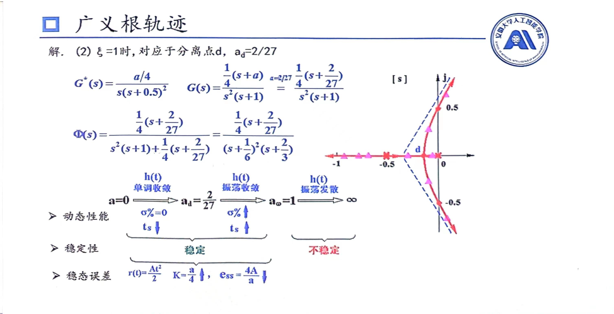
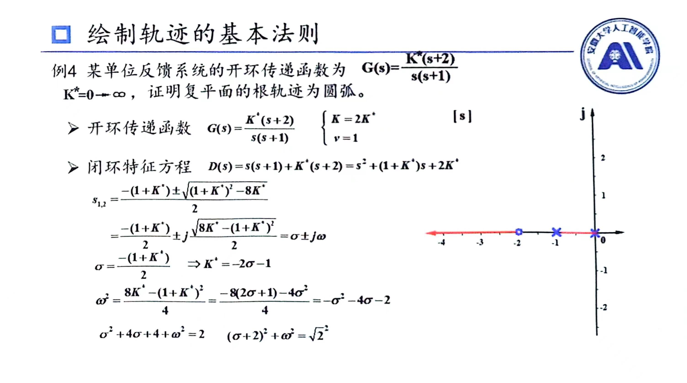

# 根轨迹特殊类型题
## 稳定性
* 根在实轴负半轴：单调收敛(指数形式)
* 根在实轴正半轴：单调发散(指数形式)
* 根在左侧平面上：振荡收敛(三角函数)
* 根在右侧平面上：振荡发散(三角函数)
* 在虚轴上：临界稳定(也是不稳定)

即在平面上就是振荡，在实轴上就是单调，在虚轴上就是最高与最低点连起来直线；在左半平面即稳定，右半平面即不稳定，在虚轴上临界稳定(不稳定)
## 动态性能指标
### 分析动态性能指标
一般只分析靠近虚轴的根，我们称其为主根，可以利用二阶系统的动态性能指标进行分析
例题如下，我们只分析上面靠近虚轴的根

通常来讲，让你分析根轨迹的动态性能指标一般只有这几条路线
1. 实轴上水平从右到左(对应例题中第一段)
   此时超调量为0，因为其是过阻尼系统(在实轴上)；调节时间变小(分母对应实轴上的绝对值，增大)
   >若根不在实轴上运动，那么此时超调量变小(($\xi$变小))
2. 向上(对应例题中第二段)
   此时超调量变大($\xi$变大)，调节时间变大(分母对应实轴上的绝对值，变小)
   
* 调节时间要看是向左(变小)、向右(变大)、还是不偏(不变)
* 超调量在实轴上为0不变，除此之外向左变小，向右变大
### 给定动态性能指标求范围
一般根据动态性能指标，按照二阶欠阻尼的公式求出对应的数值，然后画出一条直线，即求直线与根轨迹的交点
一般根据$\beta$角的关系给出交点横纵坐标关系，然后带入特征方程中求解
## 稳态误差
即正常求稳态误差，常用静态误差系数方法来计算(因为快)，不稳定时候就没有稳态误差

## 阻尼系数
$\xi>1$即处于过阻尼状态，那么要求有不相等的负实根(一般是根在实轴负半轴上，一般一直求到到分离点)
$\xi=1$即处于临界阻尼状态，那么就要求根都是相等**负实数**的状态(一般是求分离点)
$0<\xi<1$即处于欠阻尼状态，那么要求有共轭副根(有负实部,一般是从虚轴到分离点这一段)
$\xi=0$即处于无阻尼状态，那么要求都是**纯虚根**

## 根轨迹轨迹类型证明

## 后记
写到广义根轨迹里面我满脑子都是**广君**根轨迹
