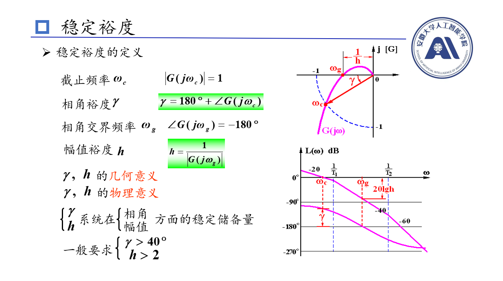
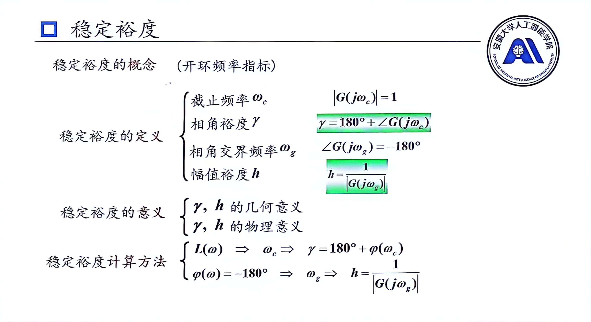
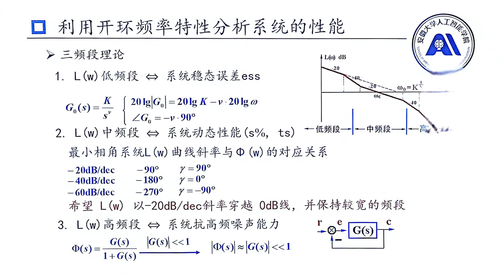
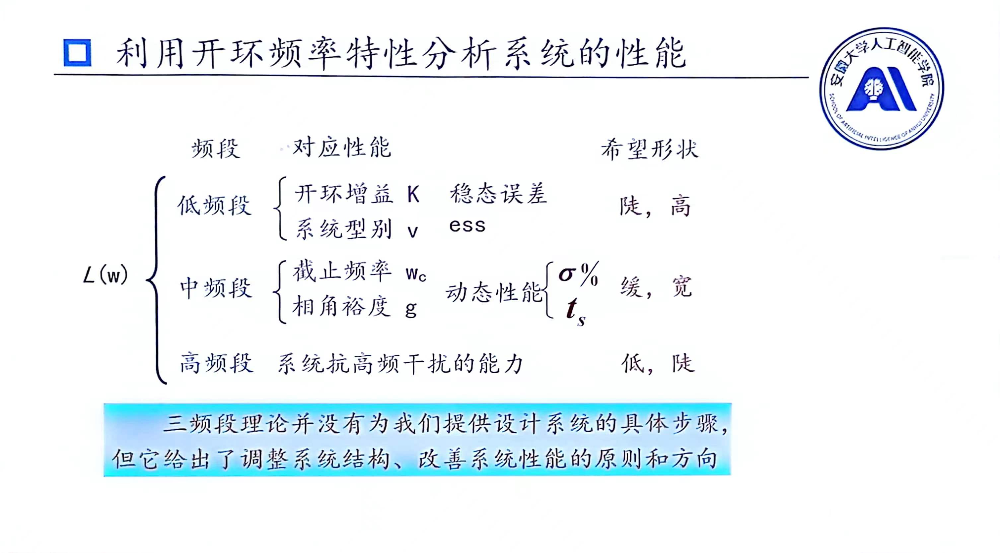
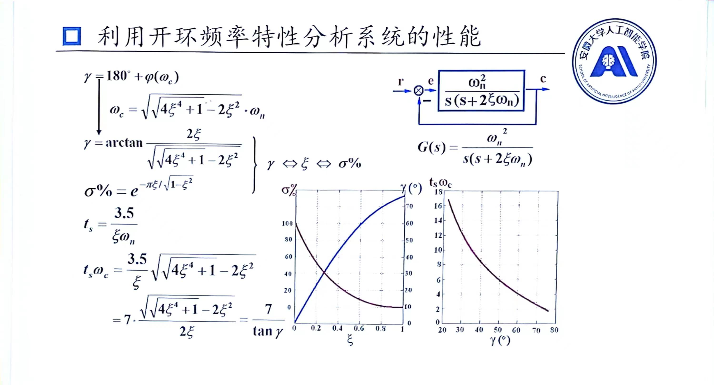

# 稳定裕度
## 稳定裕度
在时域内，一般用阻尼比$\xi$来描述系统的稳定程度，越靠近虚轴代表$、\xi$越小，调节时间就越大，一般取$\xi=0.707$最好

而在频域内一般取到(-1,0)点的距离作为衡量系统稳定程度，那么他有如下两种定义：

## 利用开环频率特性分析系统的性能

针对二阶系统而言，在中频段中动态性能指标可以按照如下计算并查表求出：

### 快速绘制Nyquist图相频特性曲线
1. 绘制出幅频特性曲线
2. 计算要趋近的角度
   $$要趋近的角度=\frac{斜率}{20}\times 90$$
   值得注意的是，纯积分微分环节不是趋近的，而是一开始就画在上述公式所算出角度，其他环节则是趋近的
3. 根据要趋近的角度画图，但是要在转折频率前就要有所变化(上升/下降)