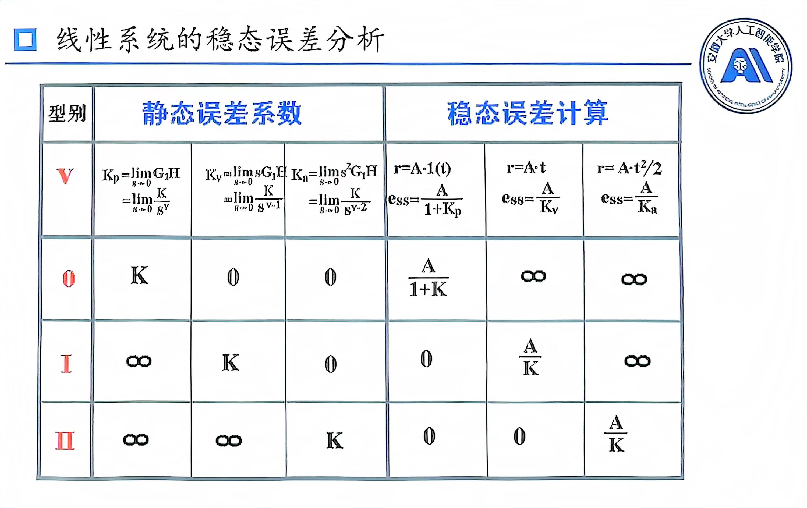

# 线性系统准确性分析
## 系统误差与稳态误差
系统误差:系统输出的期望量与实际值之差
$$
e(t) = c_r(t)-c(t)
$$
>注意:这里面是从输出角度定义的

稳态误差:$t\to\infty$时，系统误差的稳态分量
$$
e_{ss} = \lim_{t \to \infty}e(t)=\lim_{t\to\infty}[c_r(t)-c(t)]
$$
从另一种角度来说，稳态误差又是**期望输出的稳态值**与**实际输出的稳态值**之差
## 计算稳态误差

我们误差的值是反馈与输入的差值，根据图(a)而言
$$
E(s)=R(s)-C(s)
$$
那么，根据上述定义，若是针对非单位反馈系统而言，就变成了
$$
E(s)=R(s)-C(s)H(s)
$$
而同时(c)作为(b)的变换，那么又有
$$
E'(s)=\frac{R(s)}{H(s)}-C(s)
$$
同一个结构，为什么两个误差值不一样？
实际上，前者是通过**输入端**来定义的，后者是通过**输出端**来定义的
二者的关系是
$$
E'(s)=\frac{E(s)}{H(s)}
$$
值得注意的是在**单位反馈系统**中(也是根据上式)，两个定义得出结果是**完全一样**的，在这里我们统一使用输出端来定义
那么顺理成章的就有以下的式子了
1. 单位反馈系统
$$
e_{ssr}=\lim_{t\to s}sE(S)=\lim_{s\to 0}s[R(s)-C(s)]
$$
2. 非单位反馈系统
$$
e_{ssr}=\lim_{t\to s}sE'(S)=\lim_{s\to 0}s[\frac{R(S)}{H(S)}-C(s)]
$$

针对于带扰动情况，相当于没有输入R(s)，那么
$$
e_{ssn}=\lim_{s\to 0}s[0-C_n(s)]
$$
最后就有
$$
e_{ss}=e_{ssr}+e_{ssn}
$$
### 私货
**请注意:这一小段所讲述内容是基于我自己的理解，可能并不正确**
针对于上图中(a)而言，这里**系统期望的输出的稳态值**是$C_r(s)=R(s)$
$$
e_{ssr}=\lim_{t\to\infty}[C_r(t)-C(t)]=\lim_{s\to 0}s[R(s)-C(s)]
$$
针对于上图中(b)而言，这里**系统期望的输出的稳态值**是$\frac{R(S)}{H(S)}$，原因在于等效为(c)图后，其比较点输入量是$C_r(s)=\frac{R(S)}{H(S)}$，而非是$R(s)$
>实际上，上述表达的意思是稳态误差的值**不能**直接理解为:理想输入-实际输出

$$
e_{ssr}=\lim_{t\to\infty}[C_r(t)-C(t)]=\lim_{s\to 0}s[\frac{R(S)}{H(S)}-C(s)]
$$
针对于带扰动情况，这里**系统期望的输出的稳态值**是0
$$
e_{ssn}=\lim_{s\to 0}s[0-C_n(s)]
$$
### 一般计算方法
1. 判断系统的稳定性，只有稳定系统才会计算误差
2. 求误差传递函数
   * 由输入引起
    $$
    \varPhi_r(s)=\frac{E(s)}{R(s)}
    $$
    此误差对应时域为$e_{ssr}$
   * 由扰动引起
    $$
    \varPhi_n(s)=\frac{E(s)}{N(s)}
    $$
    此误差对应时域为$e_{ssn}$
3. 总误差
   $$
    E_{ss}(s)=\varPhi_r(s)R(s)+\varPhi_n(s)N(s)
   $$
   $$
   e_{ss}=e_{ssr}+e_{ssn}
   $$
4. 终值定理
   $$
    e_{ss}=\lim_{s\to 0}sE_{ss}(s) = \lim_{t\to\infty}e(t)
   $$

## 静态误差系数法

注意事项:
1. V：开环函数中**纯积分项**个数，也称V型系统
   K：开环**增益**
2. 以上求得误差仅是$e_{ssr}$
3. 纯积分项放在主反馈口与干扰误差之间，才可降低$e_{ssn}$；放在任何位置都会降低$e_{ssr}$
4. $G_1(S)H(S)$本质上就是开环传递函数
5. 在求误差前要判稳(闭环传递函数分母为特征方程)