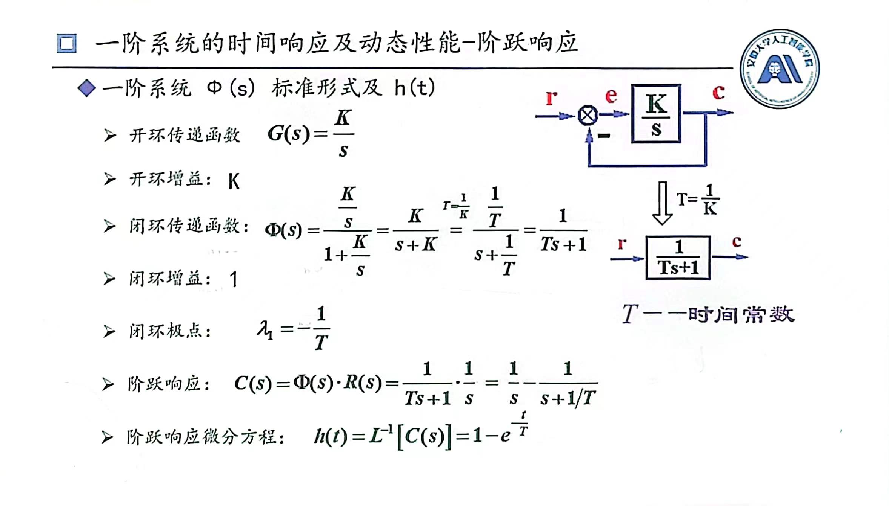
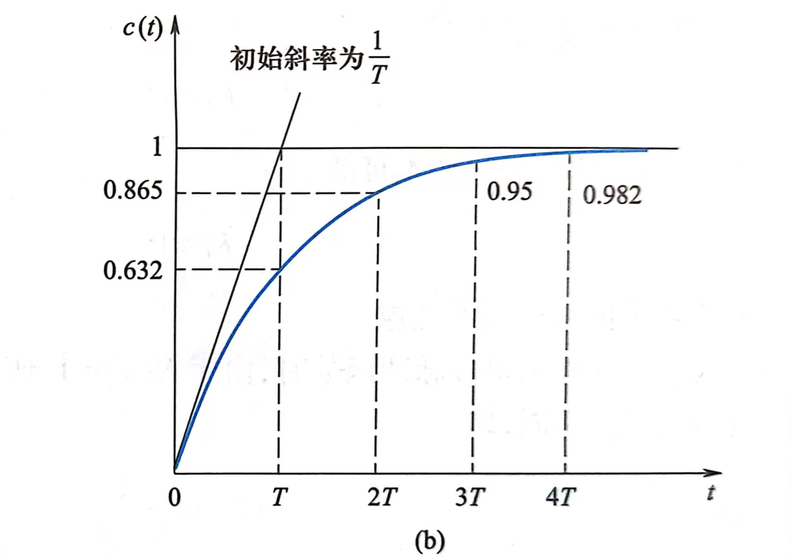
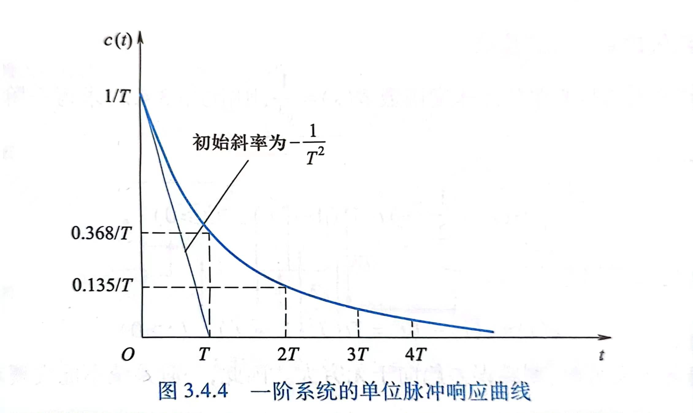
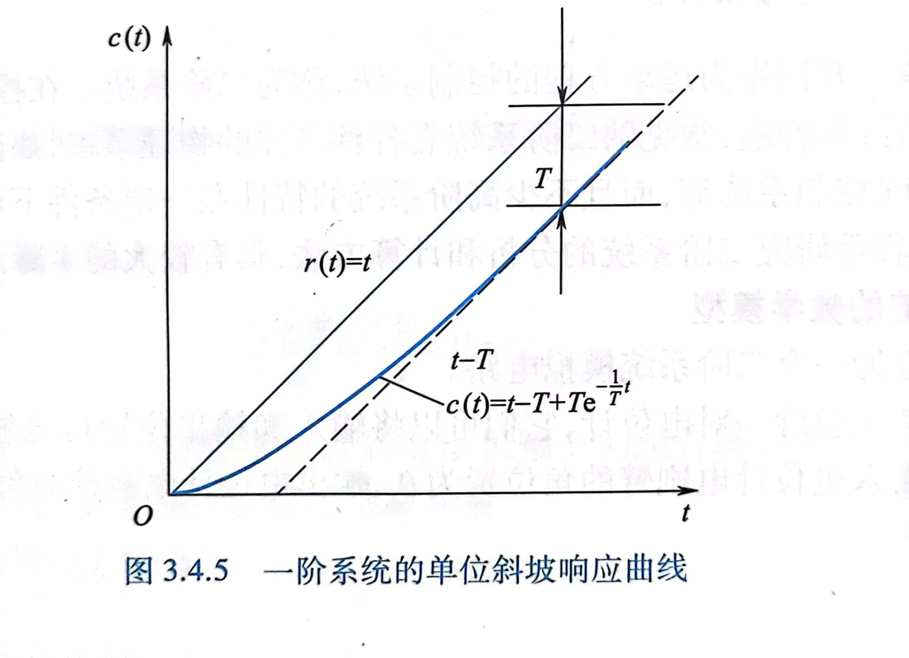
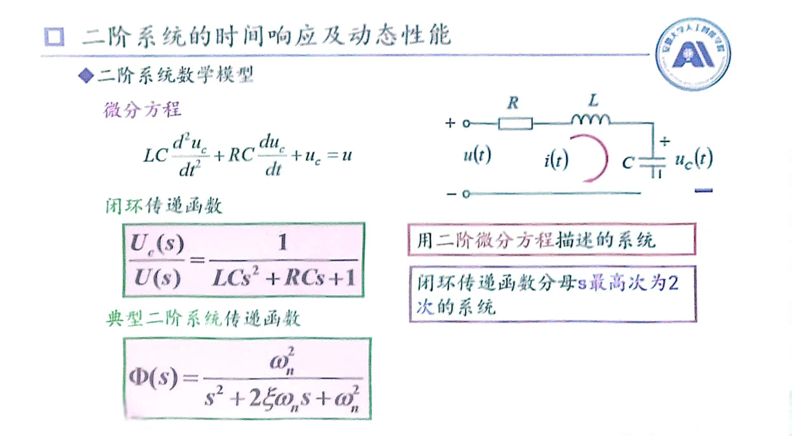
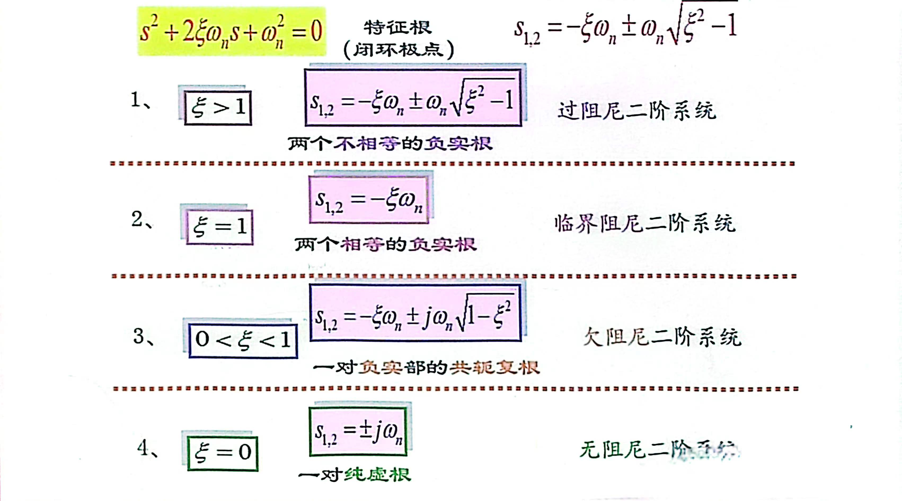
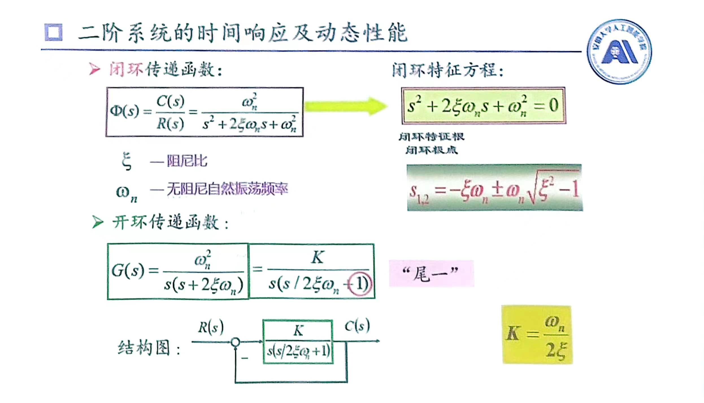
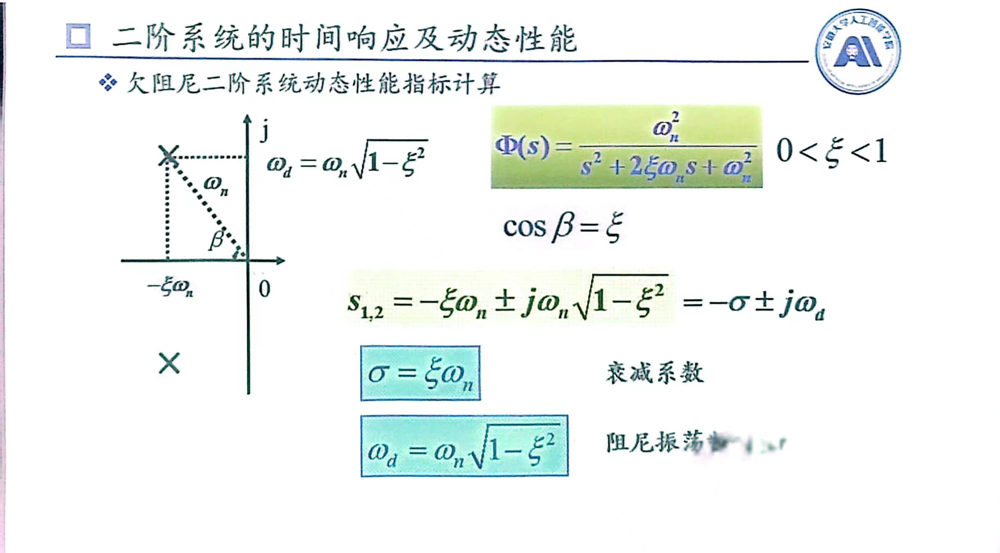
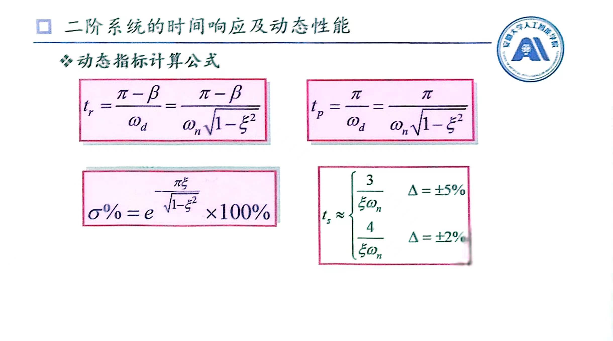

# 线性系统快速性分析
## 动态性能指标
1. $t_r$:上升时间，输出响应从0第一次上升到稳态值所用的时间
2. $t_P$:峰值时间，输出响应第一次到达最大值时间
3. $t_s$:调节时间，在稳态值附近取误差带($\pm 5\%$)，响应开始进入误差带到保持在误差带所用最短时间
4. $\sigma\%$:超调量，响应曲线超出稳态值比上稳态值
$$
\sigma\%=\frac{h(t_p)-h(\infty)}{h(\infty)}\times100\%
$$
5. $t_d$:延迟时间，第一次到达稳态值50%所用时间
6. $e_{ss}$:静态误差，系统期望值与实际稳态值之间差值

## 一阶系统快速性分析
### 一阶系统模型

### 一阶系统的单位阶跃响应($\frac{1}{s}$)

$$
C(s) = \frac{1}{s}-\frac{1}{s+1/T}
$$
$$
c(t) = 1 - e^{-\frac{t}{T}}
$$
此式子中T称为**时间常数**，同时该函数在$t=0$处导数为$\frac{1}{T}$，这意味着T可通过实验来测量
$t_r = \infty$
$t_P = \infty$
$t_s = 3T$
>这是一阶系统单位阶跃响应最重要的指标，它表示系统过渡的快慢

$\sigma\% = 0$
$e_{ss} = 0$
### 一阶系统的单位脉冲响应($1$)

$$
C(s) = \frac{1}{Ts+1}
$$
$$
c(t) = \frac{1}{T}e^{-\frac{t}{T}}
$$
### 一阶系统的单位斜坡响应($\frac{1}{s^2}$)

$$
C(s) = \frac{1}{s^2} - \frac{T}{s} + \frac{T^2}{Ts+1}
$$
$$
c(t) = t - T + Te^{-\frac{1}{T}t}
$$
$e_{ss} = T$
注意:这里的响应始终不能跟踪到输入信号，T越小，跟踪误差越小，输出量相对于输入信号迟滞越少
## 二阶系统快速性分析
### 二阶系统模型

#### 欠阻尼系统(阶跃响应)

$$
c(t) = 1 - \frac{1}{\sqrt{1-\xi^2}}e^{-\xi\omega_nt}sin(\omega_dt+\beta)
$$
 

