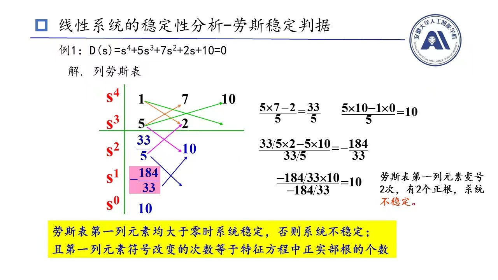

# 线性系统稳定性分析
## 稳定，稳定，还他妈是稳定
系统的初始条件是零，输入一个理想单位脉冲响应，若$\lim_{t \to 0}c(t)=0$，那么该系统是稳定的
从**闭环**传递函数角度来看，系统的**所有特征根实部小于零**，该系统稳定

特征根**全部**具有负实部，他的**必要条件**是:
1. 特征方程各项系数$a_i\neq0$，即每阶项都得有
2. 特征方程的各项系数的符号要全部相同
> 必要条件是，全部具有负实部必须满足这些条件，而满足这些条件不一定全部具有负实部；但是对于二阶系统而言，这是个充要条件，即满足以上条件，该系统稳定

## 劳斯稳定判据
### 一般情况

### 第一列为零
将为0的数设为$\epsilon$，$\epsilon$是一个无限接近于0的**正数**，计算过程中由$\epsilon$替代0进行正常计算
### 一行全部为零
将全部为0的上一行对应的方程写出来，然后求导，得出的数据作为全为0的那一行的数，然后正常运算
