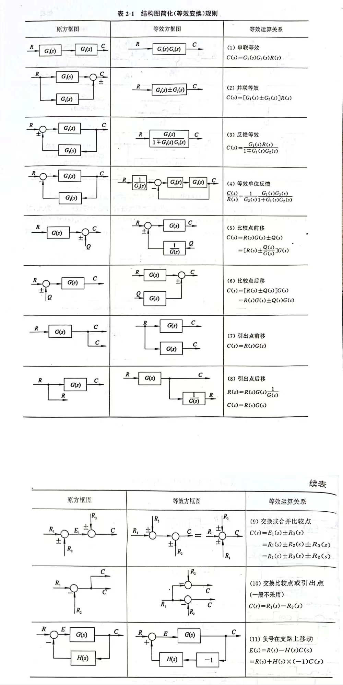

# 结构图的等效变换
## 结构图等效变换规则

## 梅森增益公式
$$
P = \frac{1}{\Delta}\sum_{K = 1}^{n}p_k\Delta_k
$$
特征式:$\Delta = 1 - \sum L_a + \sum L_bL_c - \sum L_dL_eL_f$，第一个为单独回路增益，第二个为两两互不接触的回路增益，第三个为三个互不接触的回路增益
有几个前向通路$n$就是几
$p_k$为当前前向通路的增益
$\Delta_k$就是特征值减去与当前前向通路有关的回路增益项，称为余项式

