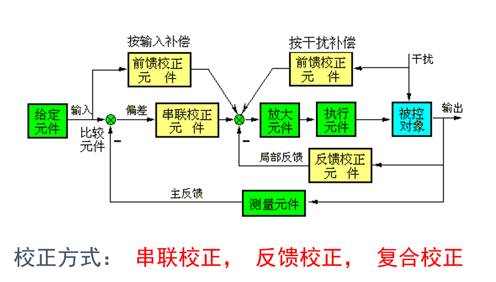
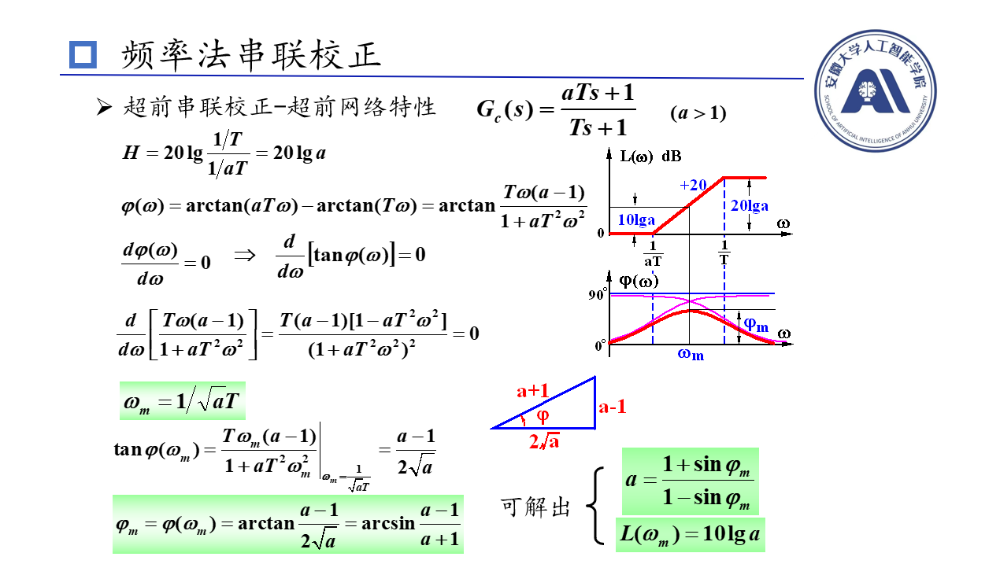
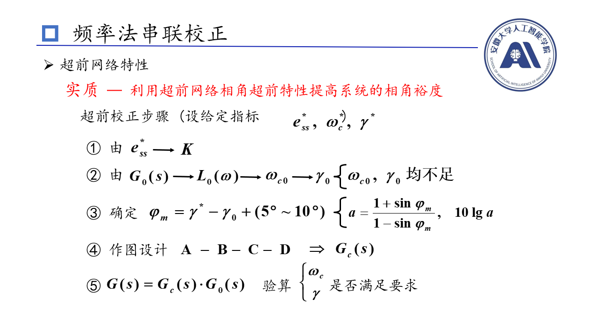
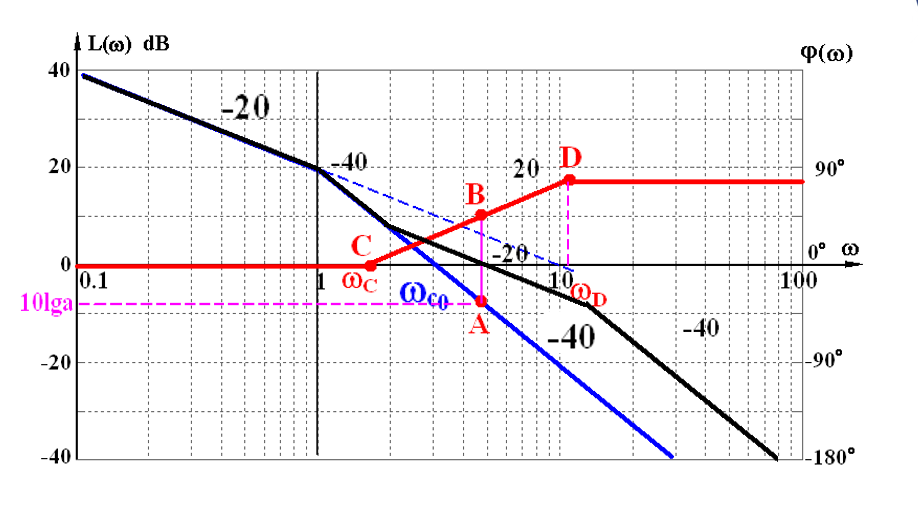

# 超前串联校正
串联超前校正，就是在原有系统的开环传递函数$G(s)$的前面**串联**一个新的环节(元件)，$G_c(s)=\frac{aTs+1}{Ts+1}$。串联后二者为一个整体，来分析新的系统是否满足我需要的特性。

## 网络特性

串联超前校正实际上就是对**增大幅值**，**扩大相角**；前者为乘的关系，后者为加的关系。即校正后的幅值是乘上串联的环节，校正后的相角是加上串连的相角。

要想**完美的利用**增加的相角，以满足稳定裕度的条件，那么就应该把**串联环节最大的相角**加到**校正后的截止频率**处(因为截止频率是用来计算相角裕度)
>注意：是校正后的截止频率，而不是校正前的截止频率

而串联环节最大的相角处对应的频率就是上图中的$\omega_c$，对应幅值是$10 \lg a$，也恰好是三角形的几何中点；同时我们也可以导出$\omega_c$与其他参数的关系

**串联环节最大相角处的幅值是$10 \lg a$，最大处的频率也是对应校正后的系统截止频率**
## 设计超前串联校正
### 方法1

为什么计算串联环节要提供的$\varphi_m$要加上5到10度？
在上文中我们强调，我们应该把**串联环节最大的相角**加到**校正后的截止频率**处，而在上图中我们计算的是**原系统的截止频率**对应的相角，而不是校正后的。而加上5到10度基本上是两个相角之间的差值
### 方法2
1. 设计开环增益(K)，满足稳态要求
2. 检验系统的指标(若是满足，那就不用设计了)
3. 设计串联超前网络参数
   * 截止频率取**要求的截止频率**
     要求的截止频率对应在原系统(未校正)对应的幅值必是负数，而我们串联超前校正，正是要通过串联环节加上一个幅值，来使**校正后的系统**在此处**幅值恰好为0**(因为在校正后的系统中，此处恰好是截止频率对应的幅值)，而这个加上的幅值大小是等于$10\lg a$(串联环节最大相角处的幅值是此值，也是对应校正后的系统截止频率)
    *  求出$a$的值，$T$的值，并验算相角裕度是否满足
    *  由于串联超前校正网络有$\frac{1}{a}$衰减，所以第一步求出的K值应该乘上a，即$最终K=第一步求出K\times a$