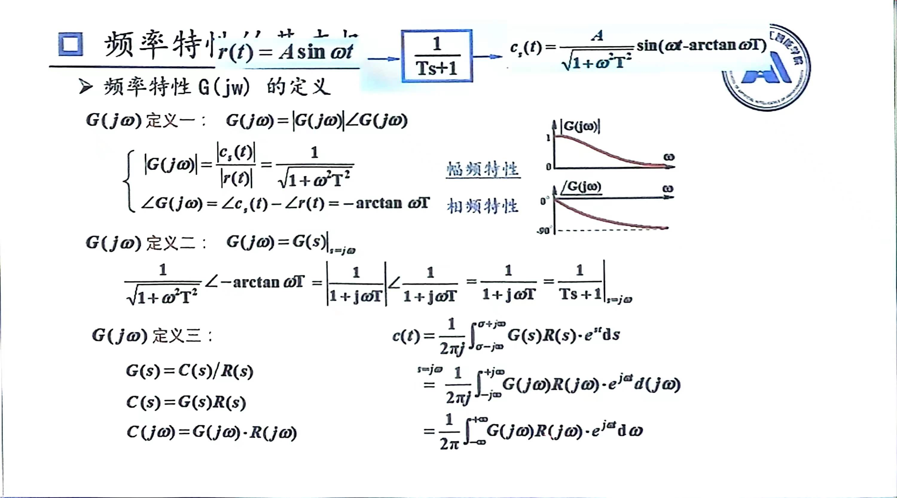
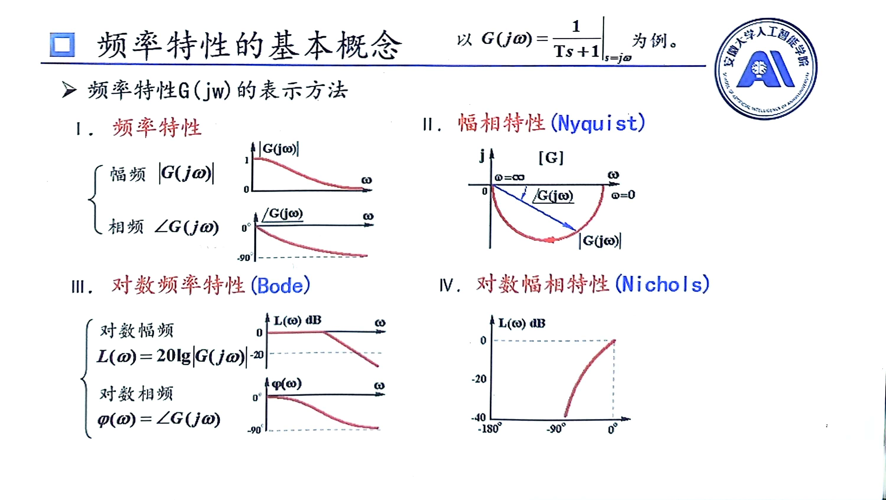

# 频率特性基本概念
## 频率响应
频率响应：线性系统稳态正弦响应的幅值、相角随输入频率变化的规律性
>就是求幅值比与相角差

在线性系统中，输入正弦信号$\sin\omega t$，输出也是正弦信号，其幅值与相位角之于$\omega$有关
## 频率特性$G(j\omega)$

* 定义一是其物理意义
* 从定义二可知，求任何系统的频率特性，只要把传递函数(闭环)$s$换成$j\omega$
  1. 取模就幅值比$$取模=\frac{输出幅值}{输入幅值}$$
  2. 取相角就是相角差$$取相角=输出相角-输入相角$$
  3. $$输出信号=输出幅值sin(\omega t+输出相角)$$
   
* 定义三就是输出的傅里叶变换就是频率特性与输入的傅里叶变换乘积，然后可导出频率特性
## 画图表示

