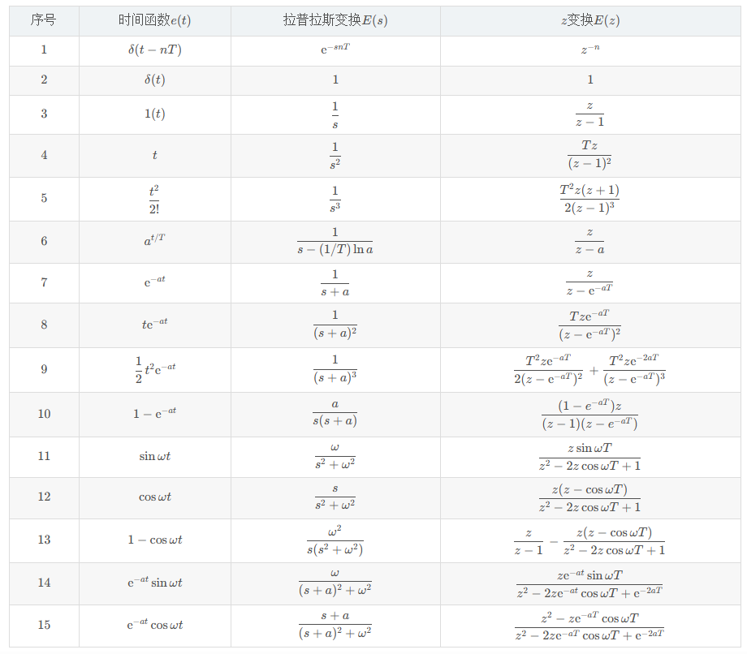

# Z变换与逆Z变换
## Z变换
z变换本质上是将采样后的拉式变换中$e^{-Ts}$代换为$z$，即:
$$
z=e^{-Ts}\\
E(z)=\sum_{0}^{\infty}e(nT)z^{-n}
$$
### 部分分式展开
通常情况下，那么就可以直接部分分式展开然后查表变换，常用的变换对如下:

### 留数法
留数的求法从数学上来说定义如下:
$$
Res[f(z),z_0]=\frac{1}{(n-1)!}lim_{z\rightarrow z_0}[(z-z_0)^nf(z)]^{n-1}
$$
其中，n为极点级数
对此，我们不难发现，要是1级极点，那么留数求法就会变成异常简单
$$
Res[f(z),z_0]=lim_{z\rightarrow z_0}(z-z_0)f(z)
$$
而且，通常情况下，$(z-z_0)$是可以和$f(z)$分母上多项式约掉的，会变得更简单

用留数法求z变换，就用下述公式:
$$
F(z)=\sum_{i=1}^nRes[F(s)\frac{1}{1-e^{sT}z^{-1}}]\bigg|_{s=s_i}
$$
也就是说，求$F(z)$那么就将$F(s)$乘上$\frac{1}{1-e^{sT}z^{-1}}$，然后挨个极点求留数(每个极点都要跟着这个东西)就行了
值得注意的是，在遇到二阶以上极点要进行求导运算，这里求导是**对s求导**，那么**不要忘记$\frac{1}{1-e^{sT}z^{-1}}$也要参与求导运算**
## 逆Z变换
### 部分分式展开法
#### 多项式展开与快速计算系数
我们以下述式子为例:
$$
\begin{equation}
\frac{1}{(z^2+1)(z+1)} = \frac{Az+B}{z^2+1}+\frac{C}{z+1}
\end{equation}
$$
拆分前是分母是多项式相乘的样子，拆分后就是把分母单独提出来作为一个式子，而分子的系数为次数分母的最高系数减1一直到0(常数)
若是:
$$
\begin{equation}
\frac{1}{(z^2+1)^2} = \frac{Az+B}{(z^2+1)^2}+\frac{Cz+D}{z^2+1}
\end{equation}
$$
若分母中的括号为n次，那么拆开后分母从n至n-1次都要写出来，分子的次数对应上一条规则来写
对于快速计算系数，我们以式子(1)为例，其原理如下:
若想求$z-1$对应系数，则有左右同乘$z-1$:
$$
\frac{1}{(z^2+1)} = \frac{Az+B}{z^2+1}(z-1)+C
$$
然后将$z_0=1$带入有(就是上述同乘的式子等于0的解):
$$
\frac{1}{(z^2+1)}\bigg|_{z_0=1} = \frac{Az+B}{z^2+1}(z-1)\bigg|_{z_0=1}+C\\
\frac{1}{(z^2+1)}\bigg|_{z_0=1}=C\\
c=2
$$
值得注意的是，我们在求C的值时候，C前面是没有Z的，也就是说实际上可简写为(示例，不一定与上面的一致):
$$
F(z)(z-2)\bigg|_{z_0=2}=C
$$
而不是:
$$
\begin{equation}
F(z)(z-2)\bigg|_{z_0=2}=zC
\end{equation}
$$
$$
\frac{F(z)(z-2)}{z}\bigg|_{z_0=2}=C
$$
若是遇到式子(3)情况，一定要注意z的值，**左侧带入$z_0$后求解的其实是$z_0C$而非c**
假设我们遇到式子(2)类似的分母带系数的情况:
$$
\frac{1}{(z+1)^2(z+3)} = \frac{A}{(z+1)^2}+\frac{B}{z+1}+\frac{C}{z+3}
$$
那么就需要求导，对于最高阶对应的系数(A)实际上就是:
$$
\frac{1}{(z+1)^2(z+3)}(z+1)^2= A+B(z+1)+\frac{C}{z+3}(z+1)^2\bigg|_{Z_0=-1}\\
\frac{1}{(z+3)}\bigg|_{Z_0=-1}= A
$$
而剩下的系数(B)就分别对应求导:
$$
\frac{d}{dz}[\frac{1}{(z+1)^2(z+3)}(z+1)^2]= \frac{d}{dz}[A+B(z+1)+\frac{C}{z+3}(z+1)]\\
\frac{d}{dz}[\frac{1}{(z+3)}]\bigg|_{Z_0=-1}= B+\frac{C}{z+3}2(z+1)\bigg|_{Z_0=-1}\\
\frac{d}{dz}[\frac{1}{(z+3)}]\bigg|_{Z_0=-1}= B
$$
而其他的系数(C)正常求即可

对于快速求系数的结论就是:
1. 将展开后的分母乘到展开前的式子，带入极点就是对应分母的分子系数
2. 遇到分母外括号带系数的，最高阶按照1正常算，剩下的依次求导计算
#### 逆变换的计算

在这里，最主要变换对为:
$$\frac{z}{z-a}\leftrightarrow z^k$$
最主要用到性质为平移性质，既:
$$
z^{-n}F(z)\qquad右移n\\
z^{n}F(z)\qquad左移n
$$
我们以此为例:
$$
F(z)=\frac{10z}{(z-1)(z-0.2)}
$$
我们可以直接展开，即为:
$$
F(z)=\frac{12.5}{z-1}-\frac{2.5}{z-0.2}
$$
我们想要按照变换对进行逆变换，很明显分子少z，那我们就乘z:
$$
zF(z)=\frac{12.5z}{z-1}-\frac{2.5z}{z-0.2}\leftrightarrow12.5(1)^k-2.5(0.2)^k
$$
注意，我们求出来的是$zF(z)$的逆变换，而不是$F(z)$逆变换，前者右移一个即为后者:
$$
F(z)=12.5(1)^{k-1}-2.5(0.2)^{k-1}=12.5-12.5(0.2)^k
$$
但是此题仍然有第二种解法:
$$
\frac{F(z)}{z}=\frac{10}{(z-1)(z-0.2)}\\
\frac{F(z)}{z}=\frac{12.5}{z-1}-\frac{12.5}{z-0.2}\\
F(z)=\frac{12.5z}{z-1}-\frac{12.5z}{z-0.2}\leftrightarrow 12.5-12.5(0.2)^k
$$
值得注意的是，右移是不需要进行额外的加减的，只需要将k-n带入即可，如果是左移，那么就需要减去移走的值了:
$$
\frac{F(z)}{z}=\frac{2z}{z-1}-\frac{2z}{z-0.5}\leftrightarrow2(1)^k-2(0.5)^k\\
F(z)\leftrightarrow2(1)^{k+1}-2(0.5)^{k+1}-2+2=2-0.5^k
$$
### 留数法

而用留数法求$F(kT)$也比较简单:
$$
F(kT)=\sum_{i=1}^nRes[F(z)z^{k-1}]\bigg|_{z=z_i}
$$
求$F(kT)$那么就将$F(z)$乘上$z^{k-1}$，然后挨个极点求留数(每个极点也要跟着这个东西)就行了
同样的，对应高阶级点进行求导运算时，也要**注意$z^{k-1}$也是参与求导运算**
$F(kT)$可简写为$F(k)$