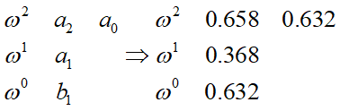
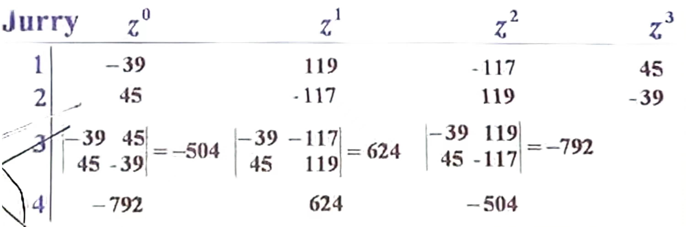
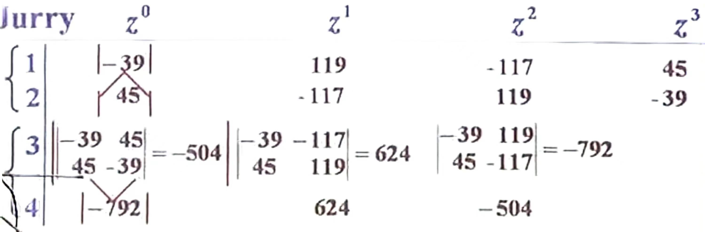
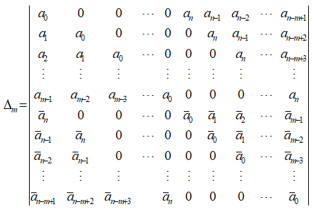
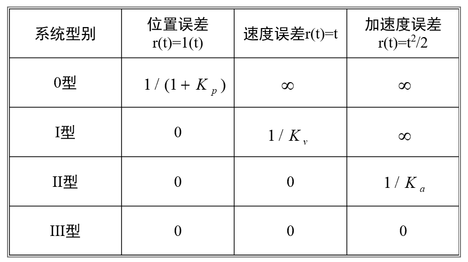

# 离散系统的性能分析
## s平面到z平面
若在s平面中，一个点的坐标为$s=\sigma+\omega j$，映射到z平面后用极坐标表示，即$|z|$为映射后点的模值，$\theta$为映射后角度:
$$
z=e^{Ts}\\
|z|=e^{T\sigma}\qquad \theta=T\omega
$$
注意，上述式子中$\omega$是s平面上点的y坐标，若是题目给你采样频率$\omega_c$，那么实际上给的是$T$，即为$T=\frac{2\pi}{\omega}$

在s平面中，在特征方程的根在平面左侧为系统稳定，那么根据上述式子我们发现，z平面实际上就是把s平面中竖线掰弯，形成一个圆，那么y轴掰弯后形成的是单位圆，即特征方程的根都在单位圆内，则系统稳定
## 稳定判据
由上述变换关系，我们得出结论，线性离散控制系统稳定的充要条件是：
闭环系统特征方程的所有根的模$|z_i|<1$，即闭环脉冲传递函数的极点(特征方程的根)均位于z平面的单位圆内
众所周知，求出所有的根是十分痛苦且很多情况是不可能的，那么就和连续系统一样，有一些判据来判断系统是不是稳定的
### w变换及w域的劳斯稳定判据
劳斯判据是在自动控制原理提出的，本质上他是在s平面上判断方程的根是否在左半轴。而z变换后，是将是s平面上的点对应到z平面上一个个圆上了，稳定判据从特征方程的根都在左半平面变为都在单位圆内
那么，我能不能想办法通过某种对应方式将z平面上点对应到类似的s平面上，然后通过劳斯判据进行判断呢？
实际上，这种对应关系就是我们的w变换
$$
w变换(双线性变换)\quad
\left\{  
             \begin{array}{lr}  
            z=\frac{1+w}{1-w}   \\  
            w=\frac{z-1}{z+1}  
             \end{array}  
\right.  
$$
同时，对于双线性变换还可以有好多组，你可以任选一组你喜欢的进行变换:
$$
\left\{  
             \begin{array}{lr}  
            z=\frac{w+1}{w-1}   \\  
            w=\frac{z+1}{z-1}  
             \end{array}  
\right.\quad
\left\{  
             \begin{array}{lr}  
            z=\frac{1+\frac{T}{2}w}{1-\frac{T}{2}w}   \\  
            w=\frac{2}{T}\frac{z-1}{z+1}  
             \end{array}  
\right.
\\
$$

将在z平面的式子通过w变换变为w变换后，就可利用劳斯判据判断稳定性了，而且判断过程，结论与s平面上的劳斯判据如出一辙

实际上，当采样周期无限小的时候，w平面近似为s平面
 
假设我们有一特征方程为:$z^2-z+0.632=0$
那么我们利用最后一组的双线性变换，可以得到:
$$0.658w^2+0.368w+0.632=0$$
然后利用劳斯判据，那么劳斯表如下所示:

### 二阶系统z域直接判定法
我们有如下二阶**闭环**系统:
$$
W(z)=z^2+a_1z+a_0
$$
满足全部以下条件，则系统稳定:
1. $|W(0)|=a_0=1$
2. $W(1)>0$
3. $W(-1)>0$

### z域中朱利稳定判据
我们将特征方程记为$D(z)$,$D(z)$若是稳定的，那么需要**满足以下全部**条件:
在此处我们以$D(z)=-39+119z-117z^2+45z^3$为例:
1. $D(1)>0$，$D(1)=8>0$
2. $\left\{  
             \begin{array}{lr}  
            D(-1) > 0 \quad 最高次项幂为偶数   \\  
            D(-1) < 0 \quad 最高次项幂为奇数
             \end{array}  
    \right.
    $
    $D(-1)=-320<0，最高次幂系数是3为奇数$
3. 列出朱利表，然后判断
   
   1. 将$D(z)$升序排列，将其系数写在第一行
   2. 将第一行反过来，写在第二行
   3. 取第一行第二列的值，取最右侧第一行第二行值，放到一起，求行列式，放到第三行第一个。行列式最左侧的数不动，从右侧挪一个位置，取右侧倒数第二第一行第二行值，求行列式，依此类推，求出第三行
   4. 将第三行反过来，写在第四号
   5. 第五行第六行重复步骤3、4，知道最后一行剩下三个数为止
     此例子中，第四行已经只剩下三个数了，所有只算到第四号行可
   
   
   判断条件:
   6. 仅看第一列，对第一列的数取模(绝对值)
   7. **第一行的数要小于第二行**
   8. 从第三行起，每两行为一组，不可以有交集，前一行的要大于后一行，即**第三行的数要大于第四行，第五行的数要大于第六行**，依次类推都是大于
   
在此例子中，第三行的绝对值没有大于第四号的绝对值，所以系统不稳定
### 修尔-科恩稳定判据
已知特征方程为$1+G(z)=0$，我们取特征方程的分子为:
$$W(z)=a_nz^n+a_{n-1}z^{n-1}+···+a_1z^1+a_0=0$$
那么可以根据下表写出一些行列式:

我们令$m=1,2,···,n$，$n$为特征方程阶数，$\bar{a_n}$为$a_n$的共轭复数
实际上，我们的$\Delta_m$是$2m\times 2m$的行列式，我们可以写出n个，即$\Delta_n \Delta_{m-1},···,\Delta_1$
这些$\Delta$改变符号的次数就是稳定根的数目，即系统稳定，那么改变符号的次数就是特征方程的阶数
$\left\{  
             \begin{array}{lr}  
            \Delta_m > 0 \quad m为偶数   \\  
            \Delta_m < 0 \quad m为奇数
             \end{array}  
    \right.
    $
## 稳态误差
### 求解稳态误差的一般方法

根据所示系统环节，求**开环**脉冲传递函数(注意采样开关的设置):
$$
GH(z)=\frac{1}{(z-1)^v}GH_0(z)\\
\lim_{z\to 1} GH_0(z)=k
$$
其中，上述式子中的$v$为系统的型数
那么，计算稳态误差步骤如下:
1. 判定稳定性
2. 求误差脉冲传递函数
   $$
    \phi_e(z)=\frac{E(z)}{R(z)}=\frac{1}{1+GH(z)}
   $$
3. 利用终值定理求$e(\infty)$
   $$
    e(\infty)=\lim_{z \to 1}(z-1)\phi_e(z)R(z)=\lim_{z \to 1}(z-1)R(z)\frac{1}{1+GH(z)}
   $$
### 静态误差系数法
与连续系统相同，在离散系统中我们也可以得到静态误差系数来求解稳态误差，在上面我们知道了系统的型数为**开环脉冲传递函数**中的$v$:
$$
GH(z)=\frac{1}{(z-1)^v}GH_0(z)\\
$$
那么类比连续系统，我们就有:
$$
静态位置误差系数 \quad k_p=\lim_{z\to 1}GH(z)\\
静态速度误差系数 \quad k_v=\frac{1}{T}\lim_{z\to 1}(z-1)GH(z)\\
静态加速度误差系数 \quad k_p=\frac{1}{T^2}\lim_{z\to 1}(z-1)^2GH(z)
$$

## 根轨迹法
利用根轨迹法可以分析系统的动态性能，在z平面中画根轨迹与在s平面中画根轨迹方法**完全相同**，只不过在s平面上，我们说在左半轴内的规矩是稳定的，而在z平面上，是在单位圆内是稳定的
也就是说，按照自动控制原理中根轨迹画法画出根轨迹，然后再画一个单位圆，在圆内稳定，圆上临界稳定，圆外不稳定

## 极点分布对动态性能影响
1. 闭环极点最好分布在z平面单位圆的右半部，最为理想的是分布在靠近原点的地方，由于这时$｜z_j｜$值较小，所以相应的瞬态过程较快，即离散系统对输入具有快速响应的性能
2. 和连续系统中相同，离散系统中也有主导极点，统响应主要由这一对主导极点决定，其他极点在分析时可忽略不计。主导极点是最靠见单位圆的极点