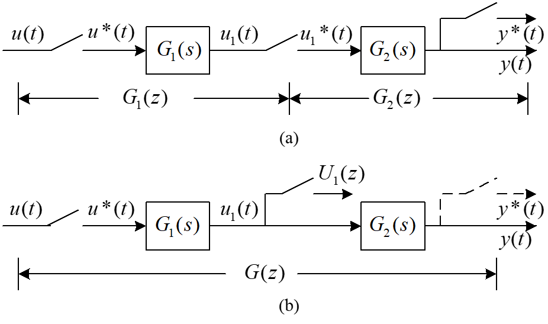
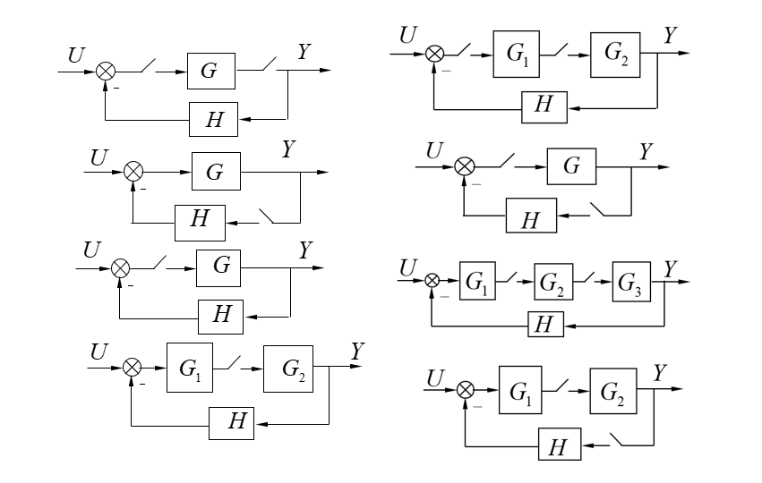

# 脉冲传递函数
## 定义
线性离散系统的脉冲传递函数定义为在**零初始条件下**，系统或环节的输出采样函数Z变换和输入采样函数z变换之比。脉冲传递函数只决定于系统本身的结构参数，与输入信号无关，即
$$
G(z)=\frac{Y(z)}{R(z)}
$$
实际上，这个定义与性质于连续系统中$G(s)$的定义类似，那么我的输出信号就类比与$G(s)$中的输出，可通过这种方法求出:
$$
Y(z)=G(z)R(z)
$$

### 广义对象脉冲传递函数
实际上，在计算机控制系统中，并不存在理想中完美的采样开关进行采样，都是利用零阶保持器进行采样的，那么此时得到的脉冲传递函数称为广义对象脉冲传递函数。而在通过这种方法采样的传递函数，相比于理想情况下，只需要在被控对象前乘上零阶保持器的传递函数，即:

$$
G(s)=\frac{1-e^{-Ts}}{s}G_p(s)
$$
然后对上述$G(s)$进行z变换，即可求出广义对象脉冲传递函数:
$$
G(z)=\frac{z-1}{z}\mathcal Z[\frac{G_p(s)}{s}]
$$

## 给定$G(s)$求脉冲传递函数
在计算机控制系统中，信号都是连续的信号，通过采样后变成离散信号在通过计算机进行控制.所以，一般我们都是已知$G(s)$
1. 对$G(s)$做拉式反变换求出$g(t)$
2. $g(t)$采样求出$g^*(KT)$，这一步一般都是把T换为KT即可
3. 对$g^*(KT)$做z变换

## 给定框图求脉冲传递函数
### 开环脉冲传递函数

在图(a)中，两个串联环节之间存在采样开关，得到的脉冲传递函数为:
$$
G(z)=G_1(z)G_2(z)
$$
在图(b)中，两个串联环节之间不存在采样开关，得到的脉冲传递函数为:
$$
G(z)=G_1G_2(z)
$$

值得注意的是，$G_1(z)G_2(z)$是$G_1(s)$与$G_2(s)$**分别**做z变换然**后相乘**的结果，而$G_1G_2(z)$是$G_1(s)$与$G_2(s)$**先相乘**，得到的**乘积**再做z变换，而在通常情况下$G_1(z)G_2(z)\neq G_1G_2(z)$

针对并联环节而言，只需要将并联的两个关节相加减即可

实际上并不是所有的环节都能求出$G(z)$的，若是出现在信号输入处没有采样环节，那么就求不出$G(z)$，最后是用$Y(z)$来表示，同样的，也要遵循基本运算规则

例如上图可表示为，注意中间有采样环节:
$$
Y(z)=G_1E(s)G_2(s)
$$

简单来说，输入信号有采样，就写$G(z)$；输入信号没有采样，就写$Y(z)$
### 闭环脉冲传递函数
闭环脉冲传递函数实际上是在开环基础上求出的，即:
$$
闭环传递函数=\frac{前向通道所有独立环节的Z变换乘积}{1+闭环回路中所有独立环节的Z变换乘积}
$$
所谓独立环节，指的是两个相邻采样开关之间的环节。特别注意，若是闭环系统的输入信号未被采样，则整个系统的闭环脉冲传递函数写不出来，我们按照上述公式求出的是$Y(z)$而非$\Phi(z)$

值得注意的是，由于分母中要求闭环**回路**中所有独立环节的Z变换乘积，要注意$H$与$G_1$之间其实是连着的
这里有个结论，如果H的两侧都有采样开关，那么H是一个单独环节，要**单独乘**(如左上角)；若H两侧不全有采样开关，那么H就是不是一个单独环节，要**乘到一起**(如左下角)，这个结论本质上仍然是判断是不是独立环节
上图左上角系统传递函数为:
$$
\Phi(z)=\frac{G_1(z)}{1+G_1H(z)}
$$
上图左下角系统传递函数为(注意输入信号无采样):
$$
Y(z)=\frac{G_1U(z)G_2(z)}{1+G_1G_2H(z)}
$$
正常题目中，一般给的是形如$G_1(s)$的$s$变换，所以一定要注意$G_1(z)G_2(z)$与$G_1G_2(z)$的区别