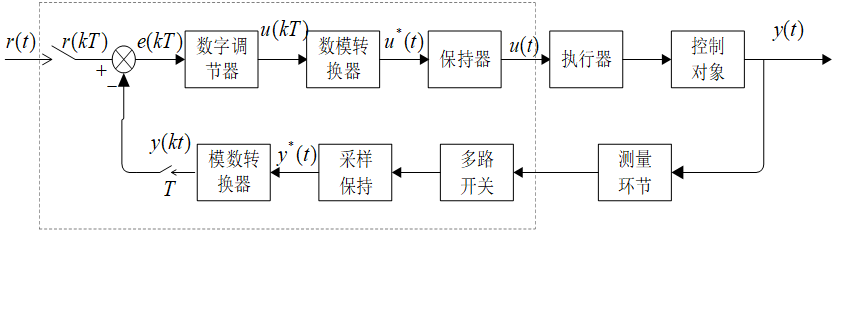
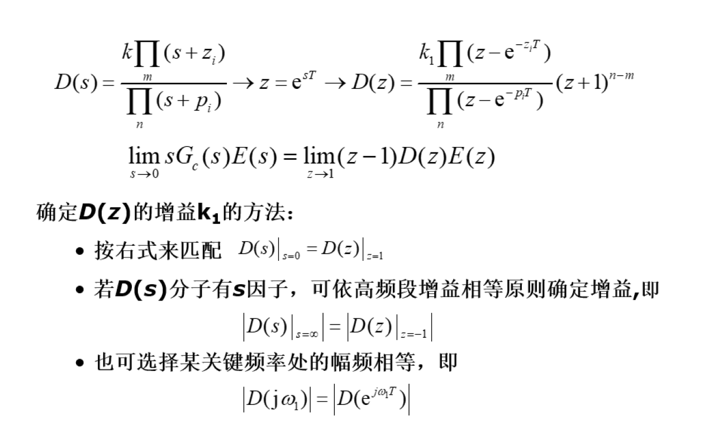
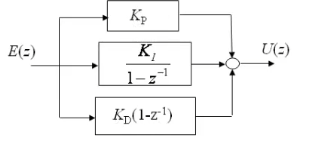
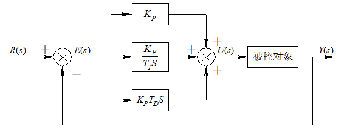
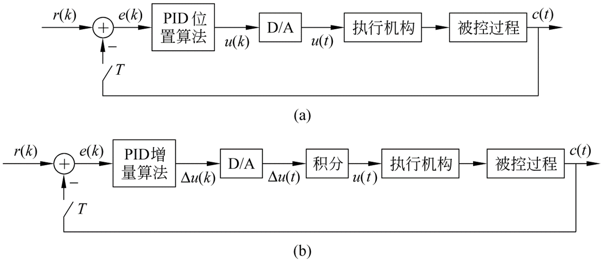
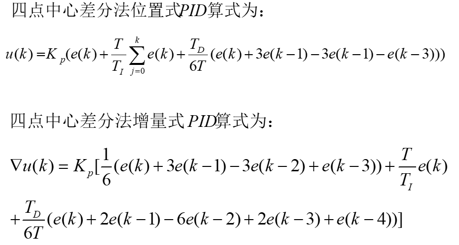
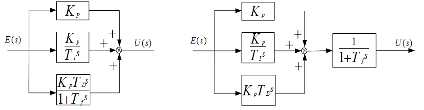
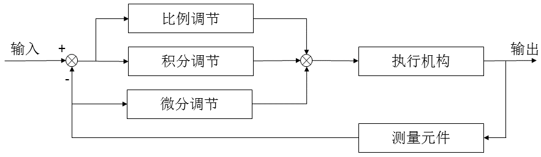

# 间接设计法
将计算机控制系统近似地看成是一个连续变化的模拟系统，用模拟系统的理论和方法进行分析和设计，得到模拟控制器，然后再将模拟控制器进行离散化，得到数字控制器，这种设计方法叫间接设计法，其中典型的算法为PID算法

这里我们只是提到对控制器进行离散化，那么对控制对象用不用离散化？
答案是不用，因为我们的控制对象前面会接入D/A转换器，他输入的是连续量而非离散量，如下图所示

## 常用的离散化方法
对于模拟控制器，我们要把他进行离散化，很多人会说那我直接采样不就离散化？实际上，这是一种离散化办法(脉冲响应不变法)，这里还有其他的离散化办法:
* 前向差分变换(实际一般不用)
  $$
    s=\frac{z-1}{T}
  $$
* 后向差分变换(常用)
  $$
    s=\frac{1-z^{-1}}{T}
  $$
* 双线性变化法
  $$
    s=\frac{2}{T}\frac{z-1}{z+1}
  $$
* 脉冲响应不变法
  实际上就是采样然后z变换过程，给采样周期直接做z变换即可得到
  所谓脉冲响应不变法就是将连续滤波器离散得到离散滤波器后，它的脉冲响应与连续滤波器的脉冲响应在各采样时刻的值是相等的
* 阶跃响应不变法
  有点类似于加上零阶保持器然后z变换的过程，前面带零阶保持器的z变换怎么求，这里就怎么求
  所谓阶跃响应不变法就是将连续滤波器离散后得到的离散滤波器，保证其阶跃响应与原连续滤波器的阶跃响应在各采样时刻的值是相等的。
  
    $$
    G(z)=\frac{z-1}{z}\mathcal Z[\frac{G_p(s)}{s}]
    $$
* 零极点匹配法
  

### 小结
1. 后向差分与双线性变换较为常用
2. 在采样周期$T$较小时，各种变换方法区别不大
3. 零极点匹配法效果最好，但比较复杂，在要求较高时使用
## 数字PID控制器
数字式PID是在模拟型PID上离散化过来的，那么对于模拟型PID我们有以下式子:
$$
u(t)=K_p[e(t)+\frac{1}{T_I}\int_0^te(t)d(t)+T_D\frac{de(t)}{dt}]
$$
实际上对于上述所有的离散方法，这里都能用，但是一般在工程上我们只用后向差分这一种方法，这里都是基于后向差分得到的，具体推导过程如下:
1. 对于时间$t$,则变为$t=KT$，通常我们省略$T$不写，只留$K$
2. 比例环节不变，积分环节就变成了长度为采样周期，高度为采样值的长方形面积加在一起(就是微元法)，即:$\int e(t)dt=T\sum_{j=0}^ke(jT)$
3. 微分环节就变成了后向差分，即:$\frac{de(t)}{dt}=\frac{e(kT)-e[(k-1)T]}{T}$

我们将上述式子替换过去，就得到了位置式PID控制的方程
### 位置式PID控制
$$
u(k)=K_p[e(k)+\frac{T}{T_1}\sum^{k}_{j=0}e(j)+\frac{T_D}{T}[e(k)-e(k-1)]]\\
=K_pe(k)+K_I\sum^{k}_{j=0}e(j)+K_D[e(k)-e(k-1)]
$$
$$
K_p比例系数\quad K_I 积分系数\quad K_D 微分系数\\
t=kT(省略T)\quad u(k)PID输出\quad e(k)PID输入
$$
### 传递函数
若对上式两边同时取z变换，那么就有(离散化是离散化，z变换是z变换，你不离散化，我怎么Z变换):
$$
U(z)=K_pE(z)+K_I\frac{E(Z)}{1-z^{-1}}+K_D(1-z^{-1})E(z)
$$
我们将$E(z)$除过去，就可以得到离散PID传递函数:
$$
D(z)=\frac{U(z)}{E(z)}=K_p+\frac{K_I}{1-z^{-1}}+K_D(1-z^{-1})
$$
对比离散和连续系统下的PID，如图所示:

模拟PID传递函数为:
$\frac{U(s)}{E(s)}=K_p(1+\frac{1}{T_Is}+T_Ds)$

有人可能会问，既然是后向差分得到的，何必那么麻烦，我直把$s=\frac{1-z^{-1}}{T}$带入模拟PID传递函数中，不就好了？
答案是可以的，求出来的结果与我们上述求得的完全相同
### 增量式PID算法
所谓增量，就是求在前后两个采样周期之间数值增加了多少，那么就有:
$$
\Delta u(k)=u(k)-u(k-1)=\\K_p[e(k)-e(k-1)]+K_I
e(k)+K_D[e(k)-2e(k-1)+e(k-2)]
$$
可以看到当前的增量值与三个采样周期的采样值有关，我们整理一下就有:
$$
\Delta u(k)=a_0e(k)-a_1e(k-1)+a_2(k-2)\\
a_0=K_p(1+\frac{T}{T_I}+\frac{T_D}{T})\\
a_1=K_p(1+2\frac{T_D}{T})\\
a_2=K_p\frac{T_D}{T}
$$
所谓增量式，就是我当前应该在上一个基础上增加多少，那么就有:
$$
u(k)=\Delta u(k)+u(k-1)
$$
即增加上述过程中我们求出的$\Delta u(t)$
### 控制结构图
对于上述两种算法，他们控制的结构图如下:

## PID算法的改进
### 抑制积分饱和的PID算法
在实际应用中，比如我电机的转速，阀门的开关都有一个最大值或最小值，即存在一个范围，我们控制的输出量不能超过这个范围，一旦超出限制范围，则实际执行的控制量就不再是计算值，而是系统执行机构的饱和临界值，从而引起不希望的效应
这种情况主要是由于积分项的存在，引起了PID运算的“饱和”，因此将它称为“积分饱和”，为了抑制积分饱和，他有以下几种方法:
1. 积分分离法
核心思想就是误差$e(k)$达到某个限制范围后，不让PID的积分项进行运算
$$
u(k)=K_pe(k)+K_LK_I\sum^{k}_{j=0}e(j)+K_D[e(k)-e(k-1)]
$$
这个式子于上述得到的位置式PID仅差一个$K_L$，$K_L$称逻辑系数，当误差量$e(k)$小于某个值时，$K_L=1$，相当于有积分；$e(k)$大于某个值时，$K_L=0$，相当于没有积分
2. 遇限削弱积分法
控制量(就是我的输出)进入饱和区间时，只执行削弱积分项累加，而不执行增大积分项的累加，即即计算$u(k)$时，先判断$u(k-1)$是否超过限制范围，若已超过$u_{max}$，则只累计负偏差；若小于$u_{min}$，则只累计正偏差，这种方法也可以避免控制量长期停留在饱和区
3. 饱和停止积分法
与积分分离法类似，只不过这里是当输出量$u(k)$达到某个阈值时，不进行积分，达不到这个阈值时，进行积分计算
注意:这三种方法都是有绝对值的，是一个范围，即$|u(k)或e(k)|<\epsilon$
4. 积分限幅法
当积分项输出达到控制输出限幅值，停止积分项的值，积分项的值取前一时刻的值
### 干扰抑制PID算法(四点中心差分法)
这种算法是在$\frac{U(s)}{E(s)}=K_p(1+\frac{1}{T_1s}+T_Ds)$基础上，将微分项进行变化，然后再进行后向差分:

可以看到，之所以叫四点中心差分，本质上就是对四个采样值求平均数，利用这个平均数进行差分
那么，得到的位置式和增量式PID如下:

### PID算法中微分项的改进(不完全微分的PID算法)
在标准PID算法中，当有阶跃信号输入时，微分项输出急剧增加，控制系统很容易产生振荡，这种就是微分项造成的，我们需要对微分项进行改进
1. 第一种算法，其基本思想是仿照模拟调节器的实际微分调节器，加入惯性环节，以克服完全微分的缺点，根据惯性环节的位置此算法有两种结构。一种是将惯性环节加到微分上，另一种是将惯性环节加到最后面 

那么他的控制规律如下:
$$
G'(s)=\frac{K_p}{1+T_fs}(1+\frac{1}{T_is}+T_Ds)
$$
2. 第二种算法叫微分先行PID控制算法，其特点是只对输出量(也就是误差量$e(t)$)进行微分，而对输入量$u(t)$不作微分

微分环节用$\frac{T_2s+1}{\sigma T_2s+1}$代替，那么他的控制规律如下:
$$
G'(s)=\frac{T_2s+1}{\sigma T_2s+1}K_1(1+\frac{1}{T_is})
$$
按后向差分带入特定式子进行离散化，有:
